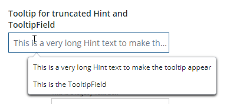

# ptcs-behavior-tooltip

## Overview

`ptcs-behavior-tooltip` is a behavior that tracks the keyboard focus and displays a focus border and, when applicable, a tooltip. This builds on the ptcs-behavior-focus, see its README for details. In addition tooltips can be shown from mouse hover.

The tooltip itself is shown via a web component `ptcs-tooltip-overlay`.

## Usage Example

```javascript
import '../ptcs-behavior-tooltip/ptcs-behavior-tooltip.js';

const MyWC = PTCS.BehaviorTooltip(PolymerElement) {
    ...
};
```

This gives `MyWC` access to the tooltip behavior.

## Component API

When adding tooltip support to your component, it gets the following properties:

```javascript
        tooltip: {
            type: String
        },

        tooltipIcon: {
            type: String
        },

        // To supply the component-determined tooltip dynamically
        tooltipFunc: {
            type: Function
        }
```

If `tooltipFunc` is a function, the tooltip is retrieved by evaluating this function. Otherwise  `tooltip` is used as-is. It `tooltip` doesn't exist, no tooltip is displayed.


#### Example

In image below, the `tooltipFunc` function has been used to retrieve truncated text, which was added as prefix to the tooltip text proper (with `\n\n` separator).



_The hint text of the text field is truncated and is shown above the tooltip text ("This is the TooltipField")_


### Properties

| Property       | Type     | Description                                          | Triggers a changed event? |
|--------------- | -------- | ---------------------------------------------------- | ------------------------- |
| tooltip        | String   | The tooltip string. Text preceding the first occurrence of `\n\n` separator will be put into `part=truncation-overflow`, with the rest (or all, if no separator) of the tooltip string put into `part=text`. This is used mainly to display partially hidden text (the truncation with ellipis overflow pattern) in the tooltip, in addition to any tooltip text proper | No |
| tooltipIcon    | String   | The icon for the tooltip (if any)                    | No                        |
| tooltipFunc    | Function | Used to return a dynamically computed tooltip string | No                        |
| disableTooltip | Boolean  | Disables the tooltip. Default is _false_             | No                        |


#### Escape Key

- Clicking on the Escape key will _hide_ a displayed tooltip.


## Styling

The tooltip overlay has following parts:

### Parts

| Part                | Description                                       |
| ------------------- | ------------------------------------------------- |
| tooltip             | The tooltip container                             |
| pointer             | The pointer of the tooltip                        |
| tooltip-icon        | The tooltip icon                                  |
| tooltip-text        | The tooltip textual contents container            |
| truncation-overflow | Tooltip text coming from e.g. truncation overflow |
| text                | The tooltip text proper                           |
