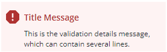

# ptcs-behavior-valid

## Overview

`ptcs-behavior-valid` is a behavior component that adds validation support to web components. You can use this component to validate the properties of other components.

The following is a list of states that are supported by the component:

- `undefined` - the component has not enabled validation
- `'unvalidated'` - the component uses validation, but the validity is not yet determined.
- `'invalid'` - the component is invalid
- `'valid'` - the component is valid

The validity of the component is available as the attribute `validity`. If validation has not been enabled for the component (i.e. the validity is `undefined`), the attribute is not present.

If the component validates several properties, the resulting validity for the component is:

- `invalid`, if any property is invalid
- `unvalidated`, if any property is unvalidated and none is invalid
- `undefined`, if all properties are undefined
- `valid`, if at least one property is valid and all other properties are either valid or undefined

## Usage Example

To validate a component property, declare a validation function in the `properties` data using the `validate` keyword.

### Example of enabling validation

```javascript
import '../ptcs-behavior-validate/ptcs-behavior-validate.js';

const MyWC = PTCS.BehaviorValidate(PolymerElement) {
    static get properties() {
        return {
            value: {
                type:     Number,
                validate: '_validateValue(min, max)'
            },
            min: {
                type: Number,
            },
            max: {
                type: Number,
            }
        };
    }

    _validateValue(min, max) { /* Se below */ }
};
```

With this configuration, the `_validateValue()` function is called when any of the `value`, `min`, or `max` properties change.

A validation function should return:

- `undefined` if validation isn't active
- `true` if the property value is valid
- `false` if the property value is invalid

### Example of a validation function

```javascript
_validateValue(min, max, value) {
    if (typeof min !== 'number' && typeof max !== 'number') {
        return undefined;
    }
    if (typeof min === 'number' && !(value >= min)) {
        return false;
    }
    if (typeof max === 'number' && !(value <= max)) {
        return false;
    }
    return true;
}
```

Note that the value of the validated property is available as the last parameter. It should _not_ be specified in the `validate` expression.

## External validation

Validation functions typically use client-side validation, where the result is returned instantly. In addition, the validation behavior supports server-side validation using the `externalValidity` property. External validation may take time to evaluate, and it may require input from a server.

The following is a list of states that are supported by the `externalValidity` property:

- `undefined`, if server validation is not used (default)
- `'unvalidated'`, if the validating process is waiting for a response from the server
- `'invalid'`, if the server validation failed
- `'valid'`, if the server validation succeeded

## isValue

The validation behavior doesn't consider validation arguments to have been assigned if they are `undefined`, `null` or `""`. If no validation argument of a validation function has been assigned, the validation function will not be called, but is considered to evaluate to `undefined` (i.e. validation is not enabled).

It is important that the validation behavor knows if validation has been enabled, because otherwise an "unvalidated" validation message might flash for a few milliseconds during initialization, before the validation function has been computed. If the validation argument is not in effect for other values than the above, it is easy to inform the validation behavior with the `isValue` method.

Example:

```javascript
    static get properties() {
        return {
            value: {
                type:     Number,
                validate: '_validateValue(min, max)'
            },
            min: {
                type:    Number,
                isValue: min => min > 0
            },
            max: {
                type:    Number,
                isValue: max => max > 0
            }
        };
    }
```

With the added `isValue` methods, the validation behavior knows that `min` and `max` should be ignored for validation purposes unless they are numbers larger than `1`.

## Validation message

The validation behavior creates a validation message (`ptcs-validation-message`) that contains the following items:

- an icon
- a title message
- a details message



You can customize the message using component properties that are listed below.

The `_insertValidationMessage` method is called by the component to display the validation:

```javascript
_insertValidationMessage(messageElement)
```

When you add validation to a component, make sure to implement this method and place the validation message at the appropriate location within the component.


## Properties

| Property        | Type    | Description                             |
|-----------------|---------|-----------------------------------------|
|_stayUnvalidated | Boolean | Components may delay the validation by assigning the property `_stayUnvalidated` to `true`. This means that the validation appears to be unvalidated even if the true validation is valid or invalid.|
| validationSuccessIcon | String | Icon for `valid` state. Default: "cds:icon_success" |
| validationErrorIcon | String | Icon for `invalid` state. Default: "cds:icon_error" |
| validationCriteriaIcon | String | Icon for `unvalidated` state. Default: "cds:icon_info" |
| validationMessage | String | The validation (title) message. This message is displayed in `unvalidated` and `invalid` state. |
| validationSuccessMessage | String | The validation success (title) message. This message is displayed in `valid` state. Default: "Success" |
| validationCriteria | String | The validation details message. This message is displayed in `unvalidated` and `invalid` state. |
| validationSuccessDetails | String | The validation success details message. This message is displayed in `valid` state. |
| hideValidationSuccess | Boolean | Hide validation message in `valid`  state? |
| hideValidationError | Boolean | Hide validation message in `invalid` state?
| hideValidationCriteria | Boolean | Hide validation message in `unvalidated` state? |


### Methods

| Signature           | Argument | Type   | Description |
|---------------------|----------|--------|-------------|
|enableValidationMessage| enable | Boolean | If `enable` is true, show success / failure messages instead of info message. If `enable` is false, always show  info message|
|getValidity  |  _None_ | | Get current validity of component |

