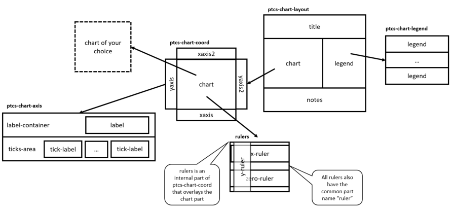

# ptcs-chart

## Overview

`ptcs-chart` is a component ecosystem that enables you to implement data visualization using charts.

The ecosystem consists of three parts:

- _Common components_: Common tasks that can be used by all components
- _Core components_: Components that implement the core functionality of a specific chart type - or types
- _Compound components_: Components that combine common and core components into a single component, for convenient usage

You can use a single compound component, if it meets your requirements, or manually combine common and core components to support more advanced requirements.

### The charting ecosystem

### Common components

- `ptcs-chart-layout`, for chart layouts
- `ptcs-chart-legend`, for chart legend
- `ptcs-chart-coord`, for combining a chart with a coordinate system (adds axes and rulers)
- `ptcs-chart-axis`, for chart axes
- `ptcs-chart-zoom`, for chart zooming controls

### Core components
- `ptcs-chart-core-bar`, a _bar chart_ component
- `ptcs-chart-core-line`, a _line chart_ component, that also implements _area charts_, _scatter plots_ and _streamgraphs_
- `ptcs-chart-core-pareto`, a _pareto chart_ component
- `ptcs-chart-core-schedule`, a _schedule chart_ component
- `ptcs-chart-core-waterfall`, a _waterfall chart_ component

### Compound components
- `ptcs-chart-bar`, a complete _bar chart_, with a _layout_, a _coordinate system_ and an _x-_ and _y-axis_
- `ptcs-chart-line`, a complete _line chart_, _area chart_, _scatter plot_ and _streamgraph_
- `ptcs-chart-pareto`, a combination of a line and a bar chart that enables you to perform Pareto analysis
- `ptcs-chart-waterfall`, a complete _waterfall chart_ to visualize changes to data
- `ptcs-chart-schedule`, a complete _schedule chart_ to visualize schedule data