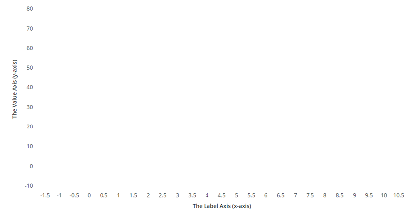

# ptcs-chart-axis
## Visual



## Overview

`ptcs-chart-axis` is a subcomponent used to add axes to charts (one for each axis). The example listed below outlines declarations
for a chart with four axes: x-axis, secondary x-axis, y-axis, and secondary y-axis. This component is nested within `ptcs-chart-layout`.

## Usage Examples

### Basic Usage

```html
        <ptcs-chart-layout
              ...
            <ptcs-chart-axis id="xaxis" slot="xaxis" part="xaxis"
                disabled="[[disabled]]"
                type="[[_xType]]"
                spec-min="[[_specValueMin(specXMin, specXMax, xZoomStart, noXZoom, _xMin, _xMax, _xType)]]"
                spec-max="[[_specValueMax(specXMin, specXMax, xZoomEnd, noXZoom, _xMin, _xMax, _xType)]]"
                side="[[_xSide(flipXAxis, flipAxes)]]"
                label="[[xAxisLabel]]"
                align-label="[[xAxisAlign]]"
                min-value="[[_xMin]]"
                max-value="[[_xMax]]"
                size="[[_xSize(_graphWidth, _graphHeight, flipAxes)]]"
                max-size="[[_if(flipAxes, verticalAxisMaxWidth, horizontalAxisMaxHeight)]]"
                ticks="{{_xTicks}}"
                ticks-rotation="[[horizontalTicksRotation]]"
                reverse="[[reverseXAxis]]"
                scale="{{_xScale}}"
                number-format-specifier="[[xAxisNumberFormatSpecifier]]"
                date-format-token="[[xAxisDateFormatToken]]"
                hidden\$="[[hideXAxis]]"></ptcs-chart-axis>
            <ptcs-chart-axis id="xaxis2" slot="xaxis2" part="xaxis2"
                ...
            ></ptcs-chart-axis>
            <ptcs-chart-axis id="yaxis" slot="yaxis" part="yaxis"
               ...
            ></ptcs-chart-axis>
            <ptcs-chart-axis id="yaxis2" slot="yaxis2" part="yaxis2"
              ...
            ></ptcs-chart-axis>
        </ptcs-chart-layout>
```


## Component API

### Properties
| Property | Type | Description | Default |
|----------|------|-------------|---------|
|type|Object|number, date, or array (of labels) | number |
|side|String|Specifies the axis position. Supported values: "top", "bottom", "left", or "right" | left|
|label|String|Axis label| |
|alignLabel|String|Specifies the axis label alignment. Supported values: "start", "center", or "end" |  |
|minValue|Object|The minimum value in the data||
|maxValue|Object|The maximum value in the data||
|specMin|Object|The specified minimum value in the data: "baseline" \| "auto" \| value, where "baseline" means to start from zero if the minimum value in the data is non-negative, otherwise use "auto". "auto": Use the minimum value of the data and subtract 20% of the full range of the data. Value: start at specified value. ||
|specMax|Object|The specified maximum value in the data: "auto" \| value ||
|numTicks|Number| Set the number of labels on the axis||
|size|Number| The current size / length of the axis (width or height, depending on property `side`)||
|maxSize|String| The maximum size / length of the axis||
|reverse|Boolean|Reverse the axis direction?||
|rotateTicks|Boolean|Rotate the ticks on collision?|`false`|
|scale|Function|The generated scale||
|scaleMin|Number|Minimum value on current scale: function(minValue, maxValue, minSpec)||
|scaleMax|Number|Maximum value on current scale: function(minValue, maxValue, maxSpec)||
|ticks|Array|Axis ticks  `[{label, value, offs}, ...]` ||
|dualTicks|Array|Ticks from a dual axis that this axis should synchronize to||
|ticksRotation|String|Only for horizontal axes: Set explicit ticks rotation in degrees, instead of using auto rotation. The allowed range is: -180 to 180. If this property is not specified, horizontal axis ticks auto-rotate 90 degrees if they collide when not rotated.||
|outerPadding|String|Padding before and after the chart area ||
|innerPadding|String|Inner padding, between data in different groups||
|numberFormat|String|Number format specifier, has precedence over `numberFormatSpecifier`||
|numberFormatSpecifier|String|The number format (e.g. `0000.0`, `#%` or `0.00`) to use on the axis||
|dateFormatToken|String|The date format token (e.g. 'YYYY-MM-DD')||
|referenceLines|Array|Array of threshold line ticks||
|isReferenceLines|Boolean|Does the axis have threshold lines?||

## Styling

### Parts

| Part | Description |
|-----------|-------------|
|label-container|Container for the axis label|
|label|Axis label|
|ticks-area|Container for the axis ticks|

### State attributes

| Attribute | Description | Part |
|-----------|-------------|------|
| side | Axis location (left / right / top / bottom) |`:host` |
| align-label| Label alignment (left / center / right) | `:host` |
| rotate-ticks| Rotate ticks on collision? | `:host` |
| is-reference-lines | Does the axis have threshold lines? | `:host` |