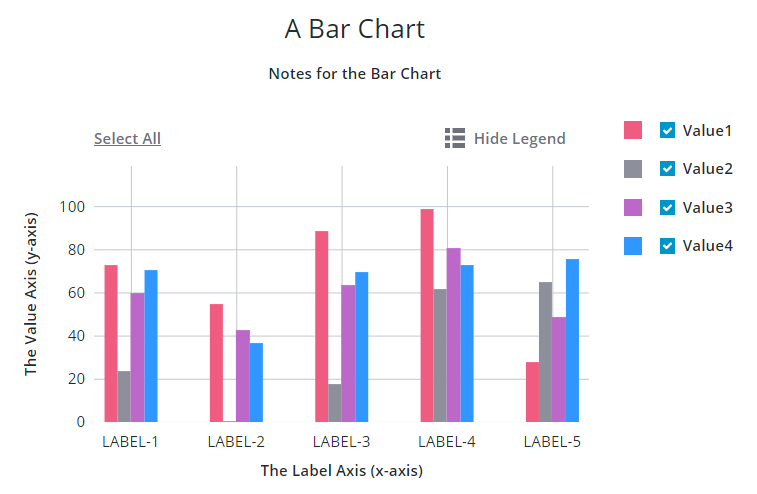

# ptcs-chart-bar
## Visual

## Overview

`ptcs-chart-bar` is a compound component that enables you to visualize data as a bar chart. In addition to the bar chart area, the chart has areas for a title, notes, legend, an X-axis, a Y-axis, and an Action Bar area for selecting / un-selecting all bars and for toggling legend visibility.

## Usage Examples

### Basic Usage

`<ptcs-chart-bar items="[[bar-chart-data]]"></ptcs-chart-bar>
`

## Component API

### Properties
| Property | Type | Description | Default |
|----------|------|-------------|---------|
|titleLabel|String|The chart title|
|titlePos|String| Specifies the title position. Supported values: "top", "bottom", "left", or "right" | top|
|titleAlign|String|Specifies the title alignment. Supported values: "left", "center", or "right" | center |
|notesLabel|String|The notes text|
|notesPos|String| Specifies the notes position. Supported values: "top", "bottom", "left", or "right" | bottom |
|notesAlign|String|Specifies the notes alignment. Supported values: "left", "center", or "right" | center |
|xAxisLabel|String|Specifies the x-axis label| |
|xAxisAlign|String|Specifies the alignment of the x-axis label. Supported values: "left", "center", or "right" | center |
|hideXAxis|Boolean|Hides the x-axis| false |
|yAxisLabel|String|Specifies the y-axis label| |
|yAxisAlign|String|Specifies the alignment of the y-axis label. Supported values: "left", "center", or "right" | center |
|hideYAxis|Boolean| Hides the y-axis| false |
|NumberOfYLabels|Number| Set the number of labels on the Y-axis||
|hideValues|Boolean|Toggle to hide bar values| false|
|referenceLines|Array|An array of items with properties `label` and `value` for threshold lines on the y-axis|
|hideLegend|Boolean|Hide the chart legends area| false |
|showLegendButton|Boolean|Show a button in the Action Bar area for toggling the legend visibility?| false |
|legend|Array|Array of strings that specifies the legend names|
|legendPos|String| Specifies the legend position. Supported values: "top", "bottom", "left", or "right" | "right" |
|legendAlign|String|Specifies the alignment of the legend. Supported values: "start", "center", or "end" | start |
|legendShape| String | Specifies the shape of the legend. Supported values: "square", "circle", "none" | square|
|filterLegend|Boolean|If true, each legend item has a checkbox that allows the user to hide or show the corresponding data|false|
|flipAxes|Boolean|Flip the positions of the x- and y-axes|false|
|flipXAxis|Boolean|Flip the position of the x-axis to the other side of the chart|false|
|flipYAxis|Boolean|Flip the position of the y-axis to the other side of the chart|false|
|showXRulers|Boolean|Show rulers that corresponds to the ticks of the x-axis|false|
|showYRulers|Boolean|Show rulers that corresponds to the ticks of the y-axis|false|
|frontRulers|Boolean|Draw rulers on top of the bars|false|
|reverseXAxis|Boolean|Reverse the order of the x-axis|false|
|reverseYAxis|Boolean|Reverse the order of the y-axis|false|
|specXMin|String|Specifies the start label of the X-axis||
|specXMax|String|Specifies the end label of the X-axis||
|specYMin|"baseline" or "auto" or Number|Specifies the start value of the Y-axis. "baseline": start from zero if the minimum value in the data is non-negative. Otherwise use "auto". "auto": Use the minimum value of the data and subtract 20% of the full range of the data. Number: start at specified number. |baseline|
|specYMax|"auto" or Number|Specifies the end value of the Y-axis. See specYMin for details| auto |
|yAxisNumberFormatSpecifier|String|The number format to use on the y-axis (e.g. '0.00') ||
|xZoomSlider|Boolean|Shows a zoom slider for the X-axis| false |
|xZoomSliderLabel|String|Specifies the label for the X-axis Zoom Slider||
|xZoomSliderMaxLabel|String|Specifies the Maximum label for the X-axis Zoom Slider||
|xZoomSliderMinLabel|String|Specifies the Minimum label for the X-axis Zoom Slider||
|yZoomSlider|Boolean|Shows a Zoom Slider for the Y-axis| false |
|yZoomSliderLabel|String|Specifies the label for the Y-axis Zoom Slider||
|yZoomSliderMaxLabel|String|Specifies the Maximum label for the Y-axis Zoom Slider||
|yZoomSliderMinLabel|String|Specifies the Minimum label for the Y-axis Zoom Slider||
|data|Array|The chart data||
|stack|String| Stack method. Only used when each x-value has several y-values. Supported values: "none", "auto", "expand".| none |
|showValues|String| Shows the value of each bar. Supported values: "none", "inside", "outside"|inside|
|hideZeroRuler|Boolean|Hides the zero ruler|false|
|outerPadding|String|Padding, in percentage of bar width, before and after the bars in the chart area|0|
|innerPadding|String|Padding, in percentage of bar width, between bars that belong to different groups|0|
|groupPadding|String|Padding, in percentage of bar width, between bars that belong to the same group|0|
|sparkView|Boolean|Displays chart preview by hiding certain parts e.g. legend  |false|
|showY2Axis|Boolean|Displays the secondary y-axis|false|
|reverseY2Axis|Boolean|Reverse the order of the secondary y-axis|false|
|data2|Array|The chart data attached to the secondary y-axis||
|specY2Min|String|Specifies the start value of the Y-axis. See specYMin for details|auto|
|specY2Max|String|Specifies the end value of the Y-axis. See specYMin for details|auto|
|y2AxisLabel|String|Specifies the secondary y-axis label||
|y2AxisAlign|String|Specifies the alignment of the secondary y-axis label. Supported values: "left", "center", or "right"|center|
|y2AxisNumberFormatSpecifier|String|The number format (e.g. '0.00') to use on the secondary y-axis.||
|yAxisRulerAlignment|String|Aligns the Y-axis rulers with the tick markers of the primary or secondary Y-axis|primary|
|horizontalTicksRotation|Number|Sets the rotation of horizontal axis ticks in degrees. The allowed range is: -180 to 180. If this property is not specified, horizontal axis ticks auto-rotates 90 degrees if they collide when not rotated. |
|selectionMode|String|Set selection mode: `"none"` (default) - no bars can be selected. `"single"` - one bar can be selected. `"multiple"` - any number of bars can be selected. The `"multiple"` option displays a link in the Action Bar area for selecting / un-selecting all bars. |"none"|
|tooltipTemplate|String|Custom tooltip to display when a data point on the chart is selected. You can show a title, text, data values, and create new lines. Use the following syntax: Add #title# before a string to show a title, #newline# to create a new line, ${<token_name>} to display data from available bar chart tokens: ${label}, ${series}, ${value}).||
|disabled|Boolean|Is the bar chart disabled?||

### Events

| Name | Data | Description |
|------|------|-------------|
| series-click | (serieIx, valueIx, x, y)| Bar data |
| zoom-selection |  `detail:   {x: left, y: top, w: right - left, h: bottom - top}` | Selected area |
| chart-selection | selection | Chart selection |

## Styling

### The Parts of a Bar Chart

A `ptcs-chart-bar` consist of these sub-components:

- `ptcs-chart-layout`, for chart layouts
- `ptcs-chart-legend`, for chart legend
- `ptcs-chart-coord`, for combining a chart with a coordinate system (adds axes and rulers)
- `ptcs-chart-axis`, for chart axes
- `ptcs-chart-core-bar`, for the bar charts
- `ptcs-chart-zoom`, for chart zoom controls
- `ptcs-toolbar`, for the `Select All` / `Clear All` link, the `Show Legend` / `Hide Legend` button to toggle legend visibility and the `Reset` button to reset the zooming.

### Parts

| Part | Description |
|-----------|-------------|
|chart-layout|The ptcs-chart-layout subcomponent|
|title-area|The chart title area container|
|title-label|The chart title|
|notes-area|The chart notes area container|
|notes-label|The chart notes title|
|chart|The ptcs-chart-coord subcomponent|
|core-chart|The ptcs-chart-core-bar subcomponent|
|legend-area|The legend area container|
|legend|The ptcs-chart-legend subcomponent|
|zoom-xaxis|The ptcs-chart-zoom subcomponent for x-axis|
|xaxis|The ptcs-chart-axis subcomponent for x-axis|
|zoom-yaxis|The ptcs-chart-zoom subcomponent for y-axis|
|yaxis|The ptcs-chart-axis subcomponent for y-axis|
|yaxis2|The ptcs-chart-axis subcomponent for secondary y-axis|
|action-bar-area|The action bar area container|
|action-bar|The ptcs-toolbar subcomponent|

The `title-label` and `notes-label` get assigned as maximum width the width of their parents (`title-area` and `notes-area`, 
respectively).

### State attributes

| Attribute | Description | Part |
|-----------|-------------|------|
| disabled | Is the Bar Chart disabled? |`:host` |

