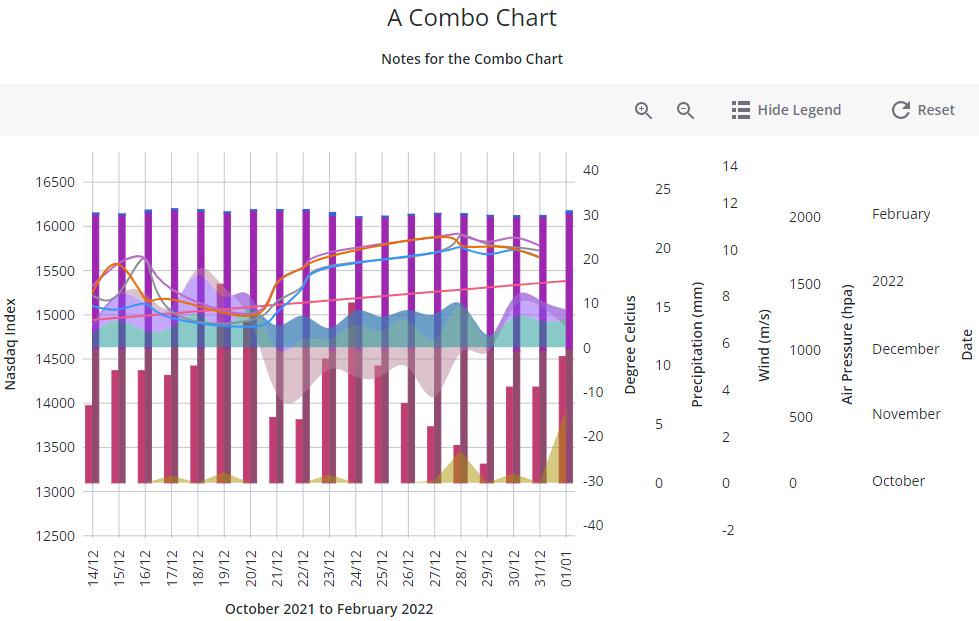

# ptcs-chart-combo

## Visual



## Overview

`ptcs-chart-combo` can visualize data as a combined line chart and bar chart. It can display:

 - _lines_
 - _areas_
 - _bars_
 - _value markers_, such as circles, squares, triangles, and more
 - _values_

Each data series can be rendered independenly or stacked with other series. The series values can be _numbers_, _string labels_ or _dates_.

In addition to the chart area, `ptcs-chart-combo` also has areas for:

- a title
- notes
- a legend
- an action bar
- an x-axis
- multiple y-axis on both sides of the chart
- a horizontal and a vertical zoom slider

## Usage Examples

### Basic Usage

```html
<ptcs-chart-combo data=[[data]] y-axes=[[yAxes]] legends=[[legends]] stacks=[[stacks]]></ptcs-chart-combo>
```

At the very minimun, the combo chart needs:

- chart data
- information about the y-axes (such as axis type, label, label alignment, etc)
- information about how to bind the series of the chart data to the axes (legends property)

If the combo chart should use stacking, it also needs to create and configure the stacks (stacks property).

## Component API

### Properties
| Property | Type | Description | Default |
|----------|------|-------------|---------|
|disabled|Boolean|Is the combo chart disabled?|false|
|titleLabel|String|The chart title| |
|titlePos|String| Specifies the title position. Supported values: "top", "bottom", "left", or "right" | top|
|titleVariant|String|The `variant` assigned to the title `ptcs-label`| `header`|
|titleAlign|String|Specifies the title alignment. Supported values: "left", "center", or "right" | center |
|notesLabel|String|The notes text| |
|hideNotes|Boolean|Hide the notes?| false |
|notesPos|String| Specifies the notes position. Supported values: "top", "bottom", "left", or "right" | bottom |
|notesAlign|String|Specifies the notes alignment. Supported values: "left", "center", or "right" | center |
|xAxisLabel|String|Specifies the x-axis label| |
|xAxisAlign|String|Specifies the alignment of the x-axis label. Supported values: "left", "center", or "right" | center |
|xAxisTickFormat|String|Format for the x-axis ticks. Typical examples are '0.00' for a number axis or 'YYYY-MM-DD' for a date axis.|
|hideXAxis|Boolean| Hide the x-axis?| false |
|yAxes|Array|Configures the yAxes. See section below for details. | |
|stacks|Array|Configures stacks for stacking bars or areas on top of each other. See section below for details. | |
|hideY1Axis|Boolean|Hide all primary y-axes?| false |
|hideY2Axis|Boolean|Hide all secondary y-axes?| false |
|hideLegend|Boolean|Hide the legend?| false |
|legend|Array|Configures how the data series should be rendered. See section below for details. | |
|legendPos|String| Specifies the legend position. Supported values: "top", "bottom", "left", or "right" | right |
|legendAlign|String|Specifies the alignment of the legend. Supported values: "start", "center", or "end" | start |
|legendShape| String |Specifies the shape of the legend. Supported values: "square", "circle", "none" | square|
|filterLegend|Boolean|When true, each legend item has a checkbox that allows the user to hide or show the corresponding data|false|
|actionBar|String|Specifies the action bar position. Supported values: "top", "bottom" | top |
|sparkView|Boolean|Displays a chart preview by hiding certain parts such as the legend and notes areas |false|
|flipAxes|Boolean|Flip the positions of the x- and y-axes|false|
|flipXAxis|Boolean|Flip the position of the x-axis to the other side of the chart|false|
|flipYAxis|Boolean|Flip the position of the primary and secondary y-axes|false|
|showXRulers|Boolean|Show rulers that corresponds to the ticks of the x-axis|false|
|showYRulers|Boolean|Show rulers that corresponds to the ticks of the y-axis|false|
|yAxisRulerAlignment|String|Aligns the Y-axis rulers with the tick markers of the "primary" or "secondary" Y-axis|primary|
|frontRulers|Boolean|Draw rulers on top of the chart|false|
|referenceLines|Array|Configures reference lines. See section below for details. | |
|xType|String|Specifies the type of the x-values. Supported values: "number", "date", "label", Array of unique labels (strings)| label |
|reverseXAxis|Boolean|Reverse the order of the x-axis|false|
|reverseYAxis|Boolean|Reverse the order of the y-axes|false|
|reverseY2Axis|Boolean|Reverse the order of the secondary y-axes|false|
|showChartBands|Boolean|Highlights the reserved space for bar categories on the chart. When set to true, the area for each category is shaded using a gray color.| |
|specXMin|String|Specifies the start value of the X-axis.| |
|specXMax|String|Specifies the end value of the X-axis.| |
|noXZoom|Boolean|Disable X-axis zooming|false|
|xZoomSlider|Boolean|Show X-Axis Zoom Slider?|false|
|xZoomSliderLabel|String|Specifies the label for the X-axis Zoom Slider||
|xZoomSliderMaxLabel|String|Specifies the Maximum label for the X-axis Zoom Slider||
|xZoomSliderMinLabel|String|Specifies the Minimum label for the X-axis Zoom Slider||
|xZoomSelect|Boolean|Enables X-axis zoom by selecting two elements on the chart|false|
|xZoomDrag|Boolean|Enables X-axis zoom by clicking and dragging the pointer|false|
|noYZoom|Boolean|Disables zoom on the y-axis|false|
|yZoomStart|Number|The start position for the Y-axes viewport. Supported value: 0 - yZoomEnd|0|
|yZoomEnd|Number|The end position for the Y-axes viewport. Supported value: yZoomStart - 100|100|
|yZoomRange|Boolean|Shows UI elements that enable you to specify a range of values to zoom to.|false|
|yZoomSlider|Boolean|Show Y-Axis Zoom Slider?| false |
|yZoomSliderLabel|String|Specifies the label for the Y-axis Zoom Slider||
|yZoomSliderMaxLabel|String|Specifies the Maximum label for the Y-axis Zoom Slider||
|yZoomSliderMinLabel|String|Specifies the Minimum label for the Y-axis Zoom Slider||
|yZoomSelect|Boolean|Enables Y-axis zoom by selecting two elements on the chart|false|
|yZoomDrag|Boolean|Enables Y-axis zoom by clicking and dragging the pointer|false|
|alignBarsAtZero|Boolean|Aligns all Y-axes that displays bars at zero. As a result, all bars will start from the same baseline.|false|
|legendMaxWidth|Number|Sets the maximum width of each legend label||
|verticalAxisMaxWidth|Number|Sets the maximum width of the vertical axis||
|yAxesMaxWidth|String|Sets the maximum width of the container for the Y-axes and resets its maximum height (or vice versa, when `flipAxes` is true)||
|horizontalAxisMaxHeight|Number|Sets the maximum height of the horizontal axis||
|horizontalTicksRotation|Number|Sets the rotation of horizontal axis ticks in degrees. The allowed range is: -180 to 180. If this property is not specified, horizontal axis ticks auto-rotates 90 degrees if they collide when not rotated. ||
|data|Array|The chart data||
|hideZeroRuler|Boolean|Hide the zero ruler?|false|
|outerPadding|Number|Sets padding, in percentage of bar width, before and after each bar on the chart|0|
|innerPadding|Number|Sets padding, in percentage of bar width, between bars that belong to different groups|0|
|groupPadding|String|Padding, in percentage of bar width, between bars that belong to the same group|0|
|selectionMode|String|Set selection mode: `"none"` (default) - no markers can be selected. `"single"` - one marker can be selected. `"multiple"` - any number of markers can be selected. The `"multiple"` option displays a link in the Action Bar area for selecting / un-selecting all markers. |"none"|
|showLegendButton|Boolean|Show a button in the Action Bar area for toggling the legend visibility?| false |
|tooltipTemplate|String|Custom tooltip to display when a data point on the chart is selected. You can show a title, text, data values, and create new lines. Use the following syntax: Add #title# before a string to show a title, #newline# to create a new line, ${<token_name>} to display data from available combo chart tokens: ${label}, ${series}, ${value}).||

### Configure y-axes (yAxes)

A combo chart can have any numbers of y-axes. The axes are configured with the `yAxis` property, an `Array` where each entry specifies an y-axis. The entry fields are:

|Name     |Type   |Description|
|---------|-------|-----------|
|id       |String |Specifies a unique id for the axis. This id is used by the `legend` and `stacks` configurations to bind data to this axis.|
|type     |String |Specifies the type of the y-values. Supported values: "number", "date", "label", or an `Array` of strings (i.e. a "label" type with ordered labels)|
|label    |String |Specifies the axis label|
|align    |String |Specifies the alignment of the axis label. Supported values: "left", "center", or "right" | center|
|position |String |Specifies the axis side. A y-axis can be placed on either side of the main chart area. By default the first axis is displayed on the _primary_ side (typically the left side) and the remaining y-axes on the _secondary_ side (typically the right side), but this can be configured with the `position` property. Supported values: "primary", "secondary"|
|reverse  |Boolean|Reverse the order of the axis? This property works in conjuction with `reverseYAxis` and `reverseY2Axis`. If both `reverse` and `reverseYAxis` / `reverseY2Axis` is true, the axis returns to its default order.|
|hide     |Boolean|Hide the axis? Note that an axis is automatically hidden if no data is mapped to it.|
|min / max|       |Specifies explicit minimum and/or maximum values of the axis. The value type must match the axis type|
|tickFormat|String|Format for the axis ticks. Typical examples are '0.00' for a number axis or 'YYYY-MM-DD' for a date axis.|

### Configure Stacks (stacks)

A stack combines bars or areas by stacking them on top of each other.

A combo chart can have any numbers of stacks. The stacks are configured with the `stacks` property, an `Array` where each entry specifies a stack. The entry fields are:

|Name   |Type   |Description|
|-------|-------|-----------|
|id     |String |Unique identifier for the stack. The `legend` configuration can put series on this stack with the `renderOn` field.|
|method |String |Stack method. Supported values: "auto", "expand", "diverging", "silhouette", "wiggle"|
|order  |String |Specifies the stacking order. Supported values: "auto", "reverse", "appearance", "ascending", "descending", "insideout"|
|curve  |String |Specify the curve drawing method. Supported values: "bar", "linear", "basis", "bundle", "cardinal", "catmull-rom", "monotone-x", "monotone-y", "natural", "step"|
|showSum|Boolean|Show the aggregated value of the stacked values|

### Configure Series (legend)

The `legend` property binds data series to axes or stacks. It also specifies a legend label for the series and rendering options.

The `legend` property is an `Array` where each entry configures a series. The entry fields are:

|Name      |Type   |Description|
|----------|-------|-----------|
|label     |String |The legend label|
|renderOn  |String |An y-axis id or a stack id|
|showValues|String |If curve is "bar", showValues specifies how to show the value of each bar. Supported values: "none", "inside", "outside". If curve is _not_ "bar" the values are displayed relative to the _marker_ (even if it is not visible). Supported values: "above", "on","below"|
|showArea  |Boolean|Show the area between the curve and the baseline?|
|showLine  |Boolean|Show the curve line?|
|marker    |String |Specify the marker shape. Supported values: "none", "square", "circle", "triangle", "plus", "cross"|
|markerSize|String |Specify the marker size. Supported values: "small", "medium", "large", "xlarge", _number_ (pixels). Default: "medium"|
|curve     |String |Specify the curve drawing method. Supported values: "bar", "linear", "basis", "bundle", "cardinal", "catmull-rom", "monotone-x", "monotone-y", "natural", "step"|
|bundleBeta|`0` .. `1`|Parameter when `curve` = "bundle"|`0.5`|
|cardinalTension|`0` .. `1`|Parameter when `curve` = "cardinal"|`0.5`|
|catmullRomAlpha|`0` .. `1`|Parameter when `curve` = "catmull-rom"|`0.5`|
|stepPosition|String|Parameter when `curve` = "step". Supported values: "center", "before", "after"|center|


### Configure Reference Lines (referenceLines)

Reference lines are labelled horizontal or vertical lines that represent a specific value on a specific axis.

Reference lines are configured with the `referenceLines` property, an `Array` where each entry specifies a reference line. The entry fields are:

|Name |Type  |Description|
|-----|------|-----------|
|axis |String|Specifies the associated label of the reference line. Either the value "xaxis" (for the x-axis) or a y-axis id (see section _Configure y-axes_ for details)|
|label|String|Specifies the associated label of the reference line.|
|value|Number or Date|Specifies the value of the reference line. The type must match the axis type.|

### Events

| Name | Data | Description |
|------|------|-------------|
| series-click | `detail: {serieIx, valueIx}` | Clicked on a marker |
| zoom-selection |  `detail:   {x, y, w, h}` | Selected area |
| chart-selection | selection | Selected data |

## Styling

### The Parts of a Combo Chart

A `ptcs-chart-combo` consist of these sub-components:

- `ptcs-chart-layout`, for chart layouts
- `ptcs-chart-legend`, for chart legend
- `ptcs-chart-coord`, for combining a chart with a coordinate system (adds axes and rulers)
- `ptcs-chart-axis`, for chart axes
- `ptcs-chart-core-combo`, for the core combo chart functionality
- `ptcs-chart-zoom`, for the chart zoom controls
- `ptcs-toolbar`, for the `Select All` / `Clear All` link, the `Show Legend` / `Hide Legend` button to toggle legend visibility and the `Reset` button to reset the zooming.

### Parts

| Part | Description |
|-----------|-------------|
|chart-layout|The ptcs-chart-layout subcomponent|
|title-area|The chart title area container|
|title-label|The chart title|
|notes-area|The chart notes area container|
|notes-label|The chart notes title|
|chart|The ptcs-chart-coord subcomponent|
|core-chart|The ptcs-chart-core-combo subcomponent|
|legend-area|The legend area container|
|legend|The ptcs-chart-legend subcomponent|
|zoom-xaxis|The ptcs-chart-zoom subcomponent for x-axis|
|xaxis|The ptcs-chart-axis subcomponent for x-axis|
|xaxis2|The ptcs-chart-axis subcomponent for secondary x-axis|
|zoom-yaxis|The ptcs-chart-zoom subcomponent for y-axis|
|yaxis|The ptcs-chart-axis subcomponent for y-axis|
|yaxis2|The ptcs-chart-axis subcomponent for secondary y-axis|
|action-bar-area|The action bar area container|
|action-bar|The ptcs-toolbar subcomponent|

The `title-label` and `notes-label` get assigned as maximum width the width of their parents (`title-area` and `notes-area`,
respectively).
