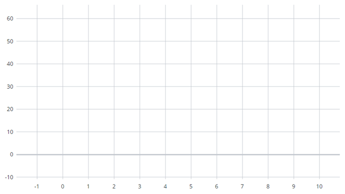

# ptcs-chart-coord

## Visual




## Overview

`ptcs-chart-coord` is a chart subcomponent to combine a chart with a coordinate system, adding axes and rules (lines) that overlay the chart,
 aligned with the ticks of the respective axes.


### Basic Usage

```html
        <ptcs-chart-layout
              ...
            <ptcs-chart-coord slot="chart" part="chart"
                flip-axes="[[flipAxes]]"
                flip-x-axis="[[flipXAxis]]"
                flip-y-axis="[[flipYAxis]]"
                x-ticks="[[_xTicks]]"
                y-ticks="[[_yTicks]]"
                x2-ticks="[[_xReferenceLines]]"
                y2-ticks="[[_if(isReferenceLines, _yReferenceLines, _y2Ticks)]]"
                show-x-rulers="[[showXRulers]]"
                show-x2-rulers="[[isReferenceLines]]"
                has-y2="[[_hasY2(showY2Axis, data2.*)]]"
                show-y-rulers="[[_showYRulers(...)]]"
                show-y2-rulers="[[_showY2Rulers(...)]]"
                is-reference-lines="[[isReferenceLines]]"
                y-axis-ruler-alignment="[[yAxisRulerAlignment]]"
                front-rulers="[[frontRulers]]"
                hide-zero-ruler="[[hideZeroRuler]]"
                spark-view="[[sparkView]]"
                graph-width="{{_graphWidth}}"
                graph-height="{{_graphHeight}}">
                <ptcs-chart-core-graph part="core-chart"
                  ...
                ></ptcs-chart-core-graph>
            </ptcs-chart-coord>
        </ptcs-chart-layout>
```

The `ptcs-chart-coord` is nested within `ptcs-chart-layout` and contains a subcomponent for the targeted chart type's core features.

## Component API

### Properties
| Property | Type | Description |
|----------|------|-------------|
|flipXAxis|Boolean| Swap x-axis and secondary x-axis? |
|flipYAxis|Boolean| Swap y-axis and secondary y-axis? |
|flipAxes|Boolean| Flip axes (change place of x-axes and y-axes) |
|hideZeroRuler|Boolean|Hide the highlighted line through the origin of the coordinate system?|
|showXRulers|Boolean|Show lines grid of the x-axis?|
|showX2Rulers|Boolean|Show lines grid of the secondary x-axis?|
|frontRulers|Boolean|Show the grid lines on top of the graph?|
|xTicks|Array|Ticks (line markings) array for the x-axis|
|x2Ticks|Array|Ticks (line markings) array for the secondary x-axis|
|showYRulers|Boolean|Show lines grid of the x-axis?|
|showY2Rulers|Boolean|Show lines grid of the secondary y-axis?|
|yTicks|Array|Ticks (line markings) array for the y-axis|
|y2Ticks|Array|Ticks (line markings) array for the secondary y-axis|
|isReferenceLines|Boolean|Show threshold lines?|
|graphWidth|Number|Width of the graph|
|graphHeight|Number|Height of the graph|
|sparkView|Boolean|Hide the graph lines grid?|
|yAxisRulerAlignment|String|Alignment for the y-axis|
|hasY2|Boolean|Graph has secondary y-axis?|

## Styling

### Parts

| Part | Description |
|-----------|-------------|
|xaxis-slot|The slot for the x-axis|
|yaxis-slot|The slot for y-axis|
|xaxis2-slot|The slot for the secondary x-axis|
|yaxis2-slot|The slot for the secondary y-axis|
|rulers|Container for the graph horizontal and vertical lines|
|chart-slot|The slot for the chart|

### State attributes

| Attribute | Description | Part |
|-----------|-------------|------|
| flip-x-axis | Swap x-axis and secondary x-axis? |`:host` |
| flip-y-axis | Swap y-axis and secondary y-axis? | `:host` |
| flip-axes | Change place on x-axes and y-axes? | `:host` |
| hide-zero-ruler | Hide the line through the origin of the coordinate system? | `:host` |
| show-x-rulers | Show lines grid of the x-axis? | `:host` |
| show-x-2-rulers|Show lines grid of the secondary x-axis?| `:host` |
| front-rulers|Show lines grid on top of the graph?| `:host` |
| show-y-rulers | Show lines grid of the y-axis? | `:host` |
| show-y-2-rulers|Show lines grid of the secondary y-axis?| `:host` |
| is-reference-lines|Show threshold lines?| `:host` |