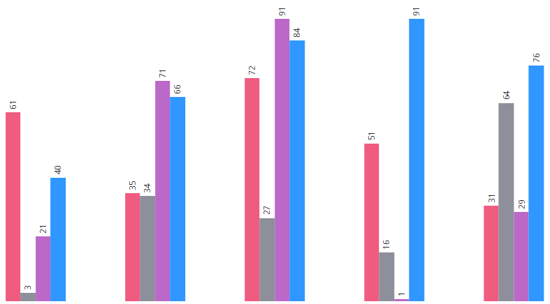

# ptcs-chart-core-bar
## Visual



## Overview

`ptcs-chart-core-bar` is a slotted core component that enables you to visualize data as a bar chart as well as to navigate or select bars via the keyboard.

## Usage Example

```html
                <ptcs-chart-core-bar slot="chart" id="chart"  part="core-chart" style="pointer-events: auto"
                    tabindex\$="[[_delegatedFocus]]"
                    data="[[data]]"
                    disabled="[[disabled]]"
                    legend="[[legend]]"
                    tooltip-template="[[tooltipTemplate]]"
                    stack-method="[[stackMethod]]"
                    stack-order="[[stackOrder]]"
                    stack-method2="[[stackMethod2]]"
                    x-min="{{_xMin}}"
                    x-max="{{_xMax}}"
                    y-min="{{_yMin}}"
                    y-max="{{_yMax}}"
                    y-axis-number-format="{{_yAxisNumberFormat}}"
                    show-y2-axis="[[showY2Axis]]"
                    data2="[[data2]]"
                    y2-min="{{_y2Min}}"
                    y2-max="{{_y2Max}}"
                    y2-scale="[[_y2Scale]]"
                    y2-axis-number-format="{{_y2AxisNumberFormat}}"
                    flip-axes="[[flipAxes]]"
                    reverse-x-axis="[[reverseXAxis]]"
                    reverse-y-axis="[[reverseYAxis]]"
                    reverse-y2-axis="[[reverseY2Axis]]"
                    x-scale="[[_xScale]]"
                    y-scale="[[_yScale]]"
                    filter-legend="[[_selectedLegend]]"
                    show-values="[[_showValues(sparkView, hideValues, showValues)]]"
                    show-y2-axis="[[_showY2Axis(showY2Axis, isReferenceLines)]]"
                    group-padding="[[groupPadding]]"
                    zoom-select="[[_zoomSelect(xZoomSelect, noXZoom, yZoomSelect, noYZoom)]]"
                    zoom-drag-x="[[_zoomDrag(xZoomDrag, noXZoom)]]"
                    zoom-drag-y="[[_zoomDrag(yZoomDrag, noYZoom)]]"
                    selection-mode="[[selectionMode]]"
                    on-chart-selection="_onSelectionChanged"
                    on-zoom-selection="_onZoomSelection"></ptcs-chart-core-bar>
```

## Component API

### Properties
| Property | Type | Description |
|----------|------|-------------|
|data|Array| `data = [{label, data}, ...]` where `data` is `value \|\| [value \|\| [start-value, end-value], ...]`|
|legend|Array|Array of strings that specifies the legend names|
|disabled|Boolean|Is the bar chart disabled?|
|xMin|Number|Minimum x value in data|
|xMax|Number|Maximum x value in data|
|yMin|Number|Minimum y value in data|
|yMax|Number|Maximum y value in data|
|xScale|Function|Scale that maps x-positions to x-axis|
|yScale|Function|Scale that maps y-positions to y-axis|
|flipAxes|Boolean|Swap the position of the x- and y-axes?|
|stackMethod|Object| Stack method. Only used when each x-value has several y-values. Supported values: `falsy`, "none", "auto", "expand"|
|showValues|String| Shows the value of each bar. Supported values: "none", "inside", "outside", "inside-end"|
|show|String|Value computed from `showValues`|
|hideValues|Boolean|Toggle to hide bar values|
|rotateValues|Boolean|Toggle to rotate bar values in order to fit the value within the bar (default: `false`) |
|reverseXAxis|Boolean|Reverse the x-axis direction?|
|reverseYAxis|Boolean|Reverse the y-axis direction?|
|reverseY2Axis|Boolean|Reverse the secondary y-axis direction?|
|filterLegend|Array|Array to hide or show the corresponding legend|
|groupPadding|String|Padding, in percentage of bar width, between bars that belong to the same group|
|zoomSelect|Boolean|Zoom by selecting two elements?|
|zoomDragX|Boolean|Zoom x-axis by click-dragging the mouse over the chart?|
|zoomDragY|Boolean|Zoom y-axis by click-dragging the mouse over the chart?|
|showY2Axis|Boolean|Display the secondary y-axis?|
|data2|Array|Secondary y-axis data|
|y2Min|Object|Minimum y value in data2|
|y2Max|Object|Maximum y value in data2|
|y2Scale|Function|Scale that maps y2-positions to y2-axis|
|stackMethod2|Object| Stack bars? Supported values: `falsy`, "none", "auto", "expand"|
|selectionMode|String|Set selection mode: `"none"` (default) - no bars can be selected. `"single"` - one bar can be selected. `"multiple"` - any number of bars can be selected|
|yAxisNumberFormat|String|The number format to use on the y-axis (e.g. '0.00')|
|y2AxisNumberFormat|String|The number format to use on the secondary y-axis (e.g. '0.00')|
|tooltipTemplate|String|Custom tooltip to display when a data point on the chart is selected. You can show a title, text, data values, and create new lines. Use the following syntax: Add #title# before a string to show a title, #newline# to create a new line, ${<token_name>} to display data from available bar chart tokens: ${label}, ${series}, ${value}).|

### Events

| Name | Data | Description |
|------|------|-------------|
| series-click | (serieIx, valueIx, x, y)| Bar data |
| zoom-selection |  `detail:   {x: left, y: top, w: right - left, h: bottom - top}` | Selected area |
| chart-selection | selection | Chart selection |

## Styling

### Parts

| Part | Description |
|-----------|-------------|
|bar| The bar chart bar|
|drag-rect|The zoom drag rectangle|
|value|The bar chart value|
|value-pos|The bar chart value position|

### State attributes

| Attribute | Description | Part |
|-----------|-------------|------|
| disabled | Is the Bar Chart disabled? |`:host` |
| flip-axes | Swap the positions of the x and y axes? |`:host` |
| stack-method | Bar stacking method |`:host` |
| show | Show values for each bar? |`:host` |
| hide-values | Hide bar values? |`:host` |
| rotate-values | Rotate bar values? |`:host` |
| reverse-x-axis | Reverse the x-axis? |`:host` |
| reverse-y-axis | Reverse the y-axis? |`:host` |
| reverse-y2-axis | Reverse the secondary y-axis? |`:host` |
| show-y2-axis | Show secondary y-axis? |`:host` |
| stack-method2 | Bar stacking method for secondary axis|`:host` |
