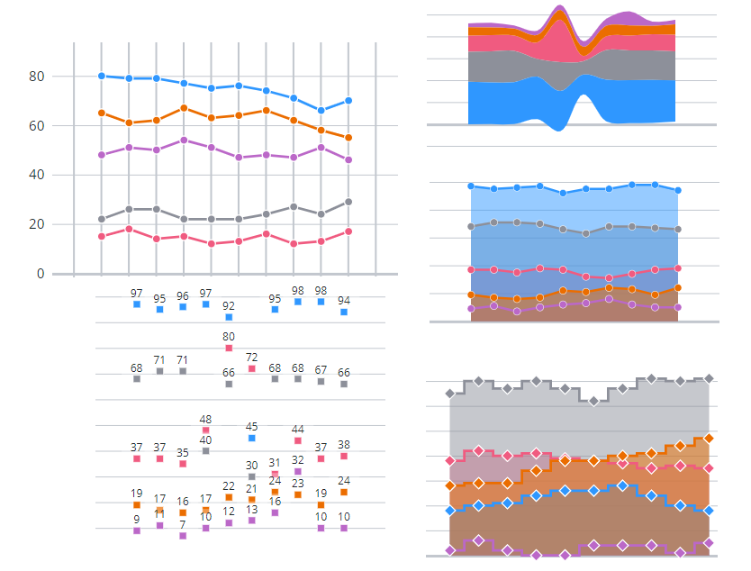

# ptcs-chart-core-line

## Visual



## Overview

`ptcs-chart-core-line` is a slotted core component that enables you to visualize data as a line chart.

The line chart can display:

 - _lines_
 - _areas_ between the line and the zero axis
 - _value markers_, such as circles, squares, triangles, and more
 - _values_, that are placed relative to the value marker (_above_, _below_, or _on_ top of it)

When the chart displays several series, you can display values as _independent_ lines, areas, or _stacked_. Stacked values support multiple options.

The X and Y-axis values can be _numbers_, _string labels_, or _dates_ (i.e. JavaScript `Date` objects).

You can configure the line chart properties to display one of the following chart types:

- Area chart
- Line chart
- Scatter plot
- Step chart
- Streamgraph
- Time Series chart

## Usage Example

### Basic Usage

```html
        <ptcs-chart-core-line id="chart" slot="chart" part="core-chart" style="pointer-events: auto"
            disabled="[[disabled]]"
            data="[[data]]"
            legend="[[legend]]"
            tooltip-template="[[tooltipTemplate]]"
            stack-method="[[stackMethod]]"
            stack-order="[[stackOrder]]"
            stack-method2="[[stackMethod2]]"
            stack-order2="[[stackOrder2]]"
            x-type="[[_xType]]"
            x-min="{{_xMin}}"
            x-max="{{_xMax}}"
            y-type="[[yType]]"
            y-min="{{_yMin}}"
            y-max="{{_yMax}}"
            hide-lines="[[hideLines]]"
            show-areas="[[showAreas]]"
            curve="[[_getCurve(chartType, curve)]]"
            bundle-beta="[[bundleBeta]]"
            cardinal-tension="[[cardinalTension]]"
            catmull-rom-alpha="[[catmullRomAlpha]]"
            step-position="[[stepPosition]]"
            flip-axes="[[flipAxes]]"
            reverse-x-axis="[[reverseXAxis]]"
            reverse-y-axis="[[reverseYAxis]]"
            x-scale="[[_xScale]]"
            y-scale="[[_yScale]]"
            filter-legend="[[_selectedLegend]]"
            marker="[[_getMarker(sparkView, chartType, hideMarkers, marker)]]"
            marker-size="[[markerSize]]"
            show-values="[[_showValues(sparkView, hideValues, showValues)]]"
            show-y2-axis="[[showY2Axis]]"
            data2="[[data2]]"
            y2-type="[[y2Type]]"
            y2-min="{{_y2Min}}"
            y2-max="{{_y2Max}}"
            y2-scale="[[_y2Scale]]"
            cursor-type="[[_cursorType(pointerType, flipAxes)]]"
            cursor-target="[[_cursorTarget(dataPointSelection, flipAxes)]]"
            zoom-select="[[_zoomSelect(xZoomSelect, noXZoom, yZoomSelect, noYZoom)]]"
            zoom-drag-x="[[_zoomDrag(xZoomDrag, noXZoom)]]"
            zoom-drag-y="[[_zoomDrag(yZoomDrag, noYZoom)]]"
            selection-mode="[[selectionMode]]"
            on-chart-selection="_onSelectionChanged"
            on-zoom-selection="_onZoomSelection"></ptcs-chart-core-line>
```

## Component API

### Properties
| Property | Type | Description |
|----------|------|-------------|
|data|Array|The chart data|
|disabled|Boolean|Is the line chart disabled?|
|legend|Array|Array of strings for tooltip legend data|
|stackMethod|String| Stack method. If assigned, enables stacking. Supported values: "auto", "expand", "diverging", "silhouette", "wiggle" |
|stackOrder|String|Specifies the stacking order. Supported values: "auto", "reverse", "appearance", "ascending", "descending", "insideout"|
|stacked|Boolean|Is stacking enabled?|
|stacked2|Boolean|Is stacking enabled for secondary y-axis?|
|xType|String|Specifies the type of the x-values. Supported values: "number", "date", "string"|
|yType|String|Specifies the type of the y-values. Supported values: "number", "date", "string"|
|xMin|Object|Minimum x value in data|
|xMax|Object|Maximum x value in data|
|yMin|Object|Minimum y value in data|
|yMax|Object|Maximum y value in data|
|xScale|Function|Scale that maps x-positions to x-axis|
|yScale|Function|Scale that maps y-positions to y-axis|
|flipAxes|Boolean|Flip the positions of the x- and y-axes|
|filterLegend|Boolean|When true, each legend item has a checkbox that allows the user to hide or show the corresponding data|
|hideLines|Boolean|Hide the chart lines|
|showAreas|Boolean|Show areas under chart lines?|
|curve|String|Specify the curve drawing method. Supported values: "linear", "basis", "bundle", "cardinal", "catmull-rom", "monotone-x", "monotone-y", "natural", "step"|
|bundleBeta|Number|Parameter with value between `0` .. `1` when `curve` = "bundle"|
|cardinalTension|Number|Parameter with value between `0` .. `1` when `curve` = "cardinal"|
|catmullRomAlpha|Number|Parameter with value between `0` .. `1` when `curve` = "catmull-rom"|
|stepPosition|String|Parameter when `curve` = "step". Supported values: "center", "before", "after"|
|marker|String|Specify the marker shape. Supported values: "none", "square", "circle", "triangle", "plus", "cross"|
|markerSize|String or Number|Specify the marker size. Supported values: "small", "medium", "large", "xlarge", _number_ (pixels)|
|showValues|String| Show marker values. The values are displayed relative to the _marker_ position. Supported values: "above", "on","below"|
|zoomSelect|Boolean|Zoom by selecting two elements|
|zoomDragX|Boolean|Zoom x-axis by click-dragging the mouse over the chart|
|zoomDragY|Boolean|Zoom y-axis by click-dragging the mouse over the chart|
|cursorType|String|Cursor: "auto" (just mouse) \|\| "x" (x-line) \|\| "y" (y-line) \|\| "xy" (cross) |
|cursorTarget|String|Target method: "auto" (over) \|\| "x" (closest x) \|\| "y" (closest y) \|\| "xy" (closest)|
|hoverPick|Object|Index to hovered item in picklist (if any) from `cursorType` / `cursorTarget` selection|
|showY2Axis|Boolean|Adds secondary y-axis|
|displayY2|Boolean|Show secondary y-axis|
|data2|Array|The chart data attached to the secondary y-axis|
|y2Type|Object|Specifies the type of the values displayed on the secondary y-axis. Supported values: "number", "date", "string"|
|y2Min|Object|Minimum y value in `data2`|
|y2Max|Object|Maximum y value in `data2`|
|y2Scale|Function|Scale that maps y2-positions to secondary y-axis|
|stackMethod2|String| Stack method for secondary axis. If assigned, enables stacking. Supported values: "auto", "expand", "diverging", "silhouette", "wiggle"|
|stackOrder2|String|Specifies the stacking order for secondary axis. Supported values: "auto", "reverse", "appearance", "ascending", "descending", "insideout"|
|selectedData|Object|Selected markers|
|selectionMode|String|Set selection mode: `"none"` (default) - no markers can be selected. `"single"` - one marker can be selected. `"multiple"` - any number of markers can be selected.|
|tooltipTemplate|String|Custom tooltip to display when a data point on the chart is selected. You can show a title, text, data values, and create new lines. Use the following syntax: Add #title# before a string to show a title, #newline# to create a new line, ${<token_name>} to display data from available line chart tokens: ${label}, ${series}, ${value}).|
|hidenstack|Boolean|Show / hide chart regions|
|hidestack1|Boolean|Show / hide chart regions for data associated with primary axis|
|hidestack2|Boolean|Show / hide chart regions for data associated with secondary axis|


### Events

| Name | Data | Description |
|------|------|-------------|
| series-click | Marker X value + Y Value | Click on a marker shape |
| series-click | Array of marker X value + Y Value | Click on an area of a series |
| zoom-selection |  `detail:   {x: left, y: top, w: right - left, h: bottom - top}` | Selected area |
| chart-selection | selection | Selected data |

## Styling

### Parts

| Part | Description |
|-----------|-------------|
|line| The line chart line|
|area|The line chart area|
|marker|The line chart marker|
|value|The line chart marker value|
|dragrect|The zoom drag rectangle|
|selected|The selected chart line|
|focus|Focus marker|
|hover-line|Horizontal / vertical line(s) indicating cursor position while hovering|


### State attributes

| Attribute | Description | Part |
|-----------|-------------|------|
| disabled | Is the Line Chart disabled? |`:host` |
| stacked | Is stacking enabled on y-axis? |`:host` |
| stacked2 | Is stacking enabled on secondary y-axis? |`:host` |
| hide-lines | Hide lines between markers? |`:host` |
| show-areas | Show areas beneath each line? |`:host` |
| marker | Marker shape ("none", "square", "circle", "triangle", "plus", "cross") |`:host` |
| hover-pick | Index to hovered item |`:host` |
| display-y2| Show secondary y-axis? |`:host` |