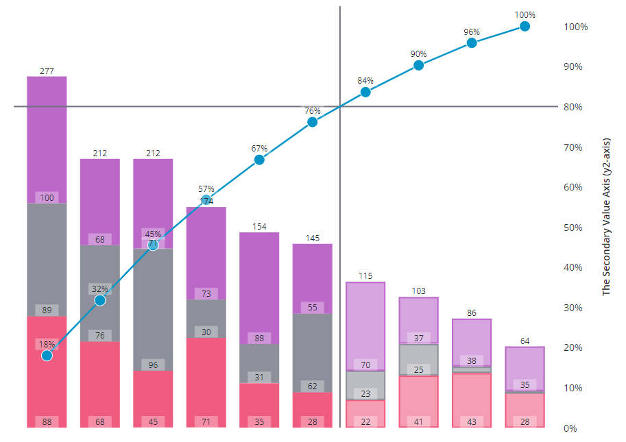

# ptcs-chart-core-pareto

## Visual



## Overview

`ptcs-chart-core-pareto` is a slotted core component for visualizing data as Pareto charts.


## Usage Examples

### Basic Usage

```html
                <ptcs-chart-core-pareto id="chart" slot="chart" part="core-chart" style="pointer-events: auto"
                    tabindex\$="[[_delegatedFocus]]"
                    disabled="[[disabled]]"
                    threshold-value="[[thresholdValue]]"
                    threshold-line="[[thresholdLine]]"
                    emphasize-threshold-factors="[[emphasizeThresholdFactors]]"
                    hide-cumulative-percentage="[[_hideCumulative(hideCumulativePercentage, _hideCumulativePercentage)]]"
                    data="[[data]]"
                    legend="[[legend]]"
                    tooltip-template="[[tooltipTemplate]]"
                    tooltip-template2="[[tooltipTemplate2]]"
                    stack-order="[[stackOrder]]"
                    x-type="{{_labels}}"
                    x-min="{{_xMin}}"
                    x-max="{{_xMax}}"
                    y-min="{{_yMin}}"
                    y-max="{{_yMax}}"
                    y-value-format="[[yAxisNumberFormatSpecifier]]"
                    show-values="[[_showValues(sparkView, hideValues, showValues)]]"
                    curve="[[curve]]"
                    bundle-beta="[[bundleBeta]]"
                    cardinal-tension="[[cardinalTension]]"
                    catmull-rom-alpha="[[catmullRomAlpha]]"
                    step-position="[[stepPosition]]"
                    flip-axes="[[flipAxes]]"
                    reverse-x-axis="[[reverseXAxis]]"
                    reverse-y-axis="[[reverseYAxis]]"
                    x-scale="[[_xScale]]"
                    y-scale="[[_yScale]]"
                    filter-legend="[[_selectedLegend2]]"
                    marker="[[_getMarker(sparkView, hideMarkers, marker)]]"
                    marker-size="[[markerSize]]"
                    show-marker-values="[[_showValues(sparkView, hideValues, showMarkerValues)]]"
                    marker-value-format="[[y2AxisNumberFormatSpecifier]]"
                    show-y2-axis="[[showY2Axis]]"
                    y2-min="[[_y2Min]]"
                    y2-max="[[_y2Max]]"
                    y2-scale="[[_y2Scale]]"
                    zoom-select="[[_zoomSelect(xZoomSelect, noXZoom, yZoomSelect, noYZoom)]]"
                    zoom-drag-x="[[_zoomDrag(xZoomDrag, noXZoom)]]"
                    zoom-drag-y="[[_zoomDrag(yZoomDrag, noYZoom)]]"
                    selection-mode="[[selectionMode]]"
                    unselectable="[[unselectable]]"
                    on-chart-selection="_onSelectionChanged"
                    on-zoom-selection="_onZoomSelection"></ptcs-chart-core-pareto>
```

## Component API

### Properties
| Property | Type | Description |
|----------|------|-------------|
|disabled|Boolean|Disables the Pareto chart|
|thresholdValue|Number|The percentage threshold value for the Pareto analysis|
|thresholdLine|String|The orientation of the threshold line ('horizontal', 'vertical', 'both', or 'none')|
|emphasizeThresholdFactors|Boolean|Applies a different style to the categories that are outside the defined threshold value.|
|hideCumulativePercentage|Boolean|Hides the cumulative percentage line|
|data|Array|The chart data|
|legend|Array|Array of strings that specifies the legend names, for tooltip|
|filterLegend|Array|Index of selected legends|
|stackOrder|String|Controls the data stacking order: 'auto', 'reverse', 'appearance', 'ascending', 'descending', or 'insideout'|
|xType|Object|Generated: x-values sorted according to percentage|
|xMin|Object|Minimum x value in data|
|xMax|Object|Maximum x value in data|
|yMin|Object|Minimum y value in data|
|yMax|Object|Maximum y value in data|
|yValueFormat|String|The number format to use on the y-axis|
|xScale|Function|Scale that maps x-positions to x-axis|
|yScale|Function|Scale that maps y-positions to y-axis|
|flipAxes|Boolean|Swap the position of the x- and y-axes?|
|reverseXAxis|Boolean|Reverse the x-axis direction?|
|reverseYAxis|Boolean|Reverse the y-axis direction?|
|showValues|String| Shows the value of each bar. Supported values: "none", "inside", "outside", "inside-end"|
|curve|String|Specify the curve drawing method. Supported values: "linear", "basis", "bundle", "cardinal", "catmull-rom", "monotone-x", "monotone-y", "natural", "step"|
|bundleBeta|Number|Parameter with value between `0` .. `1` when `curve` = "bundle"|
|cardinalTension|Number|Parameter with value between `0` .. `1` when `curve` = "cardinal"|
|catmullRomAlpha|Number|Parameter with value between `0` .. `1` when `curve` = "catmull-rom"|
|stepPosition|String|Parameter when `curve` = "step". Supported values: "center", "before", "after"|
|marker|String|Specify the marker shape. Supported values: "none", "square", "circle", "triangle", "plus", "cross"|
|markerSize|String or Number|Specify the marker size. Supported values: "small", "medium", "large", "xlarge", _number_ (pixels)|
|showMarkerValues|String| Show marker values. The values are displayed relative to the _marker_ position. Supported values: "no", "above", "on","below"|
|markerValueFormat|String|The number format for tick labels|
|zoomSelect|Boolean|Zoom by selecting two elements|
|zoomDragX|Boolean|Zoom x-axis by click-dragging the mouse over the chart|
|zoomDragY|Boolean|Zoom y-axis by click-dragging the mouse over the chart|
|showY2Axis|Boolean|Show secondary y-axis|
|y2Min|Object|Minimum y2 value (should be 0)|
|y2Max|Object|Maximum y2 value (should be 100)|
|y2Scale|Function|Scale that maps y2-positions (the percentage value) to y2-axis|
|selectionMode|String|Set selection mode: `"none"` (default) - no markers can be selected. `"single"` - one marker can be selected. `"multiple"` - any number of markers can be selected.|
|unselectable|Array|Array of indexes, where data[index] is unselectable|
|labelUnits|String|Unit for labels (default: empty string)|
|labelOfTotal|String| Default value: 'of total'|
|labelCumulativeValue|String| Default value: 'Cumulative value'|
|tooltipTemplate|String|Custom tooltip to display when a data point is selected on the chart. You can show a title, text, data values, and create new lines. Use the following syntax: Add #title# before a string to show a title, #newline# to create a new line, ${<token_name>} to display data from available bar chart tokens: ${label}, ${series}, ${value}).|
|tooltipTemplate2|String|Custom tooltip to display when a secondary axis marker is selected on the chart. You can show a title, text, data values, and create new lines. Use the following syntax: Add #title# before a string to show a title, #newline# to create a new line, ${<token_name>} to display data from available pareto chart tokens for markers: ${label}, ${total}, ${perc}, ${percCum}}.|

### Events

| Name | Data | Description |
|------|------|-------------|
| series-click | (serieIx, valueIx, x, y)| Bar data |
| zoom-selection |  `detail:   {x: left, y: top, w: right - left, h: bottom - top}` | Selected area |
| chart-selection | selection | Chart selection |


## Styling

### Parts

| Part | Description |
|-----------|-------------|
|drag-rect|The zoom drag rectangle|
|line| The pareto line|
|marker| Marker on the pareto line|
|marker-value|The marker value|
|threshold|The vertical / horizontal line intersecting the pareto line at the threshold percentage|
|value|The bar value|


### State attributes

| Attribute | Description | Part |
|-----------|-------------|------|
| disabled | Is the Pareto Chart disabled? |`:host` |
| flip-axes | Swap the positions of the x and y axes? |`:host` |
| reverse-x-axis | Reverse the x-axis? |`:host` |
| reverse-y-axis | Reverse the y-axis? |`:host` |
| marker | Marker shape |`:host`

