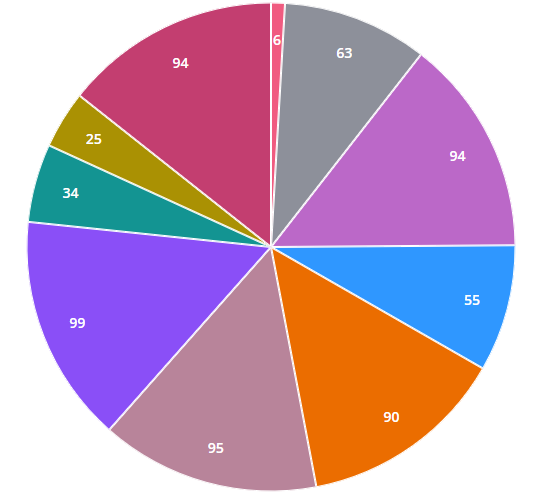

# ptcs-chart-core-pie
## Visual



## Overview

`ptcs-chart-core-pie` is a core component that enables you to visualize data as slices within a pie chart.

## Usage Example

```html
                <ptcs-chart-core-pie id="chart" slot="chart" part="core-chart"
                tabindex\$="[[_delegatedFocus]]"
                data="[[_data]]"
                value-format-specifier="[[valueFormatSpecifier]]"
                legend="[[_legend]]"
                tooltip-template="[[tooltipTemplate]]"
                filter-legend="[[_selectedLegend]]"
                donut="[[donut]]"
                polar="[[polar]]"
                pad-angle="[[padAngle]]"
                start-angle="[[startAngle]]"
                end-angle="[[endAngle]]"
                corner-radius="[[cornerRadius]]"
                highlight-selection="[[highlightSelection]]"
                show-values="[[_showValues(sparkView, showValues)]]"
                value-pos="[[valuePos]]"
                percent-label="[[percentLabel]]"
                inside-label-show-hide="[[insideLabelShowHide]]"
                single-inside-value-label-type="[[singleInsideValueLabelType]]"
                selection-mode="[[selectionMode]]"
                on-chart-selection="_onSelectionChanged"
                chart-state-data-error="{{_chartStateDataError}}"
                chart-state-data-empty="{{_chartStateDataEmpty}}"></ptcs-chart-core-pie>
```

## Component API

### Properties
| Property | Type | Description |
|----------|------|-------------|
|data|Array| `data = [{label, data}, ...]` where `data` is `value`||
|disabled|Boolean|Is the pie chart disabled?||
|valueFormatSpecifier|String|Format for slices values||
|legend|Array|An array of strings that specify the legend names|
|filterLegend|Array|An array of strings that contains the selected legend names within the ptcs-legend component||
|donut|Number|Sets the size of the hole in the center of the pie chart. Use this property to display a donut chart. Supported values are between 0 and 0.99 ||
|polar|Boolean|Uses the radius to visualize the difference between values. Each category is displayed at an equal angle | false |
|padAngle|Number|Sets the size of the padding between the pie chart slices ||
|startAngle|Number|Sets the start angle for the chart ||
|endAngle|Number|Sets the end angle for the chart ||
|cornerRadius|Number|Specifies the corner radius for the chart slices ||
|highlightSelection|Boolean|When enabled, the selected slices are pushed out and offset from the main chart ||
|showValues|String| Shows the value of each slice. Supported values: "none", "inside", "outside"||
|valuePos|String|Sets the position of the data labels relative to the slices. Supported values: `marker`, `in`, `out` or `out with line` ||
|percentLabel|Boolean|Converts and displays the data values as percentages ||
|insideLabelShowHide|Boolean|Shows a data label next to a donut chart slice when it is in a selected, hover, or focus state ||
|singleInsideValueLabelType|String|The `variant` assigned to the inside Value Label `ptcs-label`||
|tooltipTemplate|String|Custom tooltip to display when a data point on the chart is selected. You can show a title, text, data values, and create new lines. Use the following syntax: Add #title# before a string to show a title, #newline# to create a new line, ${<token_name>} to display data from available pie chart tokens: ${label}, ${value}).||
|selectionMode|String|Set selection mode: `"none"` (default) - no slices can be selected. `"single"` - one slice can be selected. `"multiple"` - any number of slices can be selected


### Events

| Name | Data | Description |
|------|------|-------------|
| series-click | no data||
| selected-data-changed | selection | Chart selection |


## Styling

### Parts

| Part | Description |
|-----------|-------------|
|chart|The pie chart|
|pie| The pie slice|
|lines| The value lines|
|value|The pie chart slice value|

### State attributes

| Attribute | Description | Part |
|-----------|-------------|------|
| disabled | Is the Pie Chart disabled? |`:host` |
