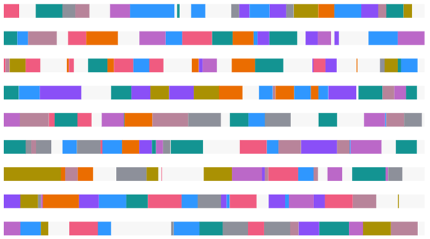

# ptcs-chart-core-schedule

## Visual



## Overview

`ptcs-chart-core-schedule` is a slotted core component for visualizing _schedule data_. Schedule data consists of a collection of objects with associated _schedule items_. A schedule object is represented using a unique name, where each schedule item has the following properties:

|name|description|
|----|-----------|
|`reason`|the reason for the item (e.g. 'Maintenance', 'Running', ... )|
|`info`|optional info, to be displayed in the items tooltip|
|`start`|the start time of the item (a JavaScript `Date`)|
|`start`|the end time of the item (a JavaScript `Date`)|
|`color`|an optional CSS color for explicitly controlling the color of the item|

The syntax for the schedule data is therefore:

~~~
data ::= [
    object,
    [
        item+  // Any number of items here
    ]
]

object ::= <string>

item ::= {
    reason: <string>,
    info:   <string>?,
    start:  <Date>
    end:    <Date>
    color:  <CSS color, e.g. 'red' or '#8030F7'>?
}
~~~

## Usage Example

```html
                <ptcs-chart-core-schedule slot="chart" id="chart" part="core-chart" style="pointer-events: auto"
                    tabindex\$="[[_delegatedFocus]]"
                    disabled="[[disabled]]"
                    legend="[[legend]]"
                    tooltip-template="[[tooltipTemplate]]"
                    data="[[data]]"
                    selected-data="{{selectedData}}"
                    labels="{{labels}}"
                    x-min="{{_xMin}}"
                    x-max="{{_xMax}}"
                    y-min="{{_yMin}}"
                    y-max="{{_yMax}}"
                    flip-axes="[[flipAxes]]"
                    reverse-x-axis="[[!reverseXAxis]]"
                    reverse-y-axis="[[reverseYAxis]]"
                    x-scale="[[_xScale]]"
                    y-scale="[[_yScale]]"
                    filter-legend="[[_selectedLegend]]"
                    zoom-select="[[_zoomMouseOpt(zoomSelect, noXZoom, noYZoom)]]"
                    zoom-drag="[[_zoomMouseOpt(zoomDrag, noXZoom, noYZoom)]]"
                    selection-mode="[[selectionMode]]"
                    on-selection="_onChartSelection"></ptcs-chart-core-schedule>

```

## Component API

### Properties
| Property | Type | Description |
|----------|------|-------------|
|data|Array| Schedule data|
|labels|Array|Labels array|
|disabled|Boolean|Is the schedule chart disabled?|
|xMin|Number|Minimum x value in data|
|xMax|Number|Maximum x value in data|
|yMin|Number|Minimum y value in data|
|yMax|Number|Maximum y value in data|
|xScale|Function|Scale that maps x-positions to x-axis|
|yScale|Function|Scale that maps y-positions to y-axis|
|flipAxes|Boolean|Swap the position of the x- and y-axes?|
|reverseYAxis|Boolean|Reverse the y-axis direction?|
|legend|Array|Array of strings that specifies the legend names|
|filterLegend|Array|Array to hide or show the corresponding legend|
|zoomSelect|Boolean|Zoom by selecting two elements?|
|zoomDrag|String|Zoom by click-dragging the mouse over the chart: 'x' \|\| 'y' \|\| 'xy' \|\| `undefined`|
|dragging|Boolean|Dragging the mouse over the chart?|
|selectedData|Object|Selected chart data|
|selectionMode|String|Set selection mode: `"none"` (default) - no items can be selected. `"single"` - one item can be selected. `"multiple"` - any number of items can be selected. |
|tooltipTemplate|String|Custom tooltip to display when a data point on the chart is selected. You can show a title, text, data values, and create new lines. Use the following syntax: Add #title# before a string to show a title, #newline# to create a new line, ${<token_name>} to display data from available bar chart tokens: ${label}, ${series}, ${value}).|

### Events

| Name | Data | Description |
|------|------|-------------|
| series-click | Info about schedule item | Event generated when the user selects a schedule item |
| chart-selection | selection | Chart selection |


## Styling

### Parts

| Part | Description |
|-----------|-------------|
|group| A row in the schedule chart |
|task|An entry within a group|
|drag-rect|The zoom drag rectangle|


### State attributes

| Attribute | Description | Part |
|-----------|-------------|------|
| disabled | Is the Schedule Chart disabled? |`:host` |
| flip-axes | Swap the positions of the x and y axes? |`:host` |
| dragging | Dragging mouse over chart? |`:host` |

