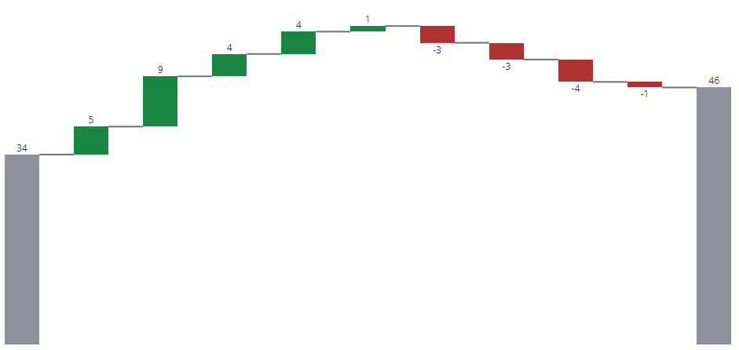

# ptcs-chart-core-waterfall

## Visual



## Overview

`ptcs-chart-core-waterfall` is a slotted core component for visualizing data as Waterfall charts.

Waterfall charts visualize _changes_ to data. A bar in a waterfall chart can either represent:

- A summary, where the bar shows the current value
- A positive change
- A negative change

Optional connector lines can be added to emphasize that each bar represents a change to the same value.

## Usage Example

```html
                <ptcs-chart-core-waterfall id="chart" slot="chart" part="core-chart" style="pointer-events: auto"
                    tabindex\$="[[_delegatedFocus]]"
                    disabled="[[disabled]]"
                    data="[[data]]"
                    legend="[[legend]]"
                    tooltip-template="[[tooltipTemplate]]"
                    x-type="{{_labels}}"
                    x-min="{{_xMin}}"
                    x-max="{{_xMax}}"
                    y-min="{{_yMin}}"
                    y-max="{{_yMax}}"
                    y-value-format="[[yAxisNumberFormatSpecifier]]"
                    show-values="[[_showValues(sparkView, hideValues, showValues)]]"
                    flip-axes="[[flipAxes]]"
                    reverse-x-axis="[[reverseXAxis]]"
                    reverse-y-axis="[[reverseYAxis]]"
                    x-scale="[[_xScale]]"
                    y-scale="[[_yScale]]"
                    filter-legend="[[_selectedLegend]]"
                    show-y2-axis="[[_showY2Axis(showY2Axis, isReferenceLines)]]"
                    zoom-select="[[_zoomSelect(xZoomSelect, noXZoom, yZoomSelect, noYZoom)]]"
                    zoom-drag-x="[[_zoomDrag(xZoomDrag, noXZoom)]]"
                    zoom-drag-y="[[_zoomDrag(yZoomDrag, noYZoom)]]"
                    selection-mode="[[selectionMode]]"
                    unselectable="[[unselectable]]"
                    summary-bars="[[summaryBars]]"
                    hide-connector-lines="[[hideConnectorLines]]"
                    trend-colors="[[trendColors]]"
                    on-chart-selection="_onSelectionChanged"
                    on-zoom-selection="_onZoomSelection"></ptcs-chart-core-waterfall>
```

## Component API

### Properties
| Property | Type | Description |
|----------|------|-------------|
|disabled|Boolean|Disables the Waterfall chart|
|stacked|Boolean|Is the data stacked?|
|data|Array|Received data in format = `[x-value, [y-values], [state-values], {additional tooltip tokens by <key: value>}]`|
|legend|Array|Names of legend items, for tooltip|
|filterLegend|Array|Index of selected legends|
|xType|Object|Generated xType|
|xMin|Number|Minimum x value in data|
|xMax|Number|Maximum x value in data|
|yMin|Number|Minimum y value in data|
|yMax|Number|Maximum y value in data|
|yValueFormat|String|The number format to use on the y-axis|
|xScale|Function|Scale that maps x-positions to x-axis|
|yScale|Function|Scale that maps y-positions to y-axis|
|flipAxes|Boolean|Swap the position of the x- and y-axes?|
|reverseXAxis|Boolean|Reverse the x-axis direction?|
|reverseYAxis|Boolean|Reverse the y-axis direction?|
|showValues|String| Shows the value of each bar. Supported values: "none", "inside", "outside", "inside-end"|
|zoomSelect|Boolean|Zoom by selecting two elements?|
|zoomDragX|Boolean|Zoom x-axis by click-dragging the mouse over the chart?|
|zoomDragY|Boolean|Zoom y-axis by click-dragging the mouse over the chart?|
|showY2Axis|Boolean|Display the secondary y-axis?|
|hideConnectorLines|Boolean|Hide Connector Lines between bars?|
|selectionMode|String|Set selection mode: `"none"` (default) - no bars can be selected. `"single"` - one bar can be selected. `"multiple"` - any number of bars can be selected. |
|unselectable|Array|Array of indexes, where data[index] is unselectable|
|summaryBars|Array|An array of x-indices that should show summary bars|
|trendColors|Boolean|Activate `use-trend-colors` attribute, if data has a single series|
|useTrendColors|Boolean|Computed property, set if `trendColors` is true and data is not stacked|
|tooltipTemplate|String|Custom tooltip to display when a data point on the chart is selected. You can show a title, text, data values, and create new lines. Use the following syntax: Add #title# before a string to show a title, #newline# to create a new line, ${<token_name>} to display data from available bar chart tokens: ${label}, ${series}, ${value}).|

### Events

| Name | Data | Description |
|------|------|-------------|
| series-click | (serieIx, valueIx, x, y)| Bar data |
| zoom-selection |  `detail:   {x: left, y: top, w: right - left, h: bottom - top}` | Selected area |
| chart-selection | selection | Chart selection |


## Styling

### Parts

| Part | Description |
|-----------|-------------|
|bar| A bar in the waterfall chart |
|bridge|Connector line between two bars|
|value|The bar value|
|drag-rect|The zoom drag rectangle|


### State attributes

| Attribute | Description | Part |
|-----------|-------------|------|
| disabled | Is the Waterfall Chart disabled? |`:host` |
| stacked | Is the data stacked? |`:host` |
| flip-axes | Swap the positions of the x and y axes? |`:host` |
| dragging | Dragging mouse over chart? |`:host` |


| Attribute | Description | Part |
|-----------|-------------|------|
| disabled | Is the Schedule Chart disabled? |`:host` |
| flip-axes | Swap the positions of the x and y axes? |`:host` |
| reverse-x-axis | Reverse the x-axis? |`:host` |
| reverse-y-axis | Reverse the y-axis? |`:host` |
| hide-connector-lines | Hide the connector lines between bars? |
| use-trend-colors | Use trend colors? |`:host` |
