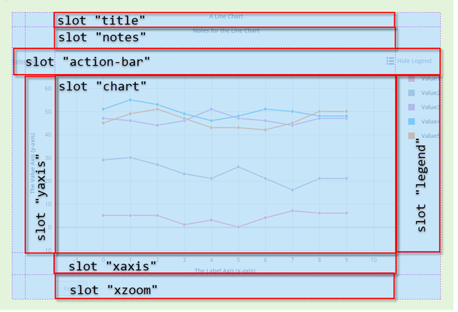
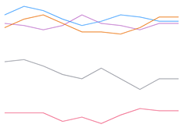

# ptcs-chart-layout

## Visual



## Overview

`ptcs-chart-layout` is a subcomponent for common chart areas (or _panes_) displayed in a CSS grid that defines the structure in which
charts are displayed. The layout areas consist of the following _slots_:

- `chart`, the chart area
- `title`, the chart title area
- `notes`, the chart notes area
- `action-bar`, the area for the `Show / Hide Legend` button and `Select / Clear All` link
- `legend`, the legend area
- `xaxis`, the x-axis area
- `xaxis2`, the secondary x-axis area
- `xzoom`, the x-axis zoom controls area
- `yaxis`, the y-axis area
- `yaxis2`, the secondary y-axis area
- `yzoom`, the y-axis zoom controls area

The _actual_ location of the slots within the layout as well as their visibility depends on configuration settings for elements such as title, legend, or notes (i.e. component properties like `titlePos`, `legend-pos`,  `notesPos`, `sparkView` etc). Slots for secondary axes and y-axis zoom controls are not indicated.



Property `sparkView` hides all areas except the chart pane, typically used to show a simplified thumbnail view of the graph.

### Basic Usage

The example below outlines a subset of the chart layout definition from the line chart, without any secondary axes, and omits some properties
for brevity's sake. Note how the `ptcs-chart-layout` nests around other chart subcomponents like `ptcs-chart-coord` and `ptcs-chart-legend`,
and the repeated use of subcomponents `ptcs-chart-zoom` and `ptcs-chart-axis` to provide corresponding chart functionality on _both_ axes.

Review any one of the chart components (`ptcs-chart-bar`, `ptcs-chart-line`, etc) for a comprehensive example.

```html
    <ptcs-chart-layout id="chart-layout" style="height:100%" part="chart-layout"
                           disabled="[[disabled]]"
                           title-pos="[[titlePos]]" hide-title="[[!titleLabel]]"
                           notes-pos="[[notesPos]]" notes-align="[[notesAlign]]" hide-notes="[[_hideNotes(notesLabel, hideNotes)]]"
                           legend-pos="[[legendPos]]" hide-legend="[[_hideLegend(hideLegend, legend)]]"
                           eff-legend-pos="{{effLegendPos}}"
                           zoom="[[_zoomActive]]"
                           x-zoom="[[_showZoomX(...)]]"
                           y-zoom="[[_showZoomY(...)]]"
                           flip-axes="[[flipAxes]]"
                           flip-x-axis="[[flipXAxis]]"
                           flip-y-axis="[[flipYAxis]]"
                           spark-view="[[sparkView]]"
                           x-axis="[[!hideXAxis]]"
                           y-axis="[[!hideYAxis]]"
                           is-reference-lines="[[isReferenceLines]]"
                           action-bar="[[...]]">
            <div part="title-area" slot="title">
                <ptcs-label part="title-label" label="[[titleLabel]]" variant="[[titleVariant]]" multi-line></ptcs-label>
            </div>
            <div part="notes-area" slot="notes">
                <ptcs-label part="notes-label" label="[[notesLabel]]" variant="label" multi-line></ptcs-label>
            </div>
            <ptcs-chart-coord slot="chart" part="chart">
             ...
            </ptcs-chart-coord>
            <div part="legend-area" slot="legend">
                <ptcs-chart-legend part="legend"
                  ...
                ></ptcs-chart-legend>
            </div>
            <ptcs-chart-zoom slot="xzoom" part="zoom-xaxis"
              ...
            ></ptcs-chart-zoom>
            <ptcs-chart-axis id="xaxis" slot="xaxis" part="xaxis"
              ...
            ></ptcs-chart-axis>
            <ptcs-chart-zoom slot="yzoom" id="zoomY" part="zoom-yaxis"
              ...
            ></ptcs-chart-zoom>
            <ptcs-chart-axis id="yaxis" slot="yaxis" part="yaxis">
              ...
            </ptcs-chart-axis>
            <div part="action-bar-area" slot="action-bar">
                <ptcs-toolbar part="action-bar"
                  ...
                ></ptcs-toolbar>
            </div>
        </ptcs-chart-layout>
```

## Component API

Since `ptcs-chart-layout` is a common chart _subcomponent_ many of its properties are familiar chart properties (e.g. `titlePos`, `notesPos`, etc), which are normally exposed using the same property name in the charts, while other properties are specific to the component (e.g. `effTitlePos`, `effNotesPos`, etc).

### Properties
| Property | Type | Description |
|----------|------|-------------|
|titlePos|String| Specifies the title position. Supported values: "top", "bottom", "left", or "right" |
|hideTitle|Boolean|Toggle to hide the title|
|notesPos|String| Specifies the notes position. Supported values: "top", "bottom", "left", or "right" |
|hideNotes|Boolean|Hides the notes area|
|notesAlign|String|Specifies the notes alignment. Supported values: "left", "center", or "right" |
|legendPos|String| Specifies the legend position. Supported values: "top", "bottom", "left", or "right" |
|hideLegend|Boolean|Hide the legend?|
|xAxis|Boolean|Show x-axis area, unless sparkView|
|yAxis|Boolean|Show y-axis area, unless sparkView|
|isReferenceLines|Boolean|Show reference (a.k.a. threshold) lines, unless sparkView|
|zoom|Boolean|Zooming of some kind is enabled, display reset button|
|xZoom|Boolean|Show x-zoom area, unless sparkView|
|yZoom|Boolean|Show y-zoom area, unless sparkView|
|actionBar|String|Specifies the position of the Action Bar area. Supported values: "top", "bottom"|
|flipAxes|Boolean|Flips the positions of the x- and y-axes|
|flipXAxis|Boolean|Flips the x-axis to the opposite side of the chart|
|flipYAxis|Boolean|Flips the y-axis to the opposite side of the chart|
|sparkView|Boolean|Hides all areas except the chart pane|
|narrow|Boolean|Toggle for narrow view, such as on a mobile device|
|effTitlePos|String|The effective title position (dependent on propTitle and hideTitle)|
|effNotesPos|String|The effective notes position|
|effLegendPos|String|The effective legend position|

## Styling

### Parts

The `ptcs-chart-layout` parts have a 1:1 correspondence with the slot by same name. The `ptcs-label` inserted by this component under 
the `title` and `notes` slots are assigned their parent container's width as `maxWidth` (parts `title-area` and `notes-area`, 
respectively).

| Part | Description |
|-----------|-------------|
|chart|the chart area|
|title|the chart title area|
|notes|the chart notes area|
|action-bar|the area for the `Show / Hide Legend` button and `Select / Clear All` link|
|legend|the legend area|
|xaxis|the x-axis area|
|xaxis2|the secondary x-axis area|
|xzoom|the x-axis zoom controls area|
|yaxis|the y-axis area|
|yaxis2|the secondary y-axis area|
|yzoom|the y-axis zoom controls area|

### State attributes

| Attribute | Description | Part |
|-----------|-------------|------|
| eff-legend-pos | The effective legend position | `:host` |
| eff-notes-pos | The effective notes position | `:host` |
| flip-axes | Are the axes flipped? | `:host` |
| legend-pos  | The legend position | `:host` |
| notes-pos | The notes position | `:host` |
| title-pos | The title position | `:host` |
