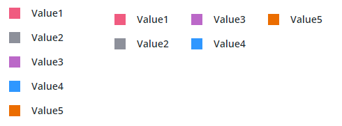
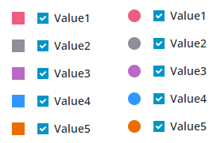

# ptcs-chart-legend

## Visual




## Overview

`ptcs-chart-legend` is a chart subcomponent to display legends. A legend (also known as a _key_) contains a list of the variables appearing in the chart and indicates their color in the graph, to allow the data from each variable to be identified in the chart. A legend item consists of three parts:

- Marker
- Checkbox
- Label

The legend can be displayed in a horizontal or vertical orientation and on any side of the graph, and can optionally be used to _filter_ the
graph by including or excluding variable data from the chart via the corresponding legend item's checkbox.



The legend _marker_ can be a circle or square, or not shown at all. The legend _label_ is the legend key, a textual description.

### Basic Usage

```html
                <ptcs-chart-legend
                    id="legend"
                    part="legend"
                    items="[[legend]]"
                    shape="[[legendShape]]"
                    filter="[[filterLegend]]"
                    horizontal="[[_horizLegend(effLegendPos)]]"
                    max-width="[[legendMaxWidth]]"
                    align="[[legendAlign]]"
                    disabled="[[disabled]]"
                    selected="{{_selectedLegend}}"></ptcs-chart-legend>
```

## Component API

### Properties
| Property | Type | Description |
|----------|------|-------------|
|horizontal|Boolean| Horizontal or vertical orientation? |
|maxWidth|String| Specifies the maximum width for the legend|
|align|String|Specifies the legend alignment. Supported values: "start", "center", or "end" |
|disabled|Boolean|Is the legend area disabled?|
|selected|Array|Indices of selected items|
|shape|String|Legend marker shape. Supported values: "circle", "square", or "none"|
|items|Array|Legend items|
|filter|Boolean|Should legend filter the related chart(s)?|
|legendcolors|Object|Only used by schedule chart|

## Styling

### Parts


| Part | Description |
|-----------|-------------|
|grid|The legend grid container|
|item|A legend item, consisting of a marker, checkbox, and label|
|marker|The legend marker|
|checkbox|The legend checkbox|
|label|The legend key|

### State attributes

| Attribute | Description | Part |
|-----------|-------------|------|
| horizontal |The legend orientation| `:host` |
| align | The legend alignment | `:host` |
| disabled | Is the legend area disabled? | `:host` |
| shape  | The legend marker shape | `:host` |
| filter | Display checkbox for filtering the related items? | `:host` |