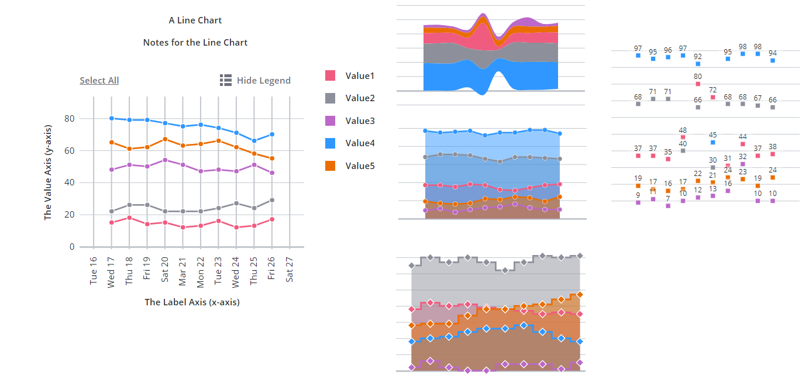

# ptcs-chart-line

## Visual



## Overview

`ptcs-chart-line` is a compound component that enables you to visualize data as a line chart.

The line chart can display:

 - _lines_
 - _areas_ between the line and the zero axis
 - _value markers_, such as circles, squares, triangles, and more
 - _values_, that are placed relative to the value marker (_above_, _below_, or _on_ top of it)

When the chart displays several series, you can display values as _independent_ lines, areas, or _stacked_. Stacked values support multiple options.

The X and Y-axis values can be _numbers_, _string labels_, or _dates_ (i.e. JavaScript `Date` objects).

You can configure the line chart properties to display one of the following chart types:

- Area chart
- Line chart
- Scatter plot
- Step chart
- Streamgraph
- Time Series chart

In addition to the line chart area, `ptcs-chart-line` also has areas for:

- a title
- notes
- a legend
- an x-axis, and
- a y-axis

## Usage Examples

### Basic Usage

```html
<ptcs-chart-line items=[[line-chart-data]]></ptcs-chart-line>
```

## Component API

### Properties
| Property | Type | Description | Default |
|----------|------|-------------|---------|
|titleLabel|String|The chart title|
|titlePos|String| Specifies the title position. Supported values: "top", "bottom", "left", or "right" | top|
|titleAlign|String|Specifies the title alignment. Supported values: "left", "center", or "right" | center |
|titleVariant|String|The `variant` assigned to the title `ptcs-label`|See `ptcs-label`|
|notesLabel|String|The notes text|
|hideNotes|Boolean|Hide the notes?|false|
|notesPos|String| Specifies the notes position. Supported values: "top", "bottom", "left", or "right" | bottom |
|notesAlign|String|Specifies the notes alignment. Supported values: "left", "center", or "right" | center |
|xAxisLabel|String|Specifies the x-axis label| |
|xAxisAlign|String|Specifies the alignment of the x-axis label. Supported values: "left", "center", or "right" | center |
|hideXAxis|Boolean| Hide the x-axis?| false |
|NumberOfXLabels|Number| Set the number of labels on the X-axis, apply only for numeric and date format||
|xType|String|Specifies the type of the x-values. Supported values: "number", "date", "string"|number|
|yAxisLabel|String|Specifies the y-axis label| |
|yAxisAlign|String|Specifies the alignment of the y-axis label. Supported values: "left", "center", or "right" | center |
|hideYAxis|Boolean| Hide the y-axis?| false |
|NumberOfYLabels|Number| Set the number of labels on the Y-axis, apply only for numeric and date format||
|yType|String|Specifies the type of the y-values. Supported values: "number", "date", "string"|number|
|referenceLines|Array|An array of items with properties `label`, `value`, and `axis` (supported values: "xaxis" or "yaxis") for corresponding threshold lines|
|hideLegend|Boolean|Hide the legend?| false |
|showLegendButton|Boolean|Show a button in the Action Bar area for toggling the legend visibility?| false |
|legend|Array|Array of strings that specifies the legend names|
|legendPos|String| Specifies the legend position. Supported values: "top", "bottom", "left", or "right" | "right" |
|legendAlign|String|Specifies the alignment of the legend. Supported values: "start", "center", or "end" | start |
|legendShape| String | Specifies the shape of the legend. Supported values: "square", "circle", "none" | square|
|filterLegend|Boolean|When true, each legend item has a checkbox that allows the user to hide or show the corresponding data|false|
|flipAxes|Boolean|Flip the positions of the x- and y-axes|false|
|flipXAxis|Boolean|Flip the position of the x-axis to the other side of the chart|false|
|flipYAxis|Boolean|Flip the position of the y-axis to the other side of the chart|false|
|showXRulers|Boolean|Show rulers that corresponds to the ticks of the x-axis|false|
|showYRulers|Boolean|Show rulers that corresponds to the ticks of the y-axis|false|
|frontRulers|Boolean|Draw rulers on top of the bars|false|
|reverseXAxis|Boolean|Reverse the order of the x-axis|false|
|reverseYAxis|Boolean|Reverse the order of the y-axis|false|
|specXMin|String|Specifies the start label of the X-axis||
|specXMax|String|Specifies the end label of the X-axis||
|specYMin|"baseline" or "auto" or Number|Specifies the start value of the Y-axis. "baseline": start from zero if the minimum value in the data is non-negative. Otherwise use "auto". "auto": Use the minimum value of the data and subtract 20% of the full range of the data. Number: start at specified number. |auto|
|specYMax|"auto" or Number|Specifies the end value of the Y-axis. See specYMin for details| auto |
|yAxisNumberFormatSpecifier|String|Number format (e.g. '0.00') to use on the y-axis (if the type is number)||
|yAxisDateFormatToken|String|Date format token (e.g. 'YYYY-MM-DD') to use on the y-axis (if the type is date)|auto|
|xAxisNumberFormatSpecifier|String|Number format (e.g. '0.00') to use on the x-axis (if the type is number)||
|xAxisDateFormatToken|String|Date format token (e.g. 'YYYY-MM-DD') to use on the x-axis (if the type is date)|auto|
|xZoomSlider|Boolean|Show X-Axis Zoom Slider?| false |
|xZoomSliderLabel|String|Specifies the label for the X-axis Zoom Slider||
|xZoomSliderMaxLabel|String|Specifies the Maximum label for the X-axis Zoom Slider||
|xZoomSliderMinLabel|String|Specifies the Minimum label for the X-axis Zoom Slider||
|yZoomSlider|Boolean|Show Y-Axis Zoom Slider?| false |
|yZoomSliderLabel|String|Specifies the label for the Y-axis Zoom Slider||
|yZoomSliderMaxLabel|String|Specifies the Maximum label for the Y-axis Zoom Slider||
|yZoomSliderMinLabel|String|Specifies the Minimum label for the Y-axis Zoom Slider||
|data|Array|The chart data||
|stackMethod|String| Stack method. Only used when each x-value has several y-values. Supported values: "auto", "expand", "diverging", "silhouette", "wiggle"| _Unassigned_ (no stacking) |
|stackOrder|String|Specifies the stacking order. Supported values: "auto", "reverse", "appearance", "ascending", "descending", "insideout"| auto|
|hideLines|Boolean|Hide the chart lines|false|
|showAreas|Boolean|Show areas under chart lines?||
|marker|String|Specify the marker shape. Supported values: "none", "square", "circle", "triangle", "plus", "cross"|none|
|markerSize|String or Number|Specify the marker size. Supported values: "small", "medium", "large", "xlarge", _number_ (pixels)|medium|
|showValues|String| Show values. The values are displayed relative to the _marker_ position. Supported values: "above", "on","below"|_Unassigned_ (hide values)|
|hideZeroRuler|Boolean|Hide the zero ruler?|false|
|curve|String|Specify the curve drawing method. Supported values: "linear", "basis", "bundle", "cardinal", "catmull-rom", "monotone-x", "monotone-y", "natural", "step"|linear|
|bundleBeta|`0` .. `1`|Parameter when `curve` = "bundle"|`0.5`|
|cardinalTension|`0` .. `1`|Parameter when `curve` = "cardinal"|`0.5`|
|catmullRomAlpha|`0` .. `1`|Parameter when `curve` = "catmull-rom"|`0.5`|
|stepPosition|String|Parameter when `curve` = "step". Supported values: "center", "before", "after"|center|
|sparkView|Boolean|Displays a chart preview by hiding certain parts such as the legend and notes areas |false|
|disabled|Boolean|Is the line chart disabled?|false|
|showY2Axis|Boolean|Adds secondary y-axis|false|
|y2Type|Specifies the type of the values displayed on the secondary y-axis. Supported values: "number", "date", "string"|number|
|reverseY2Axis|Boolean|Reverse the order of the secondary y-axis|false|
|data2|Array|The chart data attached to the secondary y-axis||
|specY2Min|String|Specifies the start value of the secondary Y-axis. See specYMin for more information.|auto|
|specY2Max|String|Specifies the end value of the secondary Y-axis. See specYMin for details|auto|
|y2AxisLabel|String|Specifies the secondary y-axis label||
|y2AxisAlign|String|Specifies the alignment of the secondary y-axis label. Supported values: "left", "center", or "right"|center|
|y2AxisNumberFormatSpecifier|String|The number format (e.g. '0.00') to use for the secondary y-axis when the axis type is number.||
|y2AxisDateFormatToken|String|The date format token (e.g. 'YYYY-MM-DD') to use for the secondary y-axis when the axis type is date.|auto|
|yAxisRulerAlignment|String|Aligns the Y-axis rulers with the tick markers of the primary or secondary Y-axis|primary|
|selectionMode|String|Set selection mode: `"none"` (default) - no markers can be selected. `"single"` - one marker can be selected. `"multiple"` - any number of markers can be selected. The `"multiple"` option displays a link in the Action Bar area for selecting / un-selecting all markers. |"none"|
|horizontalTicksRotation|Number|Sets the rotation of horizontal axis ticks in degrees. The allowed range is: -180 to 180. If this property is not specified, horizontal axis ticks auto-rotates 90 degrees if they collide when not rotated. |
|tooltipTemplate|String|Custom tooltip to display when a data point on the chart is selected. You can show a title, text, data values, and create new lines. Use the following syntax: Add #title# before a string to show a title, #newline# to create a new line, ${<token_name>} to display data from available line chart tokens: ${label}, ${series}, ${value}).||


### Events

| Name | Data | Description |
|------|------|-------------|
| series-click | Marker X value + Y Value | Click on a marker shape |
| series-click | Array of marker X value + Y Value | Click on an area of a series |
| zoom-selection |  `detail:   {x: left, y: top, w: right - left, h: bottom - top}` | Selected area |
| chart-selection | selection | Selected data |

## Styling

### The Parts of a Line Chart

A `ptcs-chart-line` consist of these sub-components:

- `ptcs-chart-layout`, for chart layouts
- `ptcs-chart-legend`, for chart legend
- `ptcs-chart-coord`, for combining a chart with a coordinate system (adds axes and rulers)
- `ptcs-chart-axis`, for chart axes
- `ptcs-chart-core-line`, for the core line chart functionality
- `ptcs-chart-zoom`, for the chart zoom controls
- `ptcs-toolbar`, for the `Select All` / `Clear All` link, the `Show Legend` / `Hide Legend` button to toggle legend visibility and the `Reset` button to reset the zooming.

### Parts

| Part | Description |
|-----------|-------------|
|chart-layout|The ptcs-chart-layout subcomponent|
|title-area|The chart title area container|
|title-label|The chart title|
|notes-area|The chart notes area container|
|notes-label|The chart notes title|
|chart|The ptcs-chart-coord subcomponent|
|core-chart|The ptcs-chart-core-line subcomponent|
|legend-area|The legend area container|
|legend|The ptcs-chart-legend subcomponent|
|zoom-xaxis|The ptcs-chart-zoom subcomponent for x-axis|
|xaxis|The ptcs-chart-axis subcomponent for x-axis|
|xaxis2|The ptcs-chart-axis subcomponent for secondary x-axis|
|zoom-yaxis|The ptcs-chart-zoom subcomponent for y-axis|
|yaxis|The ptcs-chart-axis subcomponent for y-axis|
|yaxis2|The ptcs-chart-axis subcomponent for secondary y-axis|
|action-bar-area|The action bar area container|
|action-bar|The ptcs-toolbar subcomponent|

The `title-label` and `notes-label` get assigned as maximum width the width of their parents (`title-area` and `notes-area`, 
respectively).