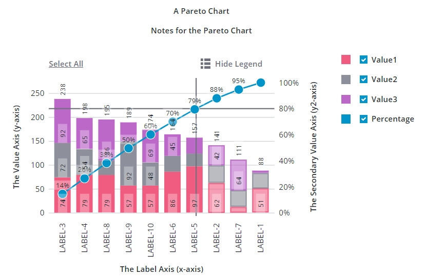

# ptcs-chart-pareto

## Visual

## Overview

`ptcs-chart-pareto` is a compound component for visualizing data as Pareto charts.

The Pareto chart is a specialized chart that combines a Bar Chart and a Line Chart. The bars show data for separate categories on the X-axis that you want to measure. Categories are sorted according to a descending order and their values are displayed on the primary axis as bars. The secondary axis displays a single line that measures the cumulative percentage of each category on the primary axis.

You can use the Pareto chart to perform analysis on defects using the Pareto principle. The Pareto principle states that 80% of consequences are derived from 20% of the causes. By performing a Pareto analysis, you can solve 80% of the problems by addressing 20% of the causes. When the cumulative percentage line is placed on top of bars, you can identify which causes lead to most of the issues. This helps you prioritize issues with the most impact when trying to reduce the overall number of issues in a process, device, or resource.

You can add an optional threshold line to analyze the result. By default, the threshold line is set to 80%. You can set your own value based on the percentage of issues you are trying to solve. The line helps you identify and compare a target percentage value with the cumulative percentage line. You can also set the `emphasizeThresholdFactors` property to style categories that are under the defined threshold value.

For example, you can use the Pareto chart to measure the failure causes of hard drives in a data center. The X-axis lists different reasons for failures. The frequency of each failure cause is measured as bars using the primary axis. You can order failure causes from the highest frequency to the lowest. The secondary axis shows the percentage value of each failure cause out of the total. The threshold line highlights the causes that form the most failures, based on the threshold line value. You can isolate the failures with the highest impact and address them to reduce the overall number of defects significantly.

Similar to other chart components, the Pareto chart also has areas for a title, notes, legend, action bar, an x-axis, and a y-axis.

## Usage Examples

### Basic Usage

`<ptcs-chart-pareto data="[[pareto-chart-data]]"></ptcs-chart-pareto>
`

## Component API

### Properties
| Property | Type | Description | Default |
|----------|------|-------------|---------|
|thresholdValue|Number|The percentage value of the threshold value for the Pareto analysis.|85|
|thresholdLine|String|The orientation of the threshold line ('horizontal', 'vertical', 'both', or 'none')|'none'|
|emphasizeThresholdFactors|Boolean|Applies a different style to the categories that are outside the defined threshold value.||
|hideCumulativePercentage|Boolean|Hides the cumulative percentage line||
|cumulativeLegend|String|Sets the legend text for the cumulative percentage line||
|titleLabel|String|The chart title||
|titlePos|String| Specifies the title position. Supported values: "top", "bottom", "left", or "right" | top|
|titleAlign|String|Specifies the title alignment. Supported values: "left", "center", or "right" | center |
|titleVariant|String|Title label variant||
|notesLabel|String|The notes text||
|hideNotes|Boolean|Hides the notes area|false|
|disabled|Boolean|Disables the Pareto chart|false|
|notesPos|String| Specifies the notes position. Supported values: "top", "bottom", "left", or "right" | bottom |
|notesAlign|String|Specifies the notes alignment. Supported values: "left", "center", or "right" | center |
|xAxisLabel|String|Specifies the X-axis label| |
|xAxisAlign|String|Specifies the alignment of the X-axis label. Supported values: "left", "center", or "right" | center |
|hideXAxis|Boolean|Hides the X-axis| false |
|yAxisLabel|String|Specifies the Y-axis label| |
|yAxisAlign|String|Specifies the alignment of the Y-axis label. Supported values: "left", "center", or "right" | center |
|hideYAxis|Boolean| Hide the y-axis?| false |
|NumberOfYLabels|Number| Set the number of labels on the Y-axis||
|hideLegend|Boolean|Hide the legend?| false |
|showLegendButton|Boolean|Show a button in the Action Bar area for toggling the legend visibility?| false |
|legend|Array|Array of strings that specifies the legend names|
|legendPos|String| Specifies the legend position. Supported values: "top", "bottom", "left", or "right" | "right" |
|legendAlign|String|Specifies the alignment of the legend. Supported values: "start", "center", or "end" | start |
|legendShape| String | Specifies the shape of the legend. Supported values: "square", "circle", "none" | square|
|filterLegend|Boolean|When enabled, each legend item has a check box that allows a user to hide or show the related data series.|false|
|sparkView|Boolean|Displays chart preview by hiding certain parts e.g. legend  |false|
|flipAxes|Boolean|Flips the positions of the x- and y-axes|false|
|flipXAxis|Boolean|Flips the order of values on the x-axis|false|
|flipYAxis|Boolean|Flips the order of values on the y-axis|false|
|outerPadding|Number|Sets padding, in percentage of bar width, before and after each bar on the chart|0|
|innerPadding|Number|Sets padding, in percentage of bar width, between bars that belong to different groups|0|
|showXRulers|Boolean|Shows guide lines that are aligned with each tick marker on the x-axis|false|
|showYRulers|Boolean|Shows guide lines that are aligned with each tick marker on the y-axis|false|
|yAxisRulerAlignment|String|Aligns the Y-axis guidelines with the tick markers of the primary or secondary y-axis.|primary|
|frontRulers|Boolean|Moves ruler lines to the front of the bars|false|
|reverseXAxis|Boolean|Reverse the order of the x-axis|false|
|reverseYAxis|Boolean|Reverse the order of the y-axis|false|
|specXMin|String|Specifies the start label of the x-axis||
|specXMax|String|Specifies the end label of the y-axis||
|specYMin|"baseline" or "auto" or Number|Specifies the start value of the Y-axis. Select "baseline" to start from zero when the minimum value in the data is not negative. Select "auto" to use the minimum value of the data and subtract 20% of the full range of the data. Enter a number to start at specified number.|baseline|
|specYMax|"auto" or Number|Specifies the end value of the y-axis. See specYMin for details| auto |
|noXZoom|Boolean|Disable X-axis zooming||
|xZoomStart|Object|The start position for the X-axis viewport|undefined|
|xZoomEnd|Object|The end position for the X-axis viewport|undefined|
|xZoomRange|Boolean|Show zoom range UI control|false|
|xZoomRangeStartLabel|String|Label for the X-axis range dropdown START (FROM) value||
|xZoomRangeEndLabel|String|Label for the X-axis range dropdown END (TO) value||
|xZoomInterval|Object|Specify zoom interval|null|
|xZoomIntervalLabel|String|Label for zoom interval control|undefined|
|xZoomIntervalControl|String|Specifies the type of UI used to control the X-axis zoom. Allowed values: "dropdown", radio, or "textfield"|undefined|
|xZoomIntervalOrigin|String|Sets the anchor point for the X-axis zoom interval: "start" or "end"| undefined |
|xShowIntervalAnchor|Boolean|Allow interval control to manipulate origin?|false|
|xZoomSlider|Boolean|Shows X-axis zoom slider|false|
|xZoomSliderLabel|String|Sets the label the X-axis zoom slider.||
|xZoomSliderMaxLabel|String|Sets the maximum label of the X-axis zoom slider||
|xZoomSliderMinLabel|String|Sets the minimum label of the X-axis zoom slider||
|xZoomSelect|Boolean|Enables X-axis zoom by selecting two elements on the chart||
|xZoomDrag|Boolean|Enables X-axis zoom by clicking and dragging the pointer||
|noYZoom|Boolean|Disables zoom on the y-axis|false|
|yZoomStart|Object|The start position for the Y-axis viewport|undefined|
|yZoomEnd|Object|The end position for the y-label axis viewport|undefined|
|yZoomRange|Boolean|Shows UI elements that enable you to specify a range of values to zoom to.|false|
|yZoomInterval|Object|Specifies the zoom interval|null|
|yZoomIntervalLabel|String|Sets the label for the Y-axis zoom interval control|undefined|
|yZoomIntervalControl|String|Specifies the type of UI used to control Y-axis interval zoom. Allowed values: "dropdown", "radio", or "textfield"|undefined|
|yZoomIntervalOrigin|String|Sets the anchor point for the Y-axis zoom interval to "start" or "end"| undefined |
|yShowIntervalAnchor|Boolean|Displays UI control for re-assigning the Y-axis interval anchor|false|
|yZoomSlider|Boolean|Shows a slider that enables you to zoom on the y-axis|false|
|yZoomSliderLabel|String|Y-Axis Zoom Slider Label||
|yZoomSliderMaxLabel|String|Sets the label for the maximum range of the Y-axis zoom slider||
|yZoomSliderMinLabel|String|Sets the label for the minimum range of the Y-axis zoom slider||
|yZoomSelect|Boolean|Enables zoom on the Y-axis by selecting two data points||
|yZoomDrag|Boolean|Enables zoom on the Y-axis by clicking and dragging the pointer on the chart to select a range||
|resetLabel|String|Sets the localization string for the zoom reset button||
|xZoomIntervalFromLabel|String|Sets the localization string for the horizontal zoom 'From' button||
|xZoomIntervalToLabel|String|Sets the localization string for the horizontal zoom 'To' button||
|yZoomIntervalFromLabel|String|Sets the localization string for the vertical zoom 'From' button||
|yZoomIntervalToLabel|String|Sets the localization string for the vertical zoom 'From' button||
|legendMaxWidth|Number|Sets the maximum width of each legend label||
|verticalAxisMaxWidth|Number|Sets the maximum width of the vertical axis||
|horizontalAxisMaxHeight|Number|Sets the maximum height of the horizontal axis||
|horizontalTicksRotation|Number|Sets the rotation of horizontal axis ticks in degrees. The allowed range is: -180 to 180. If this property is not specified, horizontal axis ticks auto-rotates 90 degrees if they collide when not rotated. ||
|data|Array|The chart data||
|showValues|String|Controls the position of bar value labels. Supported values: 'inside', 'outside', or 'inside-end'|inside|
|hideValues|Boolean|Hide all values (bar values and marker values)|false|
|stackOrder|String|Controls the data stacking order: 'auto', 'reverse', 'appearance', 'ascending', 'descending', or 'insideout'||
|curve|String|Curve "type" for the cumulative line ('linear', 'basis', 'bundle', 'cardinal', 'catmull-rom', 'monotone-x', 'monotone-y', 'natural', 'step'|linear|
|bundleBeta|Number|Only used when curve === bundle||
|cardinalTension|Number|Only used when curve === cardinal||
|catmullRomAlpha|Number|Only used when curve === catmull-rom||
|stepPosition|String|'center', 'before', or 'after' (Only used when curve === step)||
|hideMarkers|Boolean|Hide the markers on the cumulative percentage line|false|
|marker|String|Marker shape to use on the cumulative percentage line ('none', 'square', 'circle', 'triangle', 'plus', or 'cross')||
|markerSize|String|Size of the cumulative percentage line markers ('small', 'medium', 'large', 'xlarge', or <number>)||
|showMarkerValues|String|Defines how the marker values are displayed ('no', 'above', 'on', or 'below')||
|hideZeroRuler|Boolean|Hide the zero ruler?|false|
|yAxisNumberFormatSpecifier|String|Sets the number format (e.g. '0.00') to use for the y-axis||
|showY2Axis|Boolean|Displays the secondary y-axis|false|
|reverseY2Axis|Boolean|Reverse the order of values on the secondary y-axis|false|
|specY2Min|String|Specifies the start value of the Y-axis. See specYMin for details|auto|
|specY2Max|String|Specifies the end value of the Y-axis. See specYMin for details|auto|
|y2AxisLabel|String|Specifies the secondary Y-axis label||
|y2AxisAlign|String|Specifies the alignment of the secondary Y-axis label. Supported values: "left", "center", or "right"|center|
|y2AxisNumberFormatSpecifier|String|Sets the number format (e.g. '0.00') to use for the secondary y-axis||
|selectionMode|String|Set selection mode: `"none"` (default) - no bars can be selected. `"single"` - one bar can be selected. `"multiple"` - any number of bars can be selected. The `"multiple"` option displays a link in the Action Bar area for selecting / un-selecting all bars.|"none"|
|unselectable|Array|Array of indices of data points that cannot be selected. Example: if unselectable = `[3]`, no bars of `data[3]` can be selected, regardless of the current `selectionMode`.|undefined|
|tooltipTemplate|String|Custom tooltip to display when a bar on the chart is selected. You can show a title, text, data values, and create new lines. Use the following syntax: Add #title# before a string to show a title, #newline# to create a new line, ${<token_name>} to display data from available pareto chart tokens for bars: ${label}, ${total}, ${series}, ${value}, ${perc}, ${percCum}}.||
|tooltipTemplate2|String|Custom tooltip to display when a marker on the chart is selected. You can show a title, text, data values, and create new lines. Use the following syntax: Add #title# before a string to show a title, #newline# to create a new line, ${<token_name>} to display data from available pareto chart tokens for markers: ${label}, ${total}, ${perc}, ${percCum}}.||

### Events

| Name | Data | Description |
|------|------|-------------|
| series-click | (serieIx, valueIx, x, y)| Bar data |
| zoom-selection |  `detail:   {x: left, y: top, w: right - left, h: bottom - top}` | Selected area |
| chart-selection | selection | Chart selection |

## Styling

### The Parts of a Pareto Chart

The `ptcs-chart-pareto` consists of the following subcomponents:

- `ptcs-chart-layout`, for chart layouts
- `ptcs-chart-legend`, for chart legend
- `ptcs-chart-coord`, for combining a chart with a coordinate system (adds axes and rulers)
- `ptcs-chart-axis`, for chart axes
- `ptcs-chart-core-pareto`, for the pareto chart core implementation
- `ptcs-chart-zoom`, for chart zoom controls
- `ptcs-toolbar`, for the `Select All` / `Clear All` link, the `Show Legend` / `Hide Legend` button to toggle legend visibility and the `Reset` button to reset the zooming.

### Parts

| Part | Description |
|-----------|-------------|
|chart-layout|The ptcs-chart-layout subcomponent|
|title-area|The chart title area container|
|title-label|The chart title|
|notes-area|The chart notes area container|
|notes-label|The chart notes title|
|chart|The ptcs-chart-coord subcomponent|
|core-chart|The ptcs-chart-core-pareto subcomponent|
|legend-area|The legend area container|
|legend|The ptcs-chart-legend subcomponent|
|zoom-xaxis|The ptcs-chart-zoom subcomponent for x-axis|
|xaxis|The ptcs-chart-axis subcomponent for x-axis|
|zoom-yaxis|The ptcs-chart-zoom subcomponent for y-axis|
|yaxis|The ptcs-chart-axis subcomponent for y-axis|
|yaxis2|The ptcs-chart-axis subcomponent for secondary y-axis|
|action-bar-area|The action bar area container|
|action-bar|The ptcs-toolbar subcomponent|

The `title-label` and `notes-label` get assigned as maximum width the width of their parents (`title-area` and `notes-area`, 
respectively).