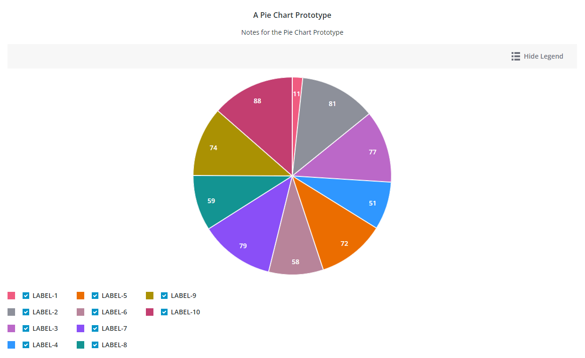

# ptcs-chart-pie
## Visual

## Overview

`ptcs-chart-pie` is a compound component that enables you to visualize data as a pie or a donut chart. In addition to the pie chart area, the component has areas for a title, notes, legend, and an action bar area that contains controls for the legend visiblity, zoom, and selecting all slices when multiple selection is enabled.

## Usage Examples

### Basic Usage

`<ptcs-chart-pie items="[[pie-chart-data]]"></ptcs-chart-pie>
`

## Component API

### Properties
| Property | Type | Description | Default |
|----------|------|-------------|---------|
|titleLabel|String|The chart title|
|titlePos|String| Specifies the title position. Supported values: "top", "bottom", "left", or "right" | top|
|titleAlign|String|Specifies the title alignment. Supported values: "left", "center", or "right" | center |
|titleVariant|String|The `variant` assigned to the title `ptcs-label`| `header`|
|notesLabel|String|The notes text|
|hideNotes|Boolean|Hide the notes?| false |
|notesPos|String| Specifies the notes position. Supported values: "top", "bottom", "left", or "right" | bottom |
|notesAlign|String|Specifies the notes alignment. Supported values: "left", "center", or "right" | center |
|chartState|String|Specifies the chart 'error' state. Supported values: `data`, `loading`, `no-data` or `error` | `data` |
|iconStateLoading|String|Specifies the icon to display when the chart data is loading ||
|labelStateNoData|String|Specifies the text to display when the chart is not bound to a data source ||
|iconStateNoData|String|Specifies the icon to display when the chart is not bound to a data source ||
|labelStateEmpty|String|Specifies the text to display when the bound infotable does not contain any data ||
|iconStateEmpty|String|Specifies the icon to display when the chart is empty ||
|labelStateError|String|Specifies the text to display when the chart data cannot be loaded ||
|iconStateError|String|Specifies the icon to display when the chart data cannot be loaded ||
|hideLegend|Boolean|Hide the chart legends area| false |
|legendPos|String| Specifies the legend position. Supported values: "top", "bottom", "left", or "right" | "right" |
|legendAlign|String|Specifies the alignment of the legend. Supported values: "start", "center", or "end" | start |
|legendShape| String | Specifies the shape of the legend. Supported values: "square", "circle", "none" | square|
|filterLegend|Boolean|If true, each legend item has a checkbox that allows the user to hide or show the corresponding data|false|
|actionBar|String|Specifies the action bar position. Supported values: "top", "bottom" | top |
|sparkView|Boolean|Displays chart preview by hiding certain parts e.g. legend  |false|
|legendMaxWidth|Number|Sets the maximum width of each legend label||
|selectionMode|String|Set selection mode: `"none"` (default) - no slices can be selected. `"single"` - one slice can be selected. `"multiple"` - any number of slices can be selected. The `"multiple"` option displays a link in the Action bar area for selecting / un-selecting all slices. |"none"|
|donut|Number|Sets the size of the hole in the center of the pie chart. Use this property to display a Donut chart. Supported values are between 0 and 0.99 ||
|polar|Boolean|Uses the radius to visualize the difference between values. Each category is displayed at an equal angle | false |
|padAngle|Number|Sets the size of the padding between the Pie chart slices ||
|startAngle|Number|Sets the start angle for the chart ||
|endAngle|Number|Sets the end angle for the chart ||
|cornerRadius|Number|Specifies the corner radius for the chart slices ||
|highlightSelection|Boolean|When enabled, the selected slices are pushed out and offset from the main chart | false |
|showValues|String| Shows the value of each slice. Supported values: "none", "inside", "outside"|inside|
|valuePos|String|Sets the position of the data labels relative to the slices. Supported values: `marker`, `in`, `out` or `out with line` | `marker` |
|percentLabel|Boolean|Converts and displays the data values as percentages | false |
|insideLabelShowHide|Boolean|Shows a data label next to a donut chart slice when it is in a selected, hover, or focus state | false |
|singleInsideValueLabel|String|The `variant` assigned to the Inside Value Label `ptcs-label`| `header`|
|data|Array|The chart data||
|tooltipTemplate|String|Custom tooltip to display when a data point on the chart is selected. You can show a title, text, data values, and create new lines. Use the following syntax: Add #title# before a string to show a title, #newline# to create a new line, ${<token_name>} to display data from available pie chart tokens: ${label}, ${value}).||
|disabled|Boolean|Is the pie chart disabled?||

### Events

| Name | Data | Description |
|------|------|-------------|
| series-click | no data||
| selected-data-changed | selection | Chart selection |

## Styling

### The Parts of a Pie Chart

A `ptcs-chart-pie` consist of these sub-components:

- `ptcs-chart-layout`, for chart layouts
- `ptcs-chart-legend`, for chart legend
- `ptcs-chart-core-pie`, for the pie charts
- `ptcs-toolbar`, for the `Select All` / `Clear All` link, the `Show Legend` / `Hide Legend` button to toggle legend visibility.

### Parts

| Part | Description |
|-----------|-------------|
|chart-layout|The ptcs-chart-layout subcomponent|
|title-area|The chart title area container|
|title-label|The chart title|
|notes-area|The chart notes area container|
|notes-label|The chart notes title|
|core-chart|The ptcs-chart-core-pie subcomponent|
|legend-area|The legend area container|
|legend|The ptcs-chart-legend subcomponent|
|action-bar-area|The action bar area container|
|action-bar|The ptcs-toolbar subcomponent|

The `title-label` and `notes-label` are assigned the same maximum width as their parents (`title-area` and `notes-area`).

### State attributes

| Attribute | Description | Part |
|-----------|-------------|------|
| disabled | Is the Pie Chart disabled? |`:host` |

