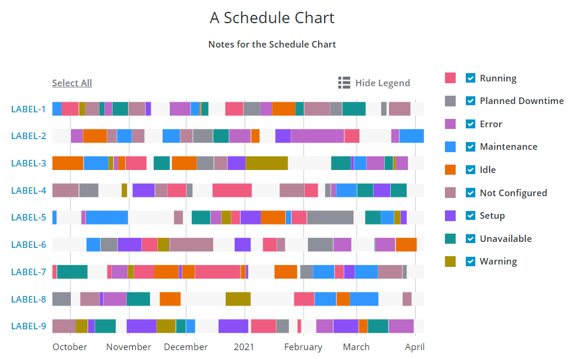

# ptcs-chart-schedule

## Visual



## Overview

`ptcs-chart-schedule` is a compound component that enables you to visualize schedule data.

Schedule data consists of a collection of objects with associated schedule items. A schedule object is represented using a unique name. Each schedule item has the following properties:

|name|description|
|----|-----------|
|`reason`|the reason for the item (e.g. 'Maintenance', 'Running', ... )|
|`info`|optional info, to be displayed in the items tooltip|
|`start`|the start time of the item (a JavaScript `Date`)|
|`start`|the end time of the item (a JavaScript `Date`)|
|`color`|an optional CSS color for explicitly controlling the color of the item|

The syntax for the schedule data is therefore:

~~~
data ::= [
    object,
    [
        item+  // Any number of items here
    ]
]

object ::= <string>

item ::= {
    reason: <string>,
    info:   <string>?,
    start:  <Date>
    end:    <Date>
    color:  <CSS color, e.g. 'red' or '#8030F7'>?
}
~~~

Except for the schedule chart itself, `ptcs-chart-schedule` also has areas for:
- a title
- notes
- a legend
- zooming controls
- an x-axis
- a y-axis

The `reason` in the schedule item tries to connect to the legend. If the legend has an entry with the same name, it will associate the schedule item with the legend color and will also allow the end user to toggle the visibility of the item.

## Usage Examples

### Basic Usage

```html
<ptcs-chart-schedule
    data=[[schedule-data]]
    legend=[[legend-data]]></ptcs-chart-schedule>
```

## Component API

### Properties
| Property | Type | Description | Default |
|----------|------|-------------|---------|
|dateFormatToken|String|Overrides the format of the displayed date of the tick label on the Time axis. See the [Available formats](https://momentjs.com/docs/#/displaying/format/).| |
|titleLabel|String|The chart title|
|titlePos|String| Specifies the title position. Supported values: "top", "bottom", "left", or "right" | top|
|titleAlign|String|Specifies the title alignment. Supported values: "left", "center", or "right" | center |
|titleVariant|String|The `variant` assigned to the title `ptcs-label`|See `ptcs-label`|
|notesLabel|String|The notes text|
|notesPos|String| Specifies the notes position. Supported values: "top", "bottom", "left", or "right" | bottom |
|notesAlign|String|Specifies the notes alignment. Supported values: "left", "center", or "right" | center |
|xAxisLabel|String|Specifies the label of the label axis| |
|xAxisAlign|String|Specifies the alignment of the label of the label axis. Supported values: "left", "center", or "right" | center |
|hideXAxis|Boolean|Hides the label axis| false |
|yAxisLabel|String|Specifies the timeline axis label| |
|yAxisAlign|String|Specifies the alignment of the timeline axis label. Supported values: "left", "center", or "right" | center |
|hideYAxis|Boolean|Hides the timeline axis| false |
|NumberOfYLabels|Number| Set the number of labels on the Y-axis||
|referenceLines|Array|An array of items with properties `label` and `value` for threshold lines on the timeline axis|
|hideLegend|Boolean|Hides the legend area| false |
|showLegendButton|Boolean|Show a button in the Action Bar area for toggling the legend visibility?| false |
|legend|Array|Array of strings that specifies the legend names|
|legendPos|String| Specifies the legend position. Supported values: "top", "bottom", "left", or "right" | "right" |
|legendAlign|String|Specifies the alignment of the legend. Supported values: "start", "center", or "end" | start |
|legendShape| String | Specifies the shape of the legend. Supported values: "square", "circle", "none" | square|
|filterLegend|Boolean|If true, each legend item has a checkbox that allows the user to hide or show the corresponding data|false|
|flipAxes|Boolean|Flip the label and timeline axes|false|
|flipXAxis|Boolean|Flip the label axis to the other side of the chart|false|
|flipYAxis|Boolean|Flip the timeline axis to the other side of the chart|false|
|showXRulers|Boolean|Show rulers that corresponds to the ticks of the label axis|false|
|showYRulers|Boolean|Show rulers that corresponds to the ticks of the timeline axis|false|
|frontRulers|Boolean|Draw rulers on top of the schedule chart|false|
|reverseXAxis|Boolean|Reverse the order of the label axis|false|
|reverseYAxis|Boolean|Reverse the order of the timeline axis|false|
|data|Array|The chart data. See above for details.||
|sparkView|Boolean|Displays chart preview by hiding certain parts e.g. legend  |false|
|noXZoom|Boolean|Disable zooming on the timeline axis|false|
|xZoomStart|Date|The start date for the timeline viewport|undefined|
|xZoomEnd|Date|The end date for the timeline viewport|undefined|
|xZoomRange|Boolean|Display a zoom control for selecting the timeline range with date pickers|false|
|xZoomInterval|Array or String|Interval(s) for the interval control. See below|null|
|xZoomIntervalLabel|String|Label for zoom interval control|undefined|
|xZoomIntervalControl|String|Selects UI control for the timeline interval zoom control. Allowed values: "dropdown" or "textfield"|undefined|
|xZoomIntervalOrigin|String|Anchor point for the timeline interval: "start" or "end"| undefined |
|xShowIntervalAnchor|Boolean|Display UI control for re-assigning the timeline interval anchor|false|
|xZoomSlider|Boolean|Show zoom slider for timeline|false|
|noYZoom|Boolean|Disable zooming on the label axis|false|
|yZoomStart|String|The start label for the label axis viewport|undefined|
|yZoomEnd|String|The end label for the label axis viewport|undefined|
|yZoomRange|Boolean|Display a zoom control for selecting the zoom range on the label axis with dropdowns|false|
|yZoomInterval|Array or String|Interval(s) for the label interval control. See below|null|
|yZoomIntervalLabel|String|Label for the label zoom interval control|undefined|
|yZoomIntervalControl|String|Selects UI control for the label interval zoom control. Allowed values: "dropdown" or "textfield"|undefined|
|yZoomIntervalOrigin|String|Anchor point for the label zoom interval: "start" or "end"| undefined |
|yShowIntervalAnchor|Boolean|Display UI control for re-assigning the label interval anchor|false|
|yZoomSlider|Boolean|Show zoom slider for label axis|false|
|zoomDrag|String|Allow zooming by dragging the mouse over the chart. Supported values: 'x' (only zoom the label axis), 'y' (only zoom the timeline axis), or 'xy' (zoom both axes)|undefined|
|zoomSelect|String|Allow zooming by selecting two chart entries with the mouse or keyboard. Supported values: 'x' (only zoom the label axis), 'y' (only zoom the timeline axis), or 'xy' (zoom both axes)|undefined|
|showY2Axis|Boolean|Show the Secondary time axis|false|
|y2AxisLabel|String|Specifies the Secondary time axis label| |
|y2AxisAlign|String|Specifies the alignment of the Secondary time axis label. Supported values: "left", "center", or "right"|left|
|y2AxisDateFormatToken|String|Overrides the format of the displayed date of the tick label for the secondary time axis. See the [Available formats](https://momentjs.com/docs/#/displaying/format/).| |
|horizontalTicksRotation|Number|Sets the rotation of horizontal axis ticks in degrees. The allowed range is: -180 to 180. If this property is not specified, horizontal axis ticks auto-rotates 90 degrees if they collide when not rotated. ||
|selectionMode|String|Set selection mode: `"none"` (default) - no items can be selected. `"single"` - one item can be selected. `"multiple"` - any number of items can be selected. The `"multiple"` option displays a link in the Action Bar area for selecting / un-selecting all items. |"none"|
|tooltipTemplate|String|Custom tooltip to display when a task on the chart is selected. You can show a title, text, data values, and create new lines. Use the following syntax: Add #title# before a string to show a title, #newline# to create a new line, ${<token_name>} to display data from available shcedule chart tokens: ${reason}, ${start]], ${end}, ${duration}.||

#### The Zoom Interval Control

A zoom interval control uses the following properties:

- control, specifies the UI control ("dropdown" or "textfield")
- interval, specifies the interval(s)
- origin, specifies the interval anchor ("start" or "end")
- showAnchor, if true display a UI control for re-assigning the interval anchor

When `control`="textfield", the interval control displays a textfield where the end user can enter text. The `interval` property should be a string. The current zooming interval is the concatenation of the input in the textfield and the `interval` property.

When `control`="dropdown", the interval control displays a dropdown where the end user can select an option. The `interval` property should be an array of the available options. The current zooming interval is the duration that is associated with the selected option.

This is a sample array for a "dropdown" interval:

~~~js
[
    {label: 'A year',   duration: '1Y'}
    {label: '6 months', duration: '6M'}
    {label: '1 month',  duration: '1M'},
    {label: '5 days',   duration: '5d'}
]
~~~

When the interval type is "date" the generated interval should match the following syntax: `<number><unit>` (no whitespace between the number and unit)

The number can be any positive number, including an optional fraction.

The supported units are:

|Unit|Time|
|----|----|
|Y|Year|
|M|Month|
|W|Week|
|d|Day|
|h|Hour|
|m|Minute|
|s|Second|
|ms|Millisecond|

The zoom interval does not have a unit when the interval type is `number` or `label`.

### Events

| Name | Data | Description |
|------|------|-------------|
| series-click | Info about schedule item | Event generated when the user selects a schedule item |
| chart-selection | selection | Chart selection |


## Styling

### The Parts of a Schedule Chart

A `ptcs-chart-schedule` consist of these sub-components:

- `ptcs-chart-layout`, for chart layouts
- `ptcs-chart-legend`, for chart legend
- `ptcs-chart-zoom`, for the zoom controls
- `ptcs-chart-coord`, for combining a chart with a coordinate system (adds axes and rulers)
- `ptcs-chart-axis`, for chart axes
- `ptcs-chart-core-schedule`, for the core schedule chart functionality