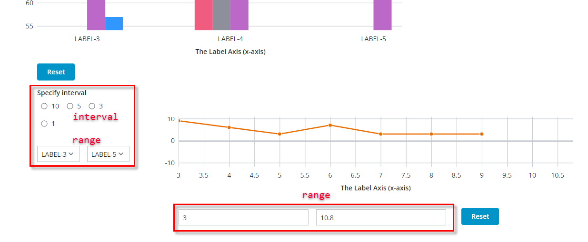
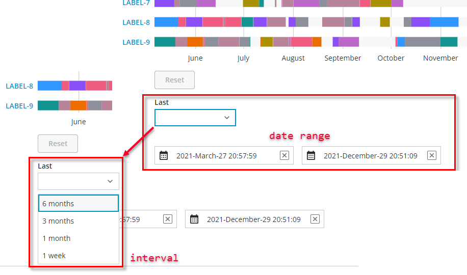

# ptcs-chart-zoom-input

## Visuals



Chart zoom input controls in the Bar Chart (`ptcs-chart-bar`) for selecting an _interval_ via radio buttons and a _range_ using dropdown, and textfields for selecting a _range_ in the Line Chart (`ptcs-chart-line`).




Chart zoom input controls for selecting an _interval_ via dropdown and a _range_ using datepickers in the Schedule Chart (`ptcs-chart-schedule`).

## Overview

`ptcs-chart-zoom-input` is a subcomponent used to add zoom input controls to charts. It is used by `ptcs-chart-zoom-interval` for selecting an _interval_ and by `ptcs-chart-zoom-range` for selecting a _range_. The input control uses one (or more) of:

- `ptcs-datepicker`, to select a date
- `ptcs-textfield`, to input a value
- `ptcs-radio`, to select a discrete value
- `ptcs-dropdown`, for selecting labels / an interval

This component can create subcomponents in the regular DOM (not in the shadow DOM) for direct styling access to content.

## Usage Example

```html
        <ptcs-chart-zoom-input part="pick" label="[[startLabel]]" part-names="[[_startPartNames]]"
                               enable-tabindex="[[_delegatedFocus]]"
                               disabled="[[disabled]]"
                               on-value-changed="_startChanged"
                               type="[[_type]]" value="[[_value(_anchorStart, anchor, minValue)]]"
                               hidden\$="[[_hideStart(origin, showAnchor)]]"></ptcs-chart-zoom-input>
```

## Component API

### Properties
| Property | Type | Description |
|----------|------|-------------|
|type|Object|number, date, or array (of labels) |
|value|Object|The input value|
|partNames|String|Sets attribute `part` name |
|formatToken|String|Used for date formatting only, sets same property in `ptcs-datepicker` |
|hintText|String|Use for dates only, sets same property in `ptcs-datepicker` (default: "Select Date & Time")|
|propName|String|Property on range subcontrol that contains value|
|enableTabIndex|String|Sets attribute `tabindex` on the input control|
|disabled|Boolean|Is the control disabled?|

## Styling

The attribute `part` value is assigned via property `partNames`.

### State attributes

| Attribute | Description | Part |
|-----------|-------------|------|
| type | 'number', 'date', or array of labels |`:host` |
