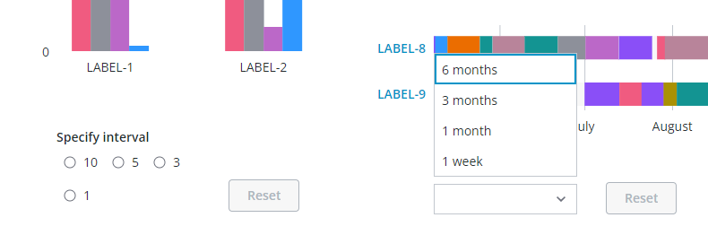

# ptcs-chart-zoom-interval

## Visual



Examples of the Chart zoom input controls for selecting an _interval_ in the Bar Chart (`ptcs-chart-bar`) via radio buttons and via a dropdown in the Schedule Chart (`ptcs-chart-schedule`). Zooming-in an interval enables the Zoom **Reset** button.

## Overview

`ptcs-chart-zoom-interval` is a subcomponent of `ptcs-chart-zoom`, used to add zoom interval input controls to charts. The component consists
 of a pair of `ptcs-chart-zoom-input` subcomponents to pick start / end of an interval, and a Zoom Reset button to restore the un-zoomed state.
 The _anchor point_ is either at the start or end of the interval, or an externally set anchor.

## Usage Examples

A zoom interval control uses the following properties:

- control, specifies the UI control
- interval, specifies the interval(s)
- origin, specifies the interval anchor ("start" or "end")
- showAnchor, if true displays a UI control for re-assigning the interval anchor

This is a sample array for a "dropdown" interval:

~~~js
[
    {label: 'A year',   duration: '1Y'}
    {label: '6 months', duration: '6M'}
    {label: '1 month',  duration: '1M'},
    {label: '5 days',   duration: '5d'}
]
~~~

When the interval type is "date" the generated interval should match the following syntax: `<number><unit>` (no whitespace between the number and unit)

The number can be any positive number, including an optional fraction.

The supported units are:

|Unit|Time|
|----|----|
|Y|Year|
|M|Month|
|W|Week|
|d|Day|
|h|Hour|
|m|Minute|
|s|Second|
|ms|Millisecond|

The zoom interval does not have a unit when the interval type is `number` or `label`.


### Basic Usage

```html
            <ptcs-chart-zoom-interval part="interval-picker"
                tabindex\$="[[_delegatedFocus]]"
                disabled="[[disabled]]"
                label="[[intervalLabel]]"
                control="[[intervalControl]]"
                origin="[[intervalOrigin]]"
                anchor="[[intervalAnchor]]"
                interval="[[interval]]"
                type="[[type]]"
                min-value="[[minValue]]"
                max-value="[[maxValue]]"
                zoom-start="{{zoomStart}}"
                zoom-end="{{zoomEnd}}"
                hide-reset="[[_or(_showRange, slider)]]"
                no-reset="{{_noResetInterval}}"
                enable-reset="[[enableReset]]"
                reset-label="[[resetLabel]]"
                start-label="[[intervalFromLabel]]"
                end-label="[[intervalToLabel]]"
                show-anchor="[[showIntervalAnchor]]"></ptcs-chart-zoom-interval>
```


## Component API

### Properties
| Property | Type | Description |
|----------|------|-------------|
|label|String|The label for the zoom interval control |
|control|String|The control type (dropdown, radio, or textfield)|
|interval|Object|Interval(s) for the interval control|
|origin|Object|Anchor point for the zoom interval ('start' or 'end')  |
|anchor|Object|Externally specified anchor|
|value|Number|Specified interval|
|minValue|Object|Minimum value in data |
|maxValue|Object|Maximum value in data |
|zoomStart|Object|Start of the zoom interval |
|zoomEnd|Object|End of the zoom interval |
|showAnchor|Boolean|Display UI control for re-assigning the interval anchor?|
|hideReset|Boolean|Hide Zoom Reset button?|
|noReset|Boolean|Assigned if it is not possible to show the Zoom Reset button (when the button is not visible)|
|enableReset|Boolean|Zoom Reset button should be enabled (regardless of current zoom state)|
|startLabel|String|The label for the interval start|
|endLabel|String|The label for the interval end|
|resetLabel|String|The label for the Zoom Reset button|
|disabled|Boolean|Is the control disabled?|

## Styling

### Parts

| Part | Description |
|-----------|-------------|
|pick|Start or end picker control|
|reset|The Zoom Reset button|

### State attributes

| Attribute | Description | Part |
|-----------|-------------|------|
| control | 'dropdown', 'radio', or 'textfield' |`:host` |
