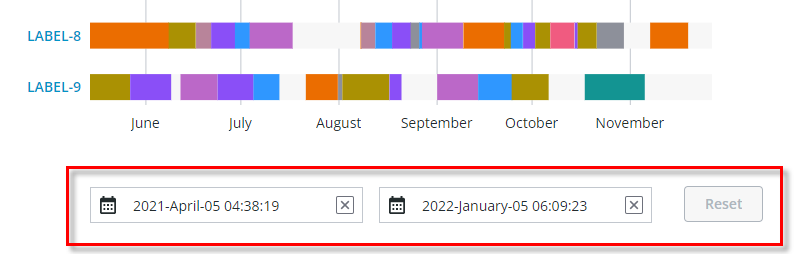

# ptcs-chart-zoom-range

## Visual



Example of the zoom input controls for selecting a _range_ in the Schedule Chart (`ptcs-chart-schedule`) via date pickers. Zooming-in a range enables the Zoom **Reset** button.

## Overview

`ptcs-chart-zoom-range` is a subcomponent of `ptcs-chart-zoom`, used to add zoom range input controls to charts. The component consists of a
pair of `ptcs-chart-zoom-input` subcomponents to pick start / end of the range, and a Zoom Reset button to restore the un-zoomed state.

## Usage Example

```html
            <ptcs-chart-zoom-range part="range-picker"
                disabled="[[disabled]]"
                type="[[type]]"
                min-value="[[minValue]]"
                max-value="[[maxValue]]"
                zoom-start="{{zoomStart}}"
                zoom-end="{{zoomEnd}}"
                hide-reset="[[...]]"
                no-reset="{{_noResetRange}}"
                enable-reset="[[enableReset]]"
                reset-label="[[resetLabel]]"
                start-label="[[rangeStartLabel]]"
                end-label="[[rangeEndLabel]]"
                hint-text="[[dateRangeHintText]]"></ptcs-chart-zoom-range>
```


## Component API

### Properties
| Property | Type | Description |
|----------|------|-------------|
|type|Object| 'number', 'date', Array of labels |
|minValue|Object|Minimum value in data |
|maxValue|Object|Maximum value in data |
|zoomStart|Object|Start of the zoom range |
|zoomEnd|Object|End of the zoom range |
|hideReset|Boolean|Hide Zoom Reset button?|
|noReset|Boolean|Assigned if it is not possible to show the Zoom Reset button (when the button is not visible)|
|enableReset|Boolean|Zoom Reset button should be enabled (regardless of current zoom state)|
|startLabel|String|The label for the interval start|
|endLabel|String|The label for the interval end|
|resetLabel|String|The label for the Zoom Reset button|
|disabled|Boolean|Is the control disabled?|
|hintText|String|Hint text for date range|


## Styling

### Parts

| Part | Description |
|-----------|-------------|
|pick|Start or end range picker control|
|reset|The Zoom Reset button|

### State attributes

No state attributes.