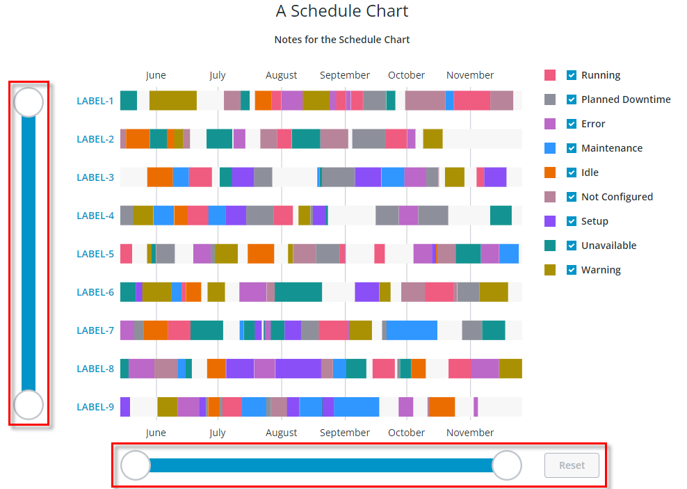

# ptcs-chart-zoom-slider

## Visual



Example of the zoom slider input controls the Schedule Chart (`ptcs-chart-schedule`). Zooming-in enables the Zoom **Reset** button.

## Overview

`ptcs-chart-zoom-slider` is a subcomponent of `ptcs-chart-zoom`, used to add zoom slider input controls to charts. The slider adjusts the
start / end of the zoomed range, with a Zoom Reset button to restore the un-zoomed state.

## Usage Example

```html
            <ptcs-chart-zoom-slider part="slider"
                tabindex\$="[[_delegatedFocus]]"
                disabled="[[disabled]]"
                side="[[side]]"
                type="[[type]]"
                min-value="[[minValue]]"
                max-value="[[maxValue]]"
                zoom-start="{{zoomStart}}"
                zoom-end="{{zoomEnd}}"
                label="[[sliderLabel]]"
                min-label="[[sliderMinLabel]]"
                max-label="[[sliderMaxLabel]]"
                hide-reset="[[_or(_showInterval, _showRange)]]"
                no-reset="{{_noResetSlider}}"
                enable-reset="[[enableReset]]"
                reset-label="[[resetLabel]]"
                show-axis="[[showSliderAxis]]"
                axis-length="[[axisLength]]"
                reverse-axis="[[reverseSlider]]"></ptcs-chart-zoom-slider>
```


## Component API

### Properties
| Property | Type | Description |
|----------|------|-------------|
|side|String|Location of the slider, in relation to the chart ('bottom' / 'top' / 'left' / 'right') |
|vertical|Boolean|Vertical slider?|
|type|Object| 'number', 'date', Array of labels |
|minValue|Object|Minimum value in data |
|maxValue|Object|Maximum value in data |
|zoomStart|Object|Start of the zoom range |
|zoomEnd|Object|End of the zoom range |
|reverseAxis|Boolean|Reverse the direction of the slider?|
|label|String|Slider label|
|minLabel|String|The label for the slider min value endpoint|
|maxLabel|String|The label for the slider max value endpoint|
|resetLabel|String|The label for the Zoom Reset button|
|showAxis|Boolean|Show the slider axis?|
|axisLength|String|Length of axis (or use full length of element)|
|hideReset|Boolean|Hide Zoom Reset button?|
|noReset|Boolean|Assigned if it is not possible to show the Zoom Reset button (when the button is not visible)|
|enableReset|Boolean|Zoom Reset button should be enabled (regardless of current zoom state)|
|disabled|Boolean|Is the control disabled?|


## Styling

### Parts

| Part | Description |
|-----------|-------------|
|slider-container|Container for the zoom slider controls|
|zoom-slider|Container for the slider and axis|
|ticks|The ticks container|
|slider|The slider|
|zoom-axis|The zoom slider axis|
|reset|The Zoom Reset button|

### State attributes

| Attribute | Description | Part |
|-----------|-------------|------|
| vertical | Vertical slider? |`:host` |
| reverse-axis | Reversed axis? |`:host` |