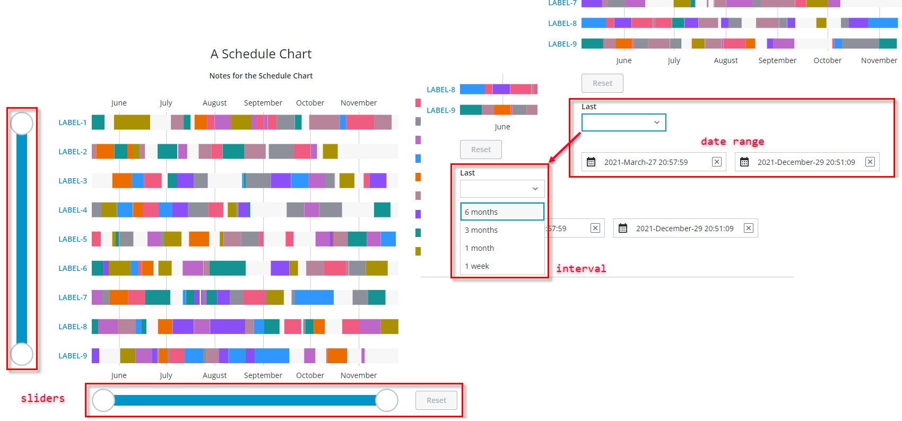

# ptcs-chart-zoom

## Visuals



Chart zoom input controls in the Schedule Chart (`ptcs-chart-schedule`) for selecting a date interval or date range, plus zooming via sliders.


## Overview

`ptcs-chart-zoom` is a chart subcomponent to add zoom input controls to charts. It uses multiple chart subcomponents to support _range_, _interval_, and _slider_ zoom controls:

- `ptcs-chart-zoom-input`
- `ptcs-chart-zoom-interval`
- `ptcs-chart-zoom-range`
- `ptcs-chart-zoom-slider`


## Usage Examples

You would typically use two `ptcs-chart-zoom` (one for each axis).

```html
            <ptcs-chart-zoom slot="xzoom" id="zoomX" part="zoom-xaxis" type="[[labels]]" hidden\$="[[noXZoom]]"
                tabindex\$="[[_delegatedFocus]]"
                disabled="[[disabled]]"
                side="[[_xSide(flipXAxis, flipAxes)]]"
                min-value="[[_xMin]]"
                max-value="[[_xMax]]"
                zoom-start="{{xZoomStart}}"
                zoom-end="{{xZoomEnd}}"
                enable-reset="[[_yEnabled(_yMin, _yMax, yZoomStart, yZoomEnd)]]"
                axis-length="[[_xSize(_graphWidth, _graphHeight, flipAxes)]]"
                active="[[_or(_zoomActive, yZoomSlider)]]"
                range-picker="[[xZoomRange]]"
                interval="[[xZoomInterval]]"
                interval-label="[[xZoomIntervalLabel]]"
                interval-control="[[xZoomIntervalControl]]"
                interval-origin="[[xZoomIntervalOrigin]]"
                show-interval-anchor="[[xShowIntervalAnchor]]"
                slider="[[xZoomSlider]]"
                slider-label="[[xZoomSliderLabel]]"
                slider-min-label="[[xZoomSliderMinLabel]]"
                slider-max-label="[[xZoomSliderMaxLabel]]"
                range-start-label="[[xZoomRangeStartLabel]]"
                range-end-label="[[xZoomRangeEndLabel]]"
                reverse-slider="[[!reverseXAxis]]"
                reset-label="[[resetLabel]]"
                interval-from-label="[[xZoomIntervalFromLabel]]"
                interval-to-label="[[xZoomIntervalToLabel]]"></ptcs-chart-zoom>
           <ptcs-chart-zoom slot="yzoom" id="zoomY" part="zoom-yaxis" type="date" hidden\$="[[noYZoom]]"
                tabindex\$="[[_delegatedFocus]]"
                disabled="[[disabled]]"
                side="[[_ySide(flipYAxis, flipAxes)]]"
                enable-reset="[[_enabled(labels, _xMin, _xMax, xZoomStart, xZoomEnd)]]"
                axis-length="[[_ySize(_graphWidth, _graphHeight, flipAxes)]]"
                active="[[_or(_zoomActive, xZoomSlider)]]"
                min-value="[[_yZoomMin(_yMin, _yMax, specYMin, specYMax)]]"
                max-value="[[_yZoomMax(_yMin, _yMax, specYMax, specYMin)]]"
                zoom-start="{{yZoomStart}}"
                zoom-end="{{yZoomEnd}}"
                range-picker="[[yZoomRange]]"
                range-start-label="[[yZoomRangeStartLabel]]"
                range-end-label="[[yZoomRangeEndLabel]]"
                interval="[[yZoomInterval]]"
                interval-label="[[yZoomIntervalLabel]]"
                interval-control="[[yZoomIntervalControl]]"
                interval-origin="[[yZoomIntervalOrigin]]"
                show-interval-anchor="[[yShowIntervalAnchor]]"
                slider="[[yZoomSlider]]"
                slider-label="[[yZoomSliderLabel]]"
                slider-min-label="[[yZoomSliderMinLabel]]"
                slider-max-label="[[yZoomSliderMaxLabel]]"
                reverse-slider="[[reverseYAxis]]"
                reset-label="[[resetLabel]]"
                interval-from-label="[[yZoomIntervalFromLabel]]"
                interval-to-label="[[yZoomIntervalToLabel]]"
                date-range-hint-text="[[dateRangeHintText]]"></ptcs-chart-zoom>
```

## Component API

### Properties
| Property | Type | Description |
|----------|------|-------------|
|side|String|Location of the slider, in relation to the chart ('bottom' / 'top' / 'left' / 'right') |
|active|Boolean|Make zoom controls active, even if no controls are visible (at least the reset button will be visible)
|enableReset|Boolean|Enable the Zoom Reset button?|
|interval|Object|Specify interval|
|rangePicker|Boolean|Show the zoom range picker?|
|slider|Boolean|Show the zoom slider?|
|showSliderAxis|Boolean|Show the zoom slider axis?|
|type|Object|number, date, or array (of labels) |
|minValue|Object|Minimum zoom value|
|maxValue|Object|Maximum zoom value|
|zoomStart|Object|Zoom start|
|zoomEnd|Object|Zoom end|
|intervalLabel|String|Label for the interval picker|
|sliderLabel|String|Label for the zoom slider|
|sliderMaxLabel|String|Label for the zoom slider maximum value endpoint|
|sliderMinLabel|String|Label for the zoom slider minimum value endpoint|
|resetLabel|String|Label for the Zoom Reset button|
|rangeEndLabel|String|Label for the range end drop-down|
|rangeStartLabel|String|Label for the range start drop-down|
|intervalFromLabel|String|Label for interval start|
|intervalToLabel|String|Label for interval end|
|intervalControl|Object|'radio' / 'dropdown' / 'textfield'|
|intervalOrigin|String|'start' or 'end'|
|intervalAnchor|Object|Interval anchor|
|showIntervalAnchor|Boolean|Show start interval anchor?|
|reverseSlider|Boolean|Reverse the direction of the slider?|
|disabled|Boolean|Disable zoom controls?|
|narrow|Boolean|Use narrow view?|
|axisLength|String|Size of axis|


## Styling

### Parts

| Part | Description |
|-----------|-------------|
|reset-container|Container for the Zoom Reset button|
|reset|The Zoom Reset button|
|interval-picker|The chart zoom interval picker|
|range-picker|The chart zoom range picker|
|slider|The chart zoom slider|


### State attributes

| Attribute | Description | Part |
|-----------|-------------|------|
| side | Location of the slider, in relation to the chart |`:host` |
