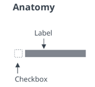

# ptcs-checkbox

## Visual

## Overview

A checkbox can be in an _on_ or an _off_ state. Selecting or clearing the checkbox toggles a state.
The checkbox behaves according to the functionality of the ptcs-behavior-binary/ptcs-behavior-binary.js and (optionally) that of ptcs-behavior-validate/ptcs-behavior-validate.js.

## Usage Examples

### Basic Usage

    <ptcs-checkbox variable="{{show}}">Show</ptcs-checkbox>

Sets the _show_ variable to _true_ when the checkbox state is _on_ and to _false_ when it is _off_.

### Start in an on state (checked)

    <ptcs-checkbox variable="{{show}}" checked>Show</ptcs-checkbox>

### Explicit variable values

    <ptcs-checkbox variable="{{tool}}" value-on="knife" value-off="fork">Use tool</ptcs-checkbox>

Sets the _tool_ variable to "knife" when the checkbox is set to _on_ and "fork" when it is set to _off_.

### Enforce validation

    <ptcs-checkbox variable="{{terms}}" value-on="read" value-off="unread" required>I have read the Terms and Conditions</ptcs-checkbox>

Require the checkbox to be set via validation, to be used for a mandatory confirmation. In this case, the _terms_ variable
set to "read" when the checkbox checked and to "unread" when it is unchecked.

## Component API

### Properties
| Property                 | Type     | Description                                                                                            | Default | Triggers a changed event |
| ------------------------ | -------- | ------------------------------------------------------------------------------------------------------ | ------- | ------------------------ |
| checked                  | Boolean  | The current state of the checkbox (on: checked = true, off: checked = false)                           | false   | No                       |
| disabled                 | Boolean  | Use this property to disable the checkbox                                                              | false   | No                       |
| label                    | String   | Specifies the checkbox label                                                                           | ""      | No                       |
| maxWidth                 | String   | Sets the maximum width of the label                                                                    |         | No                       |
| partial                  | Boolean  | Displays a dash instead of a check mark                                                                | false   | No                       |
| tooltip                  | String   | The tooltip that appears when hovering over the checkbox                                               | ""      | No                       |
| tooltipIcon              | String   | The icon for the tooltip                                                                               | ""      | No                       |
| variable                 | _any_    | Sets the variable name that the checkbox monitors and assigns                                          |         | No                       |
| valueOff                 | _any_    | Sets the value that the checkbox assigns to _variable_ when the checkbox is _off_.                     | _false_ | No                       |
| valueOn                  | _any_    | Sets the value that the checkbox assigns to _variable_ when the checkbox is _on_.                      | _true_  | No                       |
| extraValidation          | Function | Custom validation function to _complement_ the component's client-side validation logic. This is invoked with the dropdown component itself as parameter, so that it can use any ptcs-dropdown property for custom validation. Can return `true` (= valid), `false` (= invalid), or `undefined` (ignore validation)         |         | No                       |
| externalValidity         | String   | Controls the state of the validation. You can set this property to unvalidated, valid, or invalid.     |         | No                       |
| hideValidationCriteria   | Boolean  | Show a hint message about the required input for check box.                                            |         | No                       |
| hideValidationError      | Boolean  | Show a failure message when the validation fails.                                                      |         | No                       |
| hideValidationSuccess    | Boolean  | Show a success message when the validation is successful.                                              |         | No                       |
| required                 | Boolean  | Require the check box to be selected.                                                                  |         | No                       |
| requiredMessage          | String   | The message to display when a check box selection is required.                                         |         | No                       |
| validity                 | String   | Returns the value of validation: "undefined", "unverified", "invalid" or "valid"                       |         | No                       |
| validationCriteria       | String   | A secondary message that displays more information about the validation failure message.               |         | No                       |
| validationCriteriaIcon   | String   | Select an SVG icon to display within the hint message for the validation criteria.                     |         | No                       |
| validationErrorIcon      | String   | Select an SVG icon to display within the status message when the validation fails.                     |         | No                       |
| validationMessage        | String   | The message to display when the validation fails.                                                      |         | No                       |
| validationSuccessDetails | String   | A secondary message that displays more information about the validation success message.               |         | No                       |
| validationSuccessIcon    | String   | Select an SVG icon to display within the status message when the validation succeeds.                  |         | No                       |
| validationSuccessMessage | String   | The message to display when the validation is successful.                                              |         | No                       |

### Methods

No methods

## Styling

### The Parts of a Component

| Part | Description |
|------|-------------|
| root | The button container |
| box | The container for the box that contains the marker |
| check-mark | The check mark of the box element |
| label | The container for the text label |

### State attributes

| Attribute | Description | Part |
|-----------|-------------|------|
| checked | Current state (on: checked = true, off: checked = false) | :host |
| disabled | Indicates whether the checkbox is disabled | :host |
| label | The displayed label | :host, label |
| partial | Shows a dash instead of a check mark | :host |
