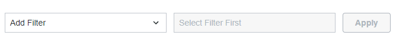
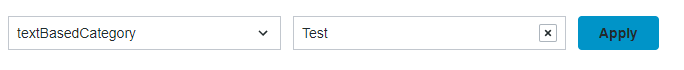
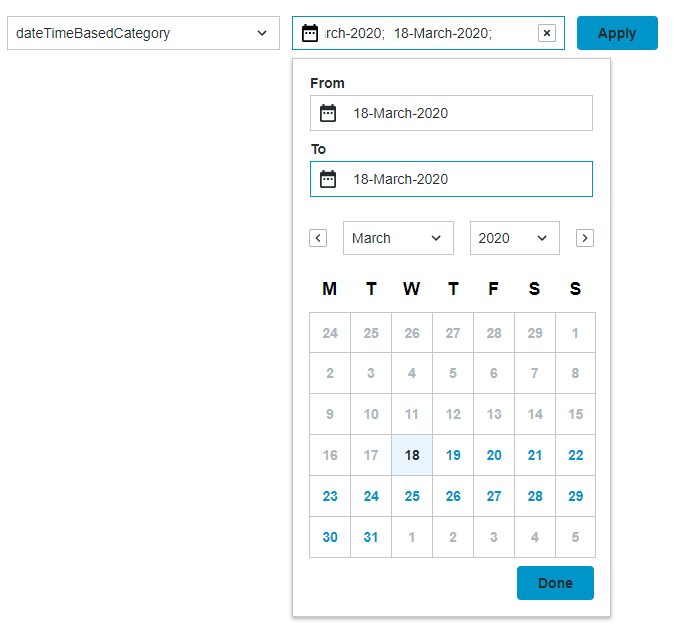
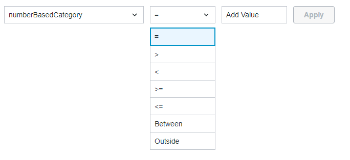
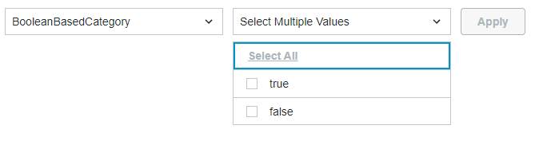

# ptcs-chip-data-filter

### Visual

### string-case

### datetime-case

### number-case

### boolean-case

## Overview

Filter Data widget is intended for data filtering. The filter options are listed in the drop down on the left side based on 'data' input parameter. "DataShape"->"fielDefinition" field is taken into account to extract the supported filter categories.

## Usage Examples

### Basic Usage

#### HTML
~~~html
    <ptcs-chip-data-filter id="dataFilterId"></ptcs-chip-data-filter>
~~~

### Pure JS
~~~javascript
    let ptcsDataFilter = document.querySelector("dataFilterId");
    if (ptcsDataFilter) {
        ptcsDataFilter.addEventListener("change", event => {
            console.log(ptcsDataFilter.query);
        });
        ptcsDataFilter.data = [
            dataShape: {
                fieldDefinitions: {
                    TextBasedCategory: {
                        name:        'textBasedCategory',
                        description: 'audit message text',
                        baseType:    'STRING',
                        ordinal:     3,
                        aspects:     {}
                    },
                    DateTimeBasedCategory: {
                        name:        'dateTimeBasedCategory',
                        description: '',
                        baseType:    'DATETIME',
                        ordinal:     1,
                        aspects:     {}
                    }
                }
            }
        ];
    }
~~~

### Polymer code
~~~javascript
    static get template() {
        return html`
            <ptcs-chip-data-filter query={{query}} on-change="__handleDataFilterChange" id="dataFilter"></ptcs-chip-data-filter>
        `;
    }
~~~

## Component API

### Properties
| Property               | Type    | Description                                                                                                  | Default   | Triggers a changed event? |
|------------------      | ------  | ------------------------------------------------------------------------------------------------------------ | --------- |---------------------------|
| data                   | Object  | The data for the filter options                                                                              |           | No                        |
| query                  | Object  | The query in JSON format, filter options                                                                     |           | No                        |
| showListFilter         | Boolean | Toggles filtering option in the category dropdown list                                                       | false     | No                        |
| hideFilterCounter      | Boolean | Controls visibility of the label displaying the current number of filters                                    | false     | No                        |
| daysContainingAnyData  | Array [Date type] | Adds indicator dots that enable you to highlight days that contain data values                     |           | No                        |
| customBaseTypesMapping | Object  | Maps base types to supported filters                                                                         |           | No                        |
| sortFilters            | Boolean | Deprecated. Sorts the list of filter options in the alphabetic sort order (default: true)                    |           | No                        |
| disableFilterSorting   | Boolean | Prevents the applied filters from getting sorted automatically in an alphabetical order                      | false     | No                        |
| showAndHideFilters     | Boolean | Controls the visibility of the Show/Hide filters button                                                      |           | No                        |
|chipsDisclosure         | String  | Specifies how to handle the "Show Filters" / "Hide Filters" toggle: `'link'` - use a ptcs-link, `'icon'` - use a ptcs-icon, `'none'` - hide the disclosure toggle and always show the active filters / chips. | "link" | No |
| columnFormat           | String  | A JSON string that contains a list of options to show in predefined order. The JSON data should have the same set of options as the data object. The `Title` field is optional and includes custom or a localizable label. Add `__showThisField=false` to hide option | null | No |
| maxWidth               | Number  | The maximum width for the filter (in pixels)                                                                 |           | No                        |
| topBarHeight           | Number  |  _Read-only_ property returning part `top-bar` height in pixels                                              |           | No                        |
| borders                | String  | Enable a border on part `top-bar`using letters `tblr` in any combination (top, bottom, left, right)          |           | No                        |
| categoryLabel          | String  | The text that is displayed above the drop-down list for the filter categories                                |           | No                        |
| conditionLabel         | String  | The text that is displayed above the drop-down list for the filter condition                                 |           | No                        |
| valueLabel             | String  | The text that is displayed above the box which contains the value for the condition                          |           | No                        |
| rangeStartValueLabel   | String  | The text displayed above the first input box when filtering a range of values                                |           | No                        |
| rangeEndValueLabel     | String  | The text displayed above the second input box when filtering a range of values                               |           | No                        |
| unitsLabel             | String  | The text displayed above the drop-down list that is used to set the units when filtering by location or date |           | No                        |
| latitudeLabel          | String  | The text displayed above the input box for latitude when filtering by location                               |           | No                        |
| longitudeLabel         | String  | The text displayed above the input box for longitude when filtering by location                              |           | No                        |

When you specify a string for a label property, it is used instead strings values that are stored in the dictionary of the component.

### Events

| Name          | Data              | Description                       |
| ------------- | ----------------- | --------------------------------- |
| query-changed | { value: Object } | The generated data in JSON format |

### Methods

| Method     | Arguments    | Description                                                                                |
| ---------- | ------------ | ------------------------------------------------------------------------------------------ |
| reset      | none         | Resets the data filter, removing all chips and clearing any pending data from the selector |

## Styling

### Parts

| Part           | Description                     |
| -------------- | ------------------------------- |
| selector       | The container of all dropdowns  |
| chip-container | The container element for chips |

