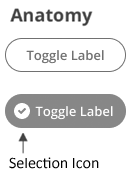

# ptcs-chip

## Visual

## Overview

A chip can be in an _on_ or _off_ state. When the chip is engaged, it toggles the state.
The chip uses the ptcs-behavior-binary/ptcs-behavior-binary.html behavior.

The chip can optionally show a selection icon when it is in the _on_ state.

## Usage Examples

### Basic Usage

    <ptcs-chip checked="{{active}}" label="Show"></ptcs-chip>

Assigns the variable _active_ to _true_ when the chip state is _on_, and to _false_ when it is _off_.

### Explicit variable values

    <ptcs-chip variable="{{tool}}" label="Use tool" value-on="knife" value-off="fork"></ptcs-chip>

Assigns the variable _tool_ to "knife" whenever the chip is _on_ and "fork" otherwise.

### Start in _on_ state (checked)

    <ptcs-chip variable="{{tool}}" label="Use tool" value-on="knife" value-off="fork" checked></ptcs-chip>

## Component API

### Properties
| Property      | Type    | Description                                                                                                          | Default | Triggers a changed event|
| ------------- | ------- | -------------------------------------------------------------------------------------------------------------------  | ------- | ----------------------- |
| disabled      | Boolean | Disables the chip                                                                                                    | false   | No                      |
| label         | String  | The displayed label                                                                                                  | " "     | No                      |
| labelalign    | String  | Determines the position of the label relative to the selection icon: `left` or `right`                               | "left"  | No                      |
| labelMaxWidth | String  | The maximum width of the label                                                                                       |         | No                      |
| icon          | String  | An icon that appears when the chip is _on_.                                                   | A checkmark inside of a circle | No                      |
| iconSrc       | String  | A URL to an icon set from wich `icon` selects an icon                                                                |         | No                      |
| hideIcon      | Boolean | Suppresses showing the selection icon                                                                                | false   | No                      |
| state         | Boolean | The current state. The state is _on_ when set to true and _off_ when set to false.                                   |         | No                      |
| checked       | Boolean | The current state. The state is _on_ when set to true and _off_ when set to false.                                   | false   | No                      |
| tooltip       | String  | The tooltip that appears when hovering over the checkbox                                                             |         | No                      |
| tooltipIcon   | String  | The icon for the tooltip                                                                                             |         | No                      |
| valueOff      | _any_   | The value that the chip assigns to `variable` when the chip is turned _off_.                                         | _false_ | No                      |
| valueOn       | _any_   | The value that the chip assigns to `variable` when the chip is turned _on_.                                          | _true_  | No                      |
| variable      | _any_   | The variable that the chip monitors and assigns.                                                                     |         | No                      |
| iconWidth     | String  | Sets a fixed width for the icon (both iconWidth and iconHeight should be set, otherwise the icon default size is set)|         | No                      |
| iconHeight    | String | Sets a fixed height for the icon (both iconWidth and iconHeight should be set, otherwise the icon default size is set)|         | No                      |

### Methods

No methods

## Styling

### The Parts of a Component

| Part | Description |
|-----------|-------------|
|label|The container that contains the label|
|icon|The icon of the chip that is displayed in the _on_ state |

### State attributes

| Attribute | Description | Part |
|-----------|-------------|------|
| checked | Current state (on: checked = true, off: checked = false) | :host |
| disabled | Is the checkbox disabled? | :host |
| hide-icon | Suppress showing the selection icon in the chip variant? | :host |
| labelalign | The alignment of the button label. You can set it to left or right. The default is left. | :host |
