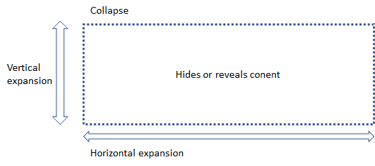

# ptcs-collapse

## Visual

## Overview

A Collapse control creates a collapsible block of content. The widget adjusts the max-height/max-width of the collapsible element to show/hide the content. The property is changed via a CSS transition, animating the state change. The animation speed is configurable via a CSS custom property.

## Usage Examples

### Basic Usage

~~~html
<ptcs-collapse>
  
Visibility of this content can be toggled

</ptcs-collapse>
~~~

Creates collapsible content that is intially hidden. When the visibility is toggled the element grows / shrinks vertically. 

### Horizontal expansion

~~~html
<ptcs-collapse opened horizontal>
  
Visibility of this content can be toggled

</ptcs-collapse>
~~~

Creates collapsible content that is intially visible. When the visibility is toggled the element shrinks / grows horizontally.

## Component API

### Properties
| Property | Type | Description |
|----------|------|-------------|
|opened    | Boolean | true if content is visible, false if it is hidden. Can be   assigned manually.|
|horizontal|Boolean|If true, the orientation is horizontal; otherwise is vertical|
|transitioning|Boolean|When true, the element is transitioning its opened state. When false, the element has finished opening/closing.|

### Events

| Name | Data | Description |
|------|------|-------------|
|opened-changed| | When the opened propery has changed |
|transitioning-changed|  | When the component starts or ends a transition |

### Methods

| Signature | Description |
|-----------|-------------|
| show() | Show content |
| hide() | Hide content |
| toggle() | Toggle visibility |

## Theming

_--iron-collapse-transition-duration_ specifies the duration of the transition. The default valuie is 300ms

## RTL

N/A

## ARIA

To be specified

## TODO

* Replace the animation speed property  _--iron-collapse-transition-duration_ with a --ptcs-... property
