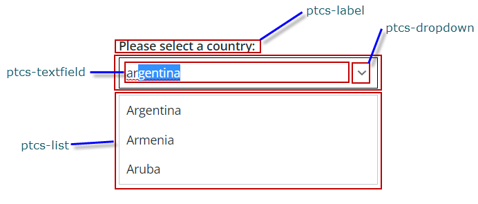

# ptcs-combobox
## Visual

## Overview

A combobox is like a dropdown with type-ahead behavior in the text field that supports direct user input, and simultaneously filters the list below the text field as the user inputs.

## Usage Examples

### Basic Usage

~~~html
<ptcs-combobox items="[[options]]"></ptcs-combobox>
~~~

## Component API

### Properties
| Property           | Type    | Description                                                                                                        | Default    |Triggers a changed event?|
| --------           | ------- | ------------------------------------------------------------------------------------------------------------------ | ------     | ----------------------- |
| alignment          | String  | Alignment of the text field and of the items in the drop-down list                                                 | "left"     |                         |
| autoSelectFirstRow | Boolean | Automatic select first item when items list is changed (true). No pre-defined selection otherwise                  | false      |                         |
| disabled           | Boolean | Is the combobox disabled?                                                                                          | false      |                         |
| escapeKeyClearsContent | Boolean | Defines how the text field should react when the user presses Escape. If this property is true, then the contents of the textfield is cleared. If not, it will revert to the previous text, before the user started typing. | false | |
| hideLabel          | Boolean | Show or hide the label of the component.                                                                           | false      |                         |
| hintText           | String  | The text to display in the text field when no item is selected.                                                    | "Select..."|                         |
| items              | Array   | A JavaScript array with the combobox data                                                                          |            |                         |
| label              | String  | An optional label above the combobox                                                                               |            |                         |
| labelVariant       | String  | Variant to use for the label. Possible values are '_body_', '_label_', '_sub-header_', and '_header_'.             | "label"    |                         |
| labelAlignment     | String  | The label alignment. You can set it to "left" (default), "center", or "right".                                     | "left"     |                         |
| noMatchesLabel     | String  | The text to use when filtering the dropdown in case none of the items match. .                                     |"No matches"|                         |
| rowHeight          | String  |  Sets the minimum height of the list items in the dropdown list.                                                   | "34"       |                         |
| selected           | Number  | Contains the index of the selected item or -1 if the text does not match any of the items.                         |            |                         |
| showClearButton    | Boolean | Shows clear button in text field in addition to dropdown icon that allows user to clear string of text within the text field.                                                                                                                                              | false      |                         |
| text               | String  | Text entered in the text field                                                                                     |            |                         |
| tooltip            | String  | The tooltip that appears when hovering over the combobox.                                                          |  " "       |                         |
| tooltipIcon        | String  | The icon for the tooltip                                                                                           |  " "       |                         |
| valueHide          | Boolean | Hides the textfield, only showing the drop-down icon.                                                              | _false_    |                         |

### Methods

No methods

## Styling

### The Parts of a Component

| Part | Description |
|-----------|-------------|
| label | The combobox label |
| select-box | The container that contains the textfield and the dropdown icon |
| text-field | The text field with the current value |
| drop-down | The dropdown list |

### State attributes

| Attribute | Description | Part |
|-----------|-------------|------|
| disabled | Is the combobox disabled? | :host |
| value-hidden | Is the combobox textfield hidden? | text-field |
