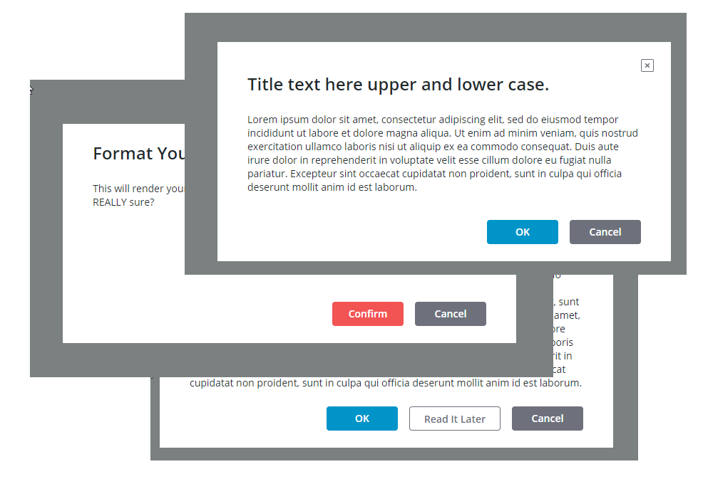

# ptcs-confirmation

## Visual

## Overview

ptcs-confirmation is a modal style interaction web component to commit or cancel an operation that displays a confirmation dialog on top of a semi-opaque background overlay. It features:

* A confirmation dialog title

* A confirmation dialog message

* Buttons for confirmation actions:
    * A Primary action
    * An optional Secondary action
    * A Cancel action

* Primary action button position (Left or Right)
* Primary action button _type_ (`primary` or `danger`)

* An optional Close ❌ button, that behaves as Cancel

## Usage Examples

### Basic Usage

~~~html
 <ptcs-confirmation  title-text="Title of the Message" message-text="Lorem ipsum dolor sit amet."></ptcs-confirmation>
~~~

### Confirmation Dialog with Close Button

~~~html
<ptcs-confirmation title-text="Terms and Conditions" message-text="Lorem ipsum" display-close-button></ptcs-confirmation>
 ~~~

By default the confirmation dialog does not display a Close button. The Close button behaves the same as Cancel.

 ### Confirmation Dialog with Primary Action Button Position Reversed

~~~html
<ptcs-confirmation title-text="Terms and Conditions" message-text="Lorem ipsum" action-position="right"></ptcs-confirmation>
 ~~~

This changes the Primary action button position from leftmost to rightmost.

## Component API

### Properties
| Property                 | Type    | Description                                                                    | Default   | Triggers a changed event? |
| ------------------------ | ------  | ------------------------------------------------------------------------------ | -------   | ------------------------- |
| mode                     | String  | To indicate the dialog state (open or closed)                                  | "closed"  | No                        |
| titleText                | String  | The dialog title                                                               | " "       | No                        |
| messageText              | String  | The dialog message text                                                        | " "       | No                        |
| actionPosition           | String  | The position of the primary action button (`left` or `right`, default: `left`) | "left"    | No                        |
| displayCloseButton       | Boolean | Toggle to display the optional Close button                                    | false     | No                        |
| primaryButtonStyle       | String  | This can be `primary` or `danger`                                              | "primary" | No                        |
| displaySecondaryAction   | Boolean | Toggle to display optional secondary action button                             | false     | No                        |
| primaryActionLabel       | String  | The label text of the primary action button                                    | null      | No                        |
| secondaryActionLabel     | String  | The label text of the secondary action button                                  | null      | No                        |
| hideCancelAction         | Boolean | Hiding cancel action button                                                    | false     | No                        |
| cancelActionLabel        | String  | The label text of the Cancel button                                            | null      | No                        |
| primaryActionIcon        | String  | The icon of the primary action button                                          | null      | No                        |
| secondaryActionIcon      | String  | The icon of the secondary action button                                        | null      | No                        |
| cancelActionIcon         | String  | The icon of the Cancel button                                                  | null      | No                        |
| actionButtonTooltipField | String  | The tooltip text of the primary action button                                  | null      | No                        |
| actionButtonTooltipIcon  | String  | The tooltip icon of the primary action button                                  | null      | No                        |
| secondButtonTooltipField | String  | The tooltip text of the secondary action button                                | null      | No                        |
| secondButtonTooltipIcon  | String  | The tooltip icon of the secondary action button                                | null      | No                        |
| cancelButtonTooltipField | String  | The tooltip text of the Cancel button                                          | null      | No                        |
| cancelButtonTooltipIcon  | String  | The tooltip icon of the Cancel button                                          | null      | No                        |
| closeButtonTooltipField  | String  | The tooltip text of the Close button                                           | null      | No                        |

### Events

| Name             | Description                                                     |
| ---------------- | --------------------------------------------------------------- |
|primary-action    | Triggered when clicking on the primary action button            |
| secondary-action | Triggered when clicking on the secondary action button          |
| close-action     | Triggered when clicking on the Cancel and / or the Close button |

### Methods

| Signature | Description                                                                                                                          |
| --------- | ------------------------------------------------------------------------------------------------------------------------------------ |
| open()    | Open the confirmation dialog                                                                                                         |
| close()   | Close the confirmation dialog. This isn't really needed, as the dialog closes when any action button or the Close button is clicked. |

## Styling

### Parts

| Part              | Description                                                     |
| ----------------- | --------------------------------------------------------------- |
| modal-overlay     | The partly opaque grey background that covers the viewport      |
| root              | The root of the confirmation dialog                             |
| dialog            | The container for the confirmation dialog components            |
| close-button      | The Close button in the dialog's top right corner               |
| message-container | The container for the message title and message text            |
| title             | The confirmation dialog title                                   |
| message           | The confirmation dialog message                                 |
| buttons-container | The container for the confirmation dialog buttons in the footer |
| primary-button    | The Primary Action button                                       |
| secondary-button  | The Secondary Action button                                     |
| cancel-button     | The Cancel button                                               |

### States
| Attribute    | Description                                      | Part                 |
|--------------|--------------------------------------------------|----------------------|
| mode         | Is the confirmation dialog open or closed?       | :host                |
