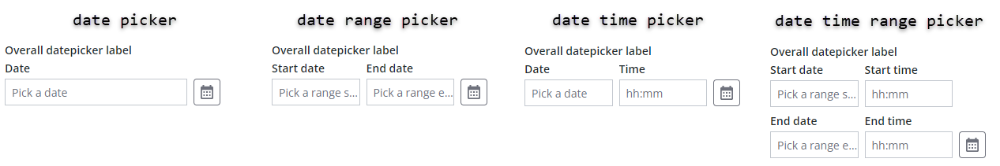
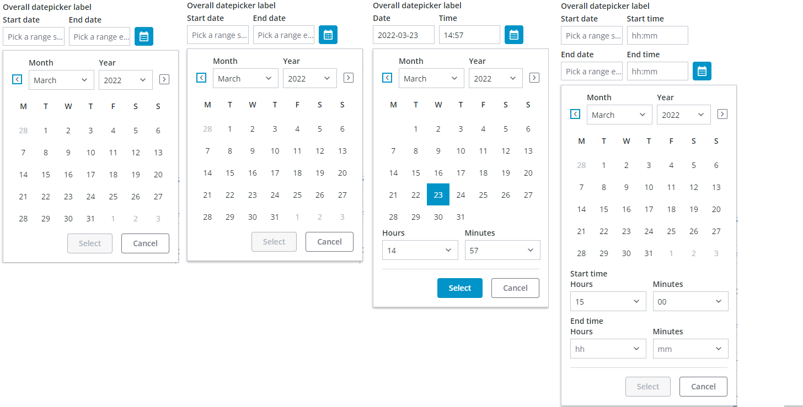
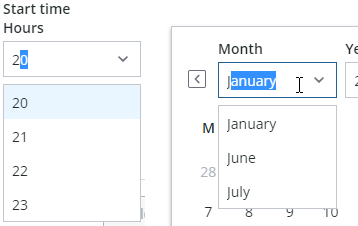
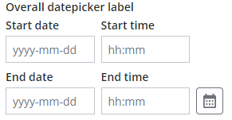
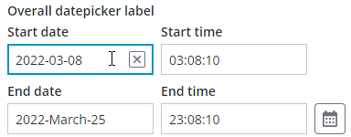
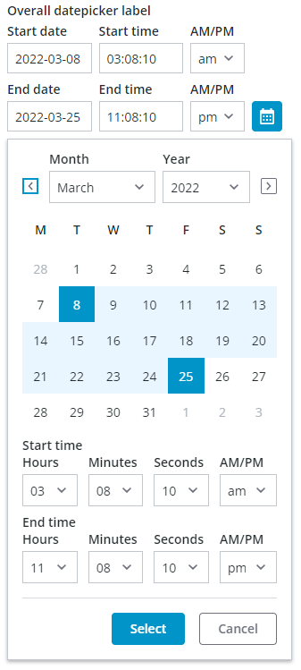
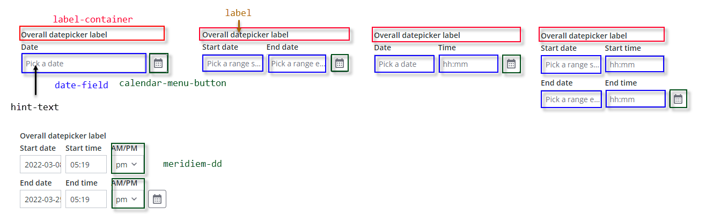
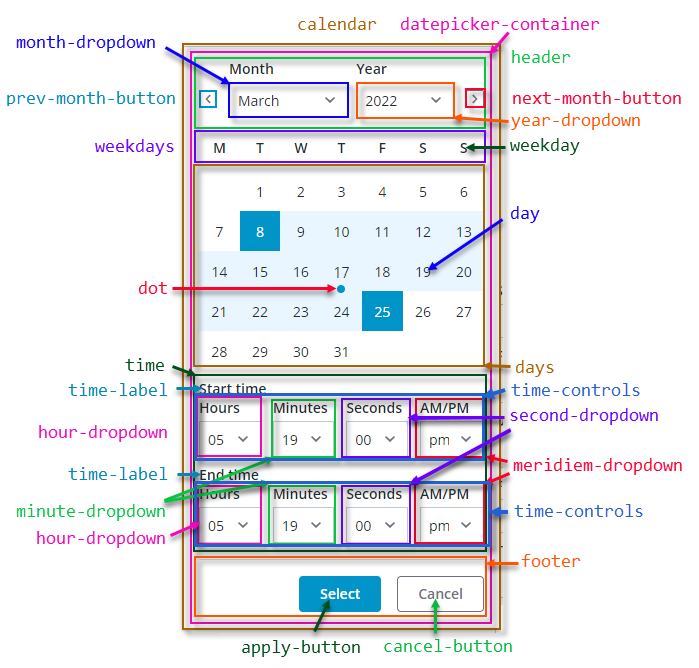

# ptcs-datepicker

## Visual

The date picker contains a calendar menu button and one or more textfields, depending on its configuration:

* A date picker used to select a date contains one textfield
* A date range picker used to select a start and an end date contains two textfields
* A date and time picker used to select date and time contains two textfields
* A date and time range picker used to select a start and end date, including time, contains four textfields

### Closed

### Opened

The calendar menu button opens a pop-up calendar that enables you to select dates interactively. Different controls are displayed
on the calendar based on the date picker configuration:

## Overview

You can set the date format by configuring the component `formatToken` property based on the [MomentJS library](https://momentjs.com) syntax.

When specifying a format token, make sure that it does not conflict with the datepicker anatomy. For example, do not include a time format
in the date field because the time is shown in a separate textfield. The custom format token only applies to the date part.

### Behavior

When selecting a date in the pop-up calendar, the current selection is highlighted and is only commited when the 'Select' button is clicked. The selection is cancelled and the previous date(s) that was displayed before opening the calendar is restored when:

* the 'Cancel' button is clicked.
* an area outside of the calendar pop-up is clicked.
* the Escape key is pressed.

Date ranges that are selected without a time indication, such as when using the date range picker, are automatically set to a time span from
start of day to end of day.

When selecting a range, the first date is typically the start of the range. However, the calendar automatically swaps the dates to maintain a
valid range when the second date selection is earlier than the first date. In addition, clicking a new date clears the existing range and
initiates the selection of a new range.

When using the date time range picker, date and time range selections are assigned the time that is set in the drop-down lists for the start
time and end time.

The calendar dropdowns are _comboboxes_ that include support for keyboard input. You can type a value to select an item more quickly.

### Labels and Hint Text

The datepicker has a general label that spans the width of the datepicker, and each control has a label and hint text to guide user date entry or selection. The default hint texts show date and time formats.

You can edit dates directly in a textfield when the date is set to any format. Dates always appears in a numeric format when editing in a textfield.

_Editing a date in the textfield_

## Usage Examples

### Basic Usage

~~~html
<ptcs-datepicker></ptcs-datepicker>
~~~

### Specific date and format selected

~~~html
 <ptcs-datepicker format="LL" date="2018-11-25"></ptcs-datepicker>
~~~

In the  example above, the attributes define the following:

- date - The initial date to display
- format - The date format specifier according to the MomentJS format. The 'LL' value generates the following: 'November 25, 2018'.

~~~html
<ptcs-datepicker week-start="day" month-format="YMD" date-order="order" action-position="location" show-time display-seconds></ptcs-datepicker>
~~~

In the above example _substitute_ attribute *values*:

- _day_ - possible values: Monday, Sunday
- _YMD_ - possible values: full, short, or numeric
- _order_ - possible values: YMD, MDY, DMY
- _location_ - possible values: left, right

### Date range selection

~~~html
 <ptcs-datepicker date-range-selection></ptcs-datepicker>
~~~

In the example above, the date picker allows users to select a date range. Time ranges are indicated in the calendar pop-up with selected days
and the range endpoints (start and end) in a distinct highlight.

You can also configure the component to display the time using a 12-hour format. Enabling this format adds an additional dropdown that lets you
choose AM or PM when selecting time. In the following image, the time indication includes seconds and uses a 12-hour clock format.

## Component API

### Properties

| Property                  | Type     | Description                                                                                      | Default | Triggers a changed event?  |
| ------------------------- | -------- | ------------------------------------------------------------------------------------------------ | ------- | -------------------------- |
| actionPosition            | String   | Sets the position of the "Select" button. The allowed values are "left" and "right". When set to "left", the button is placed to the left of the "Cancel" button. |" "| No  |
| date                      | String   | Opens the calendar on a specific date using the following format: YYYY-MM-DD                     |         | Yes                        |
| dateDelimiter             | String   | The separator to use between date components.                                                    | "-"     | No                         |
| dateOrder                 | String   | The order of the year, month, and day. You can set it to "auto", "YMD", "MDY", or "DMY". Setting it to "auto" defaults to the "YMD" format. | "YMD" | No |
| dateTime                  | Date     | The actual data, as a Date object                                                                |         | Yes                        |
| daysContainingAnyData     | Array (timestamp) | Displays dots for the dates contained in the array.                                     | [ ]     | No                         |
| disabled                  | Boolean  | Disables the date picker                                                                         | false   | No                         |
| displaySeconds            | Boolean  | Displays seconds as part of the date.                                                            | false   | No                         |
| formatToken               | String   |  Overrides the format of the displayed date. See the [Available formats](https://momentjs.com/docs/#/displaying/format/).| | No         |
| hidden                    | Boolean  | Hides the calendar                                                                               | false   | No                         |
| hintText                  | String   | Sets the prompt text to pick a date. When `undefined`, a default hint text derived from the current date format and delimiter is shown. | | No |
| fromFieldHintText         | String   | Sets the prompt text for the start date of a range. When `undefined`, a default hint text derived from the current date format and delimiter is shown. | | No |
| toFieldHintText           | String   | Sets the prompt text for the end date of a range. When `undefined`, a default hint text derived from the current date format and delimiter is shown. | | No |
| initWithCurrentDateTime   | Boolean  | Initializes the date picker with current date and time.                                          | false   | No                        |
| interval                  | Number   | The refresh rate for updating the calendar.                                                      | 0       | No                        |
| intervalType              | String   | The unit of refresh rate for updating the calendar. Allowed values: 'h' - Hours, 'm' - Minutes, 's' - Seconds, 'd' - Days   | 'h' | No |
| label                     | String   | An optional label above the date picker                                                          |         | No                        |
| monthFormat               | String   | The month format. Allowed values: "full", "short", "numeric"                                     | "full"  | No                        |
| leftMenuButton            | Boolean  | By default, the calendar menu button appears rightmost. Setting `leftMenuButton` to true positions it leftmost instead. |"right"| No   |
| labelAlignment            | String   | The horizontal alignment of the labels. Allowed values: "left", "center", "right"                | "left"  | No                        |
| selectedDate              | Object   | The selected date as a moment object                                                             | { }     | Yes                       |
| showTime                  | Boolean  | Shows the time in the picker.                                                                    | false   | No                        |
| tooltip                   | String   | The tooltip that appears when hovering over the date picker                                      | ""      | No                        |
| tooltipIcon               | String   | The icon for the tooltip                                                                         | ""      | No                        |
| weekStart                 | String   | The first day of the week. Set to  by default. The allowed values are "Monday" and "Sunday".     | "Monday"| No                        |
| dateRangeSelection        | Boolean  | Enables you to specify a date range by selecting a start and an end date. You can specify a time value when range selection is enabled and `showTime` is enabled. | true | No |
| fromDate                  | Date     | Sets the value of the start date for the date range. The value must be smaller than or equal to the toDate.| | Yes                     |
| toDate                    | Date     | Sets the value of the end date for the date range. The value must be larger than or equal to the fromDate. | | Yes                     |
| fromFieldLabel            | String   | Specifies the label to display for the start date field                                          |         | No                        |
| calendarStartTimeLabel    | String   | Specifies the label to display for the start time field on the pop-up calendar.                  |         | No                        |
| fromTimeLabel             | String   | Specifies the label to display for the start date time field                                     |         | No                        |
| toFieldLabel              | String   | Specifies the label to display for the end date field                                            |         | No                        |
| toTimeLabel               | String   | Specifies the label to display for the end date time field                                       |         | No                        |
| calendarEndTimeLabel      | String   | Specifies the label to display for the end time field on the pop-up calendar.                    |         | No                        |
| meridiemLabel             | String   | Specifies the label for the meridiem (am/pm) dropdown                                            | "AM/PM" | No                        |
| yearLabel                 | String   | Specifies the label for the year dropdown of the calendar                                        | "Year"  | No                        |
| monthLabel                | String   | Specifies the label for the month dropdown of the calendar                                       | "Month" | No                        |
| hoursLabel                | String   | Specifies the hours label for the hours dropdown of the calendar                                 | "Hours" | No                        |
| secondsLabel              | String   | Specifies the hours label for the seconds dropdown of the calendar                               |"Seconds"| No                        |
| selectLabel               | String   | Specifies the label for the 'Select' button of the calendar                                      | "Select"| No                        |
| cancelLabel               | String   | Specifies the label for the 'Cancel' button of the calendar                                      | "Cancel"| No                        |
| icon                      | String   | Specifies the icon for the calendar menu button.                                       |"cds:icon_calendar"| No                        |
| iconWidth                 | String   | Sets a fixed width for the icon (both iconWidth and iconHeight should be set, otherwise the icon default size is set)  || No           |
| iconHeight                | String   | Sets a fixed height for the icon (both iconWidth and iconHeight should be set, otherwise the icon default size is set) || No           |
| extraValidation           | Function | Custom client validation function. This is invoked with the text component itself as parameter, so that it can use any ptcs-datepicker property for custom validation. Can return `true` (= valid), `false` (= invalid), or `undefined` (ignore validation) | | |
| externalValidity          | String   | Datepicker validity as determined externally (server-side). Value: `undefined`, "unvalidated", "invalid", or "valid" | |               |
| hideValidationCriteria    | Boolean  | Don't show validation criteria in unvalidated state?                                             |         |                           |
| hideValidationError       | Boolean  | Don't show validation error state?                                                               |         |                           |
| hideValidationSuccess     | Boolean  | Don't show validation success state?                                                             |         |                           |
| required                  | Boolean  | Validation criterion: Must the datepicker have a selection?                                      |         |                           |
| requiredMessage           | String   | Validation message to display when a required value is missing                                   |         |                           |
| min                       | Date     | Validation criterion: Minimal possible date                                                      |         |                           |
| minFailureMessage         | String   | Validation message to display when the selected date is earlier than the "min" value             |         |                           |
| max                       | Date     | Validation criterion: Maximal possible date                                                      |         |                           |
| maxFailureMessage         | String   | Validation message to display when the selected date is later than the "max" value               |         |                           |
| minStartDate              | Date     | Validation criterion: Minimal possible start date for the date range selection                   |         |                           |
| minStartDateFailureMessage| String   | Validation message to display when the selected start date is earlier than the "minStartDate" value|       |                           |
| maxStartDate              | Date     | Validation criterion: Maximal possible start date for the date range selection                   |         |                           |
| maxStartDateFailureMessage| String   | Validation message to display when the selected start date is later than the "maxStartDate" value|         |                           |
| minEndDate                | Date     | Validation criterion: Minimal possible end date for the date range selection                     |         |                           |
| minEndDateFailureMessage  | String   | Validation message to display when the selected end date is earlier than the "minEndDate" value  |         |                           |
| maxEndDate                | Date     | Validation criterion: Maximal possible end date for the date range selection                     |         |                           |
| maxEndDateFailureMessage  | String   | Validation message to display when the selected end date is later than the "maxEndDate" value    |         |                           |
| validationCriteria        | String   | The validation details message                                                                   |         |                           |
| validationCriteriaIcon    | String   | Specifies the icon for criteria state (unvalidated).                                             |"cds:icon_info"|                     |
| validationErrorIcon       | String   |Specifies the icon for error state (invalid).                                                     |"cds:icon_error"|                    |
| validationMessage         | String   | The validation (title) message                                                                   |         |                           |
| validationSuccessDetails  | String   | The validation success details message                                                           |         |                           |
| validationSuccessIcon     | String   | Specifies the icon for success state (valid).                                                    |"cds:icon_success"|                  |
| validationSuccessMessage  | String   | The validation success (title) message.                                                          |"Success"|                           |

### States

| Attribute      | Description                                         | Part                        |
| -------------  | --------------------------------------------------- | --------------------------- |
|date            | The actual date data                                | :host, date-field           |
|disabled        | Date picker or calendar state                       | :host, date-field, calendar |
|hidden          | Indicates whether the date picker calendar is open. | calendar                    |
|label           | The date picker label                               | :host, label                |
|label-alignment | The horizontal alignment of the label               | :host                       |
|no-label        | Is True when there is no label                      | label                       |

### Methods

### Events

As can be seen from the properties listing:
* When selecting a _single date_, the changed date will be reported with `date-changed` (a string) and `date-time-changed` (a Date).
* When selecting a _date range_, the changed range will be reported with `from-date-changed` (a Date) and `to-date-changed` (a Date).

In addition, for backwards compatibility reasons, a date range change also dispatches `date-changed` (a string) and `range-updated`,
described below.

| Name          | Data                             | Description                                                            |
| ------------- | -------------------------------- | ---------------------------------------------------------------------- |
| range-updated | ev.detail = { fromDate, toDate } | Event that triggers when the start date or end date value is modified  |

## Styling

### Parts

The date picker has following parts:

| Part                 | Description                                                                                                              |
| -------------------- | ------------------------------------------------------------------------------------------------------------------------ |
| label-container      | The container panel of the label above the date picker                                                                   |
| label                | The label above the date picker                                                                                          |
| date-field           | The container for the date or time, or hint text                                                                         |
| meridiem-dd          | The dropdown for the 12-hour clock AM / PM indication                                                                    |
| calendar-menu-button | The button to open the calendar. By default this only shows a calendar icon, which can be customized via property `icon` |

The following figure shows the different parts of the date picker:

The calendar has following parts:

| Part                 | Description                                                                                                                                     |
| -------------------- | ----------------------------------------------------------------------------------------------------------------------------------------------- |
| calendar             | The container panel of the calendar drop-down in the date picker                                                                                |
| datepicker-container | The calendar container panel                                                                                                                    |
| header               | The top part of the date picker, with navigation button for previous month, month dropdown, year dropdown, and navigation button for next month |
| prev-month-button    | The button to go to previous month                                                                                                              |
| month-dropdown       | The month drop-down selector / combobox                                                                                                         |
| year-dropdown        | The year drop-down selector / combobox                                                                                                          |
| next-month-button    | The button to go to next month                                                                                                                  |
| weekdays             | The weekdays container panel                                                                                                                    |
| weekday              | A single weekday                                                                                                                                |
| days                 | The day date container panel                                                                                                                    |
| day                  | A single day                                                                                                                                    |
| dot                  | A dot highlight below a day's date, generated via property `daysContainingAnyData`                                                              |
| time                 | The time selectors container                                                                                                                    |
| time-controls        | The container for the Hours / Minutes / Seconds / AM/PM comboboxes                                                                              |
| time-label           | The label above the time dropdown / combobox selectors                                                                                          |
| hour-dropdown        | The hours drop-down selector                                                                                                                    |
| minute-dropdown      | The minutes drop-down selector                                                                                                                  |
| second-dropdown      | The seconds drop-down selector                                                                                                                  |
| meridiem-dropdown    | The AM / PM dropdown selector                                                                                                                   |
| footer               | The lower panel container for the buttons 'Select' and 'Cancel'                                                                                 |
| apply-button         | The 'Select' button                                                                                                                             |
| cancel-button        | The 'Cancel' button                                                                                                                             |

The following figure shows the different parts of the pop-up calendar:

