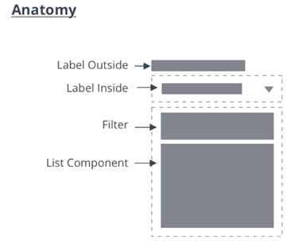
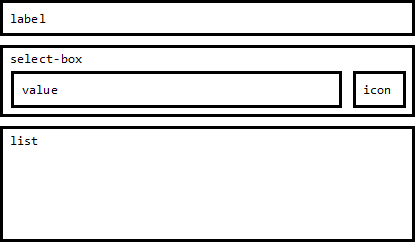

# ptcs-dropdown
## Visual

## Anatomy

## Overview

The Dropdown allows the user to select from a list of choices. The selection can be a single item or multiple items. The list of items is only visible when the user interacts with the dropdown.

## Usage Examples

### Basic Usage

~~~html
<ptcs-dropdown items="[[options]]"></ptcs-dropdown>
~~~

### Multi select dropdown

~~~html
<ptcs-dropdown items="[[options]]" multi-select></ptcs-dropdown>
~~~

## Component API

### Properties
| Property                 | Type     | Description                                                                                                                             | Default |  Triggers a changed event? |
| ------------------------ | -------- | --------------------------------------------------------------------------------------------------------------------------------------- | ------- | -------------------------- |
| alignment                | String   | Alignment of the selected value and of the items in the drop-down list                                                                  | 'left'  |                            |
| autoSelectFirstRow       | Boolean  | Automatic select first item when items list is changed (true). No pre-defined selection otherwise                                       | false   |                            |
| clearSelectionItem       | Boolean  | Toggle to display an item to clear a selection in single selection list                                                                 | false   |                            |
| clearSelectionLabel      | String   | The custom text to display in the item to clear a selection in single selection list                                                    | " "     |                            |
| disabled                 | Boolean  | Is the drop-down disabled?                                                                                                              | false   |                            |
| displayMode              | String   | When displayMode is set to "default", a drop-down icon is displayed in the select box. When displayMode is set to "small", a small ptcs-button is displayed. | "default" |     |
| filter                   | Boolean  | Enables the display of a filter text-field box in the dropdown list.                                                                    | false   |                            |
| filterHintText           | String   | The hint text to display in the filter of the dropdown list.                                                                            |"Filter" |                            |
| hintText                 | String   | The text to display in the selected value box when no item is selected. Note: This value is inherited by the drop-down list as its hintText property. It is also used as the label for the "reset selection" option.                                                                                                                                         | " "     |                            |
| itemMeta                 | Object   | Consists of three parts: _itemMeta.type_ is one of "text" (default), "link", "image", or "checkbox". The value specifies whether the selected value and list items are a label, link, image, or a checkbox. When it is a link, the link label is specified by _itemMeta.label_ and the target by _itemMeta.target_. The item value is used as the href of the link |type: "text"|                      |
| items                    | Array    | A JavaScript array with the drop-down data                                                                                              | [ ]     |                            |
| label                    | String   | An optional label above the drop down                                                                                                   | " "     |                            |
| labelAlignment           | String   | The label alignment. You can set it to "left" (default), "center", or "right".                                                          | 'left'  |                            |
| selectAllLabel           | String   | The text to display for the item used to select all items in the drop-down list. The item is displayed at the top of the list when no items are selected in multiple selection mode.                                                                                                                                                                           |"Select All"|                         |
| clearSelectedItemsLabel  | String   | The text to display for the item used to clear all selections in the drop-down list. The item is displayed at the top of the list when one or more items are selected in multiple selection mode.                                                                                                                                                        |"Clear Selected Items"|               |
| metaSelector             | Any      | The same as _selector_ but selects the meta string instead. If _metaSelector_ is "falsy", the meta string is not displayed              | null    |                            |
| multiSelect              | Boolean  | Enables multiple selection mode. Set to _false_ by default.                                                                             | false   |                            |
| rowHeight                | String   |  Sets the minimum height of the list items in the drop-down list.                                                                       | '34'    |                            |
| selected                 | Number   | Contains the index of the selected item when selectMode is set to "single".                                                             |         |                            |
| selectedIndexes          | Array    | An array with the indexes of the selected items                                                                                         | [ ]     | yes                        |
| selectedItems            | Array    | An array with the selected items                                                                                                        | [ ]     | yes                        |
| selectedValue            | Object   | Contains the value of the (according to _valueSelector_) selected item when selectMode is set to "single".                              |         | yes                        |
| selector                 | Any      | Selects a string from each item in _items_ to be displayed as the drop-down item label. If _unassigned_, items should be an array of strings. If a _string_, then items is an array of objects, where selector specifies the (string) property to display. If a _function_, then the function is called for each item and should return a string that represents the item. | null |                  |
| tooltip                  | String   | The tooltip that appears when hovering over the dropdown (if different from the label text or ellipsis overflow text)                   |         | No                         |
| tooltipIcon              | String   | The icon for the tooltip                                                                                                                |         | No                         |
| treatValueAsString       | Boolean  | Deprecated. Returns _selectedValue_ as _string_ when set to true and returns the original object when set to false.                     |         |                            |
| returnOriginalValue      | Boolean  | Returns selectedValue in the original object format when set to true and as a string when set to false.                                 | false   |                            |
| valueHide                | Boolean  | Hides the selected value field. For example, you can enable the property to only show the drop-down icon.                               | false   |                            |
| valueSelector            | Any      | Selects a string from each item in _items_ to be displayed as the drop-down item value. If _unassigned_, uses _selector_ instead. If a _string_, then items is an array of objects, where valueSelector specifies the (string) property to display. If a _function_, then the function is called for each item, and should return a string that represents the item. | false |                    |
| extraValidation          | Function | Custom validation function to _complement_ the component's client-side validation logic. This is invoked with the dropdown component itself as parameter, so that it can use any ptcs-dropdown property for custom validation. Can return `true` (= valid), `false` (= invalid), or `undefined` (ignore validation)                                          |         |                            |
| externalValidity         | String   | Dropdown validity as determined externally (server-side). Value: `undefined`, "unvalidated", "invalid", or "valid"                      |         |                            |
| hideValidationCriteria   | Boolean  | Don't show a hint message about the required selection in unvalidated state?                                                            |         |                            |
| hideValidationError      | Boolean  | Don't show a failure message when the validation failed?                                                                                |         |                            |
| hideValidationSuccess    | Boolean  | Don't show a success message when the validation is successful?                                                                         |         |                            |
| required                 | Boolean  | Validation criterion: Require a selection in the drop-down list.                                                                        |         |                            |
| requiredMessage          | String   | The message to display when a list item is not selected.                                                                                |"A selection is required"|            |
| validationCriteria       | String   | A secondary message that displays more information about the validation failure/criteria message.                                       |         |                            |
| validationCriteriaIcon   | String   | An icon to display within the criteria status message (unvalidated).                                                                    |"cds:icon_info"|                      |
| validationErrorIcon      | String   | An icon to display within the status message when the validation fails (invalid).                                                       |"cds:icon_error"|                     |
| validationMessage        | String   | The validation (title) message to display when the validation is in `invalid` or `unvalidated` states.                                  |         |                            |
| validationSuccessDetails | String   | A secondary message that displays more information about the validation success message.                                                |         |                            |
| validationSuccessIcon    | String   | An icon to display within the status message when the validation succeeds (valid).                                                      |"cds:icon_success"|                   |
| validationSuccessMessage | String   | The message (title) to display when the validation is successful.                                                                       |"Success"|                           |
| validity                 | String   | Dropdown validity status. Value: `undefined`, `unvalidated`, `invalid`, or `valid`                                                      |         |                            |

### Methods

No methods

## Styling

### The Parts of a Component

| Part       | Description                                                                   |
| ---------  | ----------------------------------------------------------------------------- |
| label      | The dropdown label                                                            |
| select-box | The container that contains the selected value and the dropdown icon / button |
| value      | The selected value                                                            |
| icon       | The icon of the dropdown icon / dropdown button                               |
| list       | The dropdown list                                                             |

### State attributes

| Attribute    | Description                            | Part       |
|------------- | -----------                            | ---------- |
| closed       | Is the dropdown list closed (hidden)   | :host      |
| disabled     | Is the dropdown disabled               | :host      |
| open         | Is the dropdown list is open (visible) | :host      |
| hidden       | Is the dropdown label hidden?          | label      |
| display-mode | see property displayMode               | select-box |
| hidden       | Is the dropdown value hidden ?         | value      |
