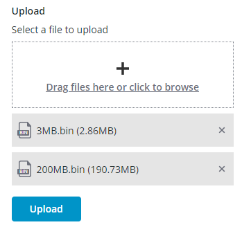

# ptcs-file-upload

## Visual




## Overview


## Usage Examples

### Upload Manager
File upload uses the upload manager in order to perform the following actions:
- Upload file
- Get uploading progress

### Basic Usage

```html
<ptcs-file-upload upload-manager="[[uploadMgr]]"></ptcs-file-upload>
```

## Component API

### Properties

| Property                      | Type     | Description                                                                                   | Default  | Triggers a changed event?|
| ----------------------------- | -------- | --------------------------------------------------------------------------------------------- | -------- | ----------------------- |
| disabled                      | Boolean  | Set to True to disable the element                                                            | false    | No                      |
| uploadManager                 | Object   | Specifies the upload manager. Refer to the detailed section about the upload manager below.   |          | No                      |
| showRepositorySelector        | Boolean  | If TRUE, the component will include a repository selector.                                    | false    | No                      |
| showRepositoryPath            | Boolean  | If TRUE, the component will include a repository path that the user can upload the file(s) to.| false    | No                      |
| fileUploadType                | String   | Sets the file upload control type (select/drag). If set to "Select file", the uploader is presented as a button that the user can click to open a file selection dialog box. If set to "drop zone", the file upload is presented as a drag-and-drop box where the user drags the files to upload, or alternatively the user can click anywhere in the box to browse for files. | "drag" | No |
| maxHeight                     | Number   | Sets the maximum height (in pixels) for the component. If not set, the height for the component is not restricted.| | No           |
| title                         | String   | Defines the label text for the component.                                                     | "Upload" | No                      |
| titleStyle                    | String   | Sets the label text style for the component.                                                  | "label"  | No                      |
| description                   | String   | Defines the description text for the component.                                               | ""       | No                      |
| descriptionStyle              | String   | Sets the description text style for the component.                                            | "body"   | No                      |
| disableInstantUpload          | Boolean  | If set to “true”, only placeholders for files are created, and the files are uploaded only after a submission. No progress indicators are shown. When set to "false", the files are uploaded with the content and progress indicators would show.| false | No |
| hideFileTypeIcon              | Boolean  | If set to “true”, the file type icon is not shown.                                            | false    | No                      |
| dropZoneLabel                 | String   | Defines the label text for the drop zone for the component.         |"Drag files here or click to browse"| No                      |
| dropZoneIcon                  | String   | Defines the icon in the drop zone                                                             |          | No                      |
| dropZoneHeight                | Number   | Defines the height for the drop zone box                                                      |          | No                      | 
| uploadedFileHeight            | Number   | Defines the height for an uploaded file box                                                   |          | No                      | 
| browseButtonLabel             | String   | Defines the label text of the browse button                                                   | "Browse" | No                      |
| browserButtonStyle            | String   | Defines the label style for the Browse button                                                 |"tertiary"| No                      |
| showUploadButton              | Boolean  | If set to “true”, the Submit button is available to submit the files selected for upload      | false    |                         |
| uploadButtonLabel             | String   | Defines the label text of the submit button                                                   | "Upload" | No                      |
| uploadButtonVariant           | String   | Sets the button style for the Submit button                                                   | "primary"| No                      |
| showDeleteAllButton           | Boolean  | If set to “true”, the “Delete All” button allows the user to cancel the upload and delete all uploaded files| |                    |
| deleteAllButtonLabel          | String   | Defines the label text for the “Delete All” button                                            | false    | No                      |
| fileNames                     | String   | (ReadOnly) The names of the selected files                                                    |          |                         |
| fullPaths                     | String   | (ReadOnly) The full paths of the files with path                                              |          | No                      |
| allowedFileTypes              | String   | Enter file types separated by a comma to only allow specific types. For example: gif, pdf, jpg.|         | No                      |
| allowedFileTypesMessage       | String   | The message to display when an unsupported file is added.                                     |          | No                      |
| allowedFileTypesMessageDetails| String   | A secondary message that displays more information when an unsupported file is added.         |          | No                      |
| externalValidity              | String   | The component's validity as determined externally (server-side). Value: `undefined`, `unvalidated`, `invalid`, or `valid` || No    |
| extraValidation               | Function | Custom validation function to _complement_ the component's client-side validation logic. Can return `true` (= valid), `false` (= invalid), or `undefined` (ignore validation) | | No |
| fileRequired                  | Boolean  | Require at least one file to be uploaded.                                                     |          | No                      |
| fileRequiredMessage           | String   | The message to display when a required file is missing.                                       |          | No                      |
| fileUploadErrorDetails        | String   | A secondary message that displays more information about the validation failure message for a file.|     | No                      |
| fileUploadErrorMessage        | String   | A message that displays as primary error message for a file.                                  |          | No                      |
| hideValidationCriteria        | Boolean  | Don't show a hint message about the required selection in unvalidated state?                  |          |                         |
| hideValidationError           | Boolean  | Don't show a failure message when the validation failed?                                      |          |                         |
| hideValidationSuccess         | Boolean  | Don't show a success message when the validation is successful?                               |          |                         |
| maxFileSize                   | Number   | Sets a maximum size limit on each individual file in megabytes (MB).                          |          | No                      |
| maxFileSizeFailureMessage     | String   | The message to display when a file exceeds the maximum allowed.                               |          | No                      |
| maxFileSizeFailureTitle       | String   | The title of the the dialog box that displays when the file size exceeds the maximum allowed. |          | No                      |
| maxNumberOfFiles              | Number   | Limits the maximum number of files that you can add to the upload list.                       |          | No                      |
| maxNumberOfFilesFailureMessage| String   | The message to display when the number of files added exceeds the maximum.                    |          | No                      |
| maxUploadSize                 | Number   | Sets a maximum size limit in MB for all selected files.                                       |          | No                      |
| maxUploadSizeFailureMessage   | String   | The message to display when the total upload size exceeds the maximum allowed.                |          | No                      |
| maxUploadSizeFailureTitle     | String   | The title of the dialog box that is displayed when the total upload size exceeds the maximum allowed.|   | No                      |
| validationCriteria            | String   | A secondary message that displays more information about the validation failure/criteria message.|       |                         |
| validationCriteriaIcon        | String   | An icon to display within the criteria status message (unvalidated).                    | "cds:icon_info"|                         |
| validationErrorIcon           | String   | An icon to display within the status message when the validation fails (invalid).       |"cds:icon_error"| No                      |
| validationMessage             | String   | The validation (title) message to display when the validation is in `invalid` state.|"File Upload Error(s)"| No                    |
| validationSuccessDetails      | String   | A secondary message that displays more information about the validation success message.      |          |                         |
| validationSuccessIcon         | String   | An icon to display within the status message when the validation succeeds (valid).    |"cds:icon_success"|                         |
| validationSuccessMessage      | String   | The message (title) to display when the validation is successful.                             | "Success"|                         |
| validity                      | String   | The component's validity status. Value: `undefined`, `unvalidated`, `invalid`, or `valid`     |          |                         |

### Using the Upload Manager Interface
To use an upload manager with the component, it should have the following methods and properties:

---
~~~js
upload(file, opts = {}, onprogress, onstatuschange)
~~~

Uploads the file to server. This method reports ongoing progress of the upload and the final status of the process.

#### Parameters
- ```file```: a Web API File object.
- ```opts```: Options can contain following fields:
  - ```repo```: the repo name to upload the file to (used by TWX)
  - ```path```: a path on the repo (used by TWX)
  - ```filename```: can be different from file.name in case of duplicate files
  - ```replace```: if destination file should be replaced
- ```onprogress```: This handler should be called by the upload manager when the uploading progress changes. ```e.progress``` should contain the percents number (0 <= progress < 100). 100% will be displayed by the file upload only when the 200 status is reported. ```e.filename``` should be assigned with the file name.
- ```onstatuschange```: This handler should be called by the upload manager when the upload status changes. In case of a successful upload ```e.status``` should be assinged to 200. ```e.filename``` should be assigned with the file name.
#### Returns
Object that contains the following methods that can be applied to the current upload:
``` cancel ```

### Events

| Name              | Data                                      | Description                                          |
| ----------------- | ----------------------------------------- | ---------------------------------------------------- |
| `delete-file`     | `ev.detail = { filename, repo, path }`    | Generated when the user removes a file from the list |
| `upload-started`  | `ev.detail = { [filenames], repo, path }` | Generated when the upload starts                     |
| `upload-failed`   | `ev.detail = { [filenames], repo, path }` | Generated when the upload fails                      |
| `upload-complete` | `ev.detail = { [filenames], repo, path }` | Generated when the upload is complete                |

### Methods

| Name        | Description                                                                                                                |
| ----------- | -------------------------------------------------------------------------------------------------------------------------- |
| `uploadAll` | Upload the files when "disable instant upload" is true                                                                     |
| `deleteAll` | Delete all the files from the list. Pass "noconfirm" argument as true if you don't need the confirmation dialog to appear. |
