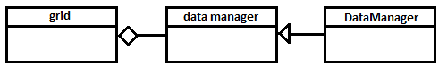
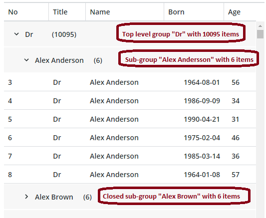

# Grid DataManager Implementation

This document describes the grid `DataManager` implementation.

The grid component uses a _data manager_ to manage the grid data. The documentation for the grid describes the properties and methods it expects in the data manager.

You can create your own implementation of the data manager for your grid clients. However, implementing it is complex, so the grid package contains a default implementation named `DataManager`.

The interface of the `DataManager` is declared in the `grid-data.d.ts` TypeScript declaration file.

## Overview

The `DataManager` manages an array of objects, and it supports the following operations:

- creating items
- updating items
- deleting items
- sorting
- filtering
- grouping
- selecting items
- hierarchical items (aka tree grid data)

The `DataManager` manages all items in the array, where the all of the grid data is stored. Therefore, you should implement features such as lazy loading or infinite scrolling as part of the grid client.

## Concepts

Each item is identified by its index in the data manager. Initially, the index is the same as the items index in the data array. However, when the data items are sorted, filtered, or grouped - _projected_ - the index changes.

These projections can occur frequently, which makes it hard to track the items. Therefore, the data manager uses _two_ indices for each item:

- the `baseIndex`, which is the index in the data array. This index is semi-persistent, and is only affected when items are added or deleted.
- the `index`, which is the items index in the current projection. This index is volatile. It can also reference _virtual_ items. For instance, when grouping is enabled, each group marker becomes a (virtual) grouping item.

## Basic methods

### Constructor

The data items can be specified when creating the `DataManager`.

~~~js
new DataManager(items)
~~~

The `items` argument is an array with different objects.

### CRUD operations

The following properties are available for CRUD operations:

| Property | Description |
|----------|-------------|
| `items`  | A write-only property that allows the client to replace all data items |
| `length` | A read-only property that contains the number of items in the current projection |

The following methods are available for CRUD operations:

| Method     | Arguments    | Description |
|------------|--------------|-------------|
| `item`     |  `index`     | Returns the item with the index in the current projection |
| `baseItem` | `baseIndex` | Returns the item with the base index in the data array |
| `baseIndex` | `index` | Translates the projection index to a base index |
| `translateBaseIndexToIndex` | `baseIndex` | Translate the base index to a projection index. This method is slow [O(n)] if there is an active projection. |
|`updateItem` | `index`, `update` | Updates the fields in the item with the projection index using fields that are specified in `update`. For example: `updateItem(3, {price: 45});`
|`insertItem` | `item`, `baseIndex` | Inserts the item `item` at the baseIndex `baseIndex`. This increases the baseIndexes for all following items. The selected items are automatically adjusted. |
|`insertTreeItem`|`item`, `baseIndex`, `where`|(Only availble in the Tree Model.) Inserts the item `item` relative to the `baseIndex` item, as specified by `where`: `'before'` (as previous sibling), `'after'`(as following sibling) or `'child'` (as the child). The `'child'` option can only be used on leaf nodes. If the baseIndex item already has children, you need to specify the position of the child relative to one of the existing children.
| `deleteItem` | `index` | Removes the item with the projection index `index`. |

### Sorting

Sorting is controlled with the `sort` property, which is a function that compares two data items. The function is called with the following parameters:

~~~js
sort(item1, item2, baseIndex1, baseIndex2, dataManager)
~~~

- `item1` and `item2` are the data items to compare.
- `baseIndex1` and `baseIndex2` are the base index of the items.
- `dataManager` is the data manager object that contains the items.

The function should return:

-  a number less than `0` if `item1` < `item2`
-  a number greater than `0` if `item1` > `item2`
-  `0` if `item1` = `item2`

Note: The `sort` function is a standard JS sort comparison function that is extended with three additional parameters.

### Filtering

Filtering is controlled with the `filter` property, which is a function that controls whether a data item is visible or hidden. The function is called with two parameters:

~~~js
function(item, baseIndex)
~~~

- `item` is the data item
- `baseIndex` is the baseIndex of `item`

The function must return:

- a _truthy_ value if the `item` should be kept in the projection.
- a _falsy_ value if the `item` should be removed from the projection.

### Grouping

Grouping is controlled with the `group` property, which is an array of functions that retrieves grouping keys from data items. If only a single grouping key is needed, `group` can be assigned directly to that function.

The grouping function is called with a data item and it returns the grouping key of that item.

The `DataManager` groups all items using the key of the first function. If there is a second grouping function, each group is grouped using the key of the second function. If there is a third function, each sub-group is grouped by the third function. This process is repeated until all grouping functions are applied.

Example:

~~~js
  // Extract company field from item
  const companyKey = item => item.company;

  // Extract department field from item
  const departmentKey = item => item.department;

  // Extract floor field from item
  const floorKey = item => item.floor;

  // Group dataManager1 by company field
  dataManager1.group = companyKey;

  // Group dataManager2 by company field, then department field, then floor field
  dataManager1.group = [companyKey, departmentKey, floorKey];
~~~

Groups become items with their own projection indexes. Each group item has the following fields:

- `$groupKey`, the group key
- `level`, the grouping level; an integer that starts at `0`.
- `count`, the number of data items in the group
- `isOpen`, a Boolean that is `true` when the group is expanded.

All groups are closed initially, and you can expand or collapse a group using the following method:

~~~js
toggleGroup(index, open)
~~~

where:

- `index` is the projection index of the group item.
- `open` controls whether the group is expanded or collapsed. Set to `true` to expand the group, `false` to collapse the group, or `undefined` to toggle between the two modes.

### Hierarchical items (Tree Grid)

When the data has hierarchical items, the grid allows the end user to expand and collapse items to reveal or hide their sub items.

Support for hierarchical items is enabled by giving the `DataManager` two methods that tells it how to find the sub-items.

- `subItemsState` determines if the item should have a collapse / expand icon or not
- `subItems` retrieve the sub items when the user expands the item

Details:

~~~js
subItemsState(item, baseIndex)
~~~

- `item` is a data item
- `baseIndex` is the base index of `item`

`subItemsState` should return either of:
- `true` if the item has sub-items that should, initially, be expanded
- `false` if the item has sub-items that should, initially, be collapsed
- `undefined` if the item is a leaf item (i.e. has no sub-items)
- `null` if the state is unknown. (This implies that the returned value of `subItems` for this item will be a `Promise`.)

~~~js
subItems(item, baseIndex)
~~~

- `item` is a data item
- `baseIndex` is the base index of `item`

`subItems` should return either of:

-  _falsy_ if item doesn't have any sub-items (children)
-  an array of sub-items (where `[]` is interpeted as _falsy_)
-  a `Promise` that resolves to _falsy_ or an array of sub-items

Example:

~~~js
items = [
    {label: 'Foo', content: [{label: 'Bar'}]},
    {label: 'Baz', content: 'https://data-provider.com/data/baz'},
    {label: 'Thunk'}
]

dataManager = new DataManager(items);

dataManager.subItemsState = item =>  {
    if (Array.isArray(item.content)) {
        return false; // Item has sub-items. Should start as collapsed
    }
    if (typeof item.content === 'string') {
        return null; // Don't know if item has children
    }
    return undefined; // No sub-items
};

dataManager.subItems = item => {
    if (Array.isArray(item.content)) {
        return item.content;
    }
    if (typeof item.content === 'string') {
        return fetch(item.content);
    }
    return null;
};
~~~

#### Methods for hierarchical items

The following methods are available for hierarchical items:

| Method     | Arguments    | Description |
|------------|--------------|-------------|
| `baseLevel`| `baseIndex`  | Returns the depth of item with the base index `baseIndex`. Top-level items has depth `0`, their children has depth `1`, etc. |
| `collapseAll`| | Collapses all sub-items. Only the top-level remains visible |
| `expandAll` | | Expands all sub-items. All items becomes visible |
| `numOpenDescendants` | `index` | Returns the number of open (visible) descendants of the item with the index `index` |
|`subTree`| `index`, `state` | Sets or gets the current visiblity state of the sub-items of the item with the index `index`. See below for additional details.|

~~~js
subTree(index, state)
~~~

- `index` is the index of a data item
- `state` sets or gets the visibility of the sub-items

If `state` is `undefined`, then `subTree` returns one of:
 - `true` - if the sub-items are visible
 - `false` - if the sub-items are hidden
 - `undefined` - if there is no sub-items
 - `null` - if there _might_ be sub-items (not yet resolved)
 - `'loading'` - if the data manager is waiting for a Promise to be resolved that will determine if there are sub-items

If `state` is:
- `true` - expand the sub-items
- `false` - collapse the sub-items
- `-1` - toggle the visibility of the sub-items

### Resetting the View

You can reset all projections using the `resetView()` method. Using this method is much faster than resetting the filtering, sorting, and grouping, which forces a projection remap at each step.

### Selections

The `DataManager` supports three selection modes that are specified using the `selectionMethod` property. The property has three options:

- `'none'` - selection is disabled (default)
- `'single'` - only a single item can be selected
- `'multiple'` - any number of items can be selected

You can assign and query the selected items using the `selected` property.

- If no items are selected then `selected` is `null`.
- If `selectionMethod` is `'single'` then `selected` is the base index of the selected item.
- If `selectionMethod` is `'multiple'` then `selected` is an array of the selected base indexes. The base indexes are always sorted.

Selections use base indexes instead of projection indexes to keep the `selected` value persistent when the projection changes.

Use the following methods to query and change the selection:

| Method | Arguments | Description |
|--------|-----------|-------------|
| `isSelected` | `index` | Returns `true` if the item with the projection index `index` is selected |
| `isSelectedBaseIndex` | `baseIndex` | Returns `true` if the item with the baseIndex `baseIndex` is selected |
| `select` | `baseIndex`, `selected`, `directSelection` | Set the selection mode of the item with the baseIndex `baseIndex`. If `selected` is `true` the item becomes selected. If `selected` is `false` the item becomes unselected. The selection mode toggles if `selected` is `undefined`. Use `directSelection` argument to set if row or rows selection was triggered directly or by data service |
| `setSelected` | `selected`, `directSelection`  | Set the selected items. Use `directSelection` argument to set if row or rows selection was triggered directly or by data service  |
| `selectAllItems` | `directSelection` | Selects all data items that are visible in the current projection. Use `directSelection` argument to set if row or rows selection was triggered directly or by data service |
| `unselectAllItems` | `directSelection` | Unselects all data items that are visible in the current projection. Use `directSelection` argument to set if row or rows selection was triggered directly or by data service |

### Callbacks

The `DataManager` uses callback functions to send updates about changes. To monitor these callbacks, you must register an observer, which is an object that has functions for the callbacks it monitors.

You can register an observer using the following method:

~~~js
observe(observer)
~~~

Use the following method to unregister the observer when you wish to stop monitoring changes to the data manager:

~~~js
unobserve(observer);
~~~

The following table lists the available callback functions:

| Function     | Arguments           | Description |
|--------------|-------------------|-------------|
|dmView        |                   | The data view is changed (i.e. the data  _items_ or the _sort_ function or the _filter_ function or the _group_ specification). |
|dmItem        |index              | The item with the index `index` is updated |
|dmInserted    |[[index, size], ...]| `size` number of items are added at `index`. The current selection is automatically adjusted. Note that several segments can be inserted at the same time. |
|dmRemoved     |[[index, size], ...]| `size` number of items are removed from `index`. The current selection is automatically adjusted. Note that several segments can be removed at the same time.|
|dmSelection   |selected           | The current selection is changed. `selected` is either `null` (when nothing is selected), a baseIndex (when `selectMethod` is `'single'`) or an array of baseIndexes (when `selectMethod` is `'multiple'`)|
|dmSelected    |baseIndex, selected| The selection mode changed for the item with the `baseIndex` base index. If `selected` is `false` it has been unselected and if `selected` is `true` it has been selected. |
|dmSort        |sort               | The sort function changed: `sort` is the new sort function. |
|dmFilter      |filter             | The filter function changed: `filter` is the new filter function. |
|dmSelectMethod|selectMethod       | The select method changed: `selectMethod` is the new select method. |
