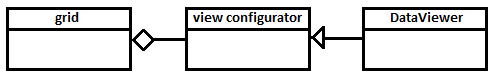
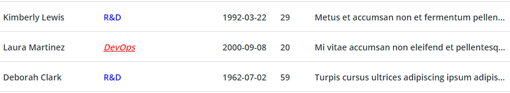

# Grid DataViewer

The following document describes the `DataViewer` JavaScript implementation that is used by the grid.

The Grid component uses a view configurator that is used to determine how data is displayed. The documentation for the grid describes the properties and methods that should be controlled by the view configurator.

You can create your own implementation of the view configurator. However, implementing it is complex, so the grid package contains a default implementation named `DataViewer`.

## Overview

The `DataViewer` consists of three parts:

- Grid properties - define global settings for the grid
- Column configurations - define the columns of the grid
- Callbacks - informs about changes to the view configuration

The interface of the `DataViewer` is declared in the `grid-view.d.ts` TypeScript declaration file.

## Grid properties

You can specify the initial values of the grid properties in the `options` argument of the `DataViewer` constructor:

~~~js
new DataViewer(columns, options);
~~~

Example:

~~~js
dataViewer = new DataViewer(
    columns,
    {
        selectMethod:     'multiple',
        singleLineHeader: true
    });
~~~

The properties can also be assigned dynamically. For example:

~~~js
dataViewer.selectMethod = 'single';
~~~

### canDelete

A Boolean property that specifies whether to add a separate _delete column_ after the grid data.

Each cell in the delete column contains a delete button. When the user clicks on the button, a request is sent to the data manager to delete the row, and the row is deleted. In some cases, the request may be ignored by the data manager.

### externalSort

A Boolean property that specifies whether data sorting is performed internally by the view configurator, or externally by the grid client.

This property applies to the _sort icons_ in the grid header. If the user clicks on a sort icon and `externalSort` is `false`, the view configurator assigns the sort function in the data manager to sort on the column data. If `externalSort` is `true`, the view configurator only updates the sort icons to reflect the sort order. In this case, the client listens to the `sort-icon-click` event and manually assigns the sort function.

### minHeightRow

A numeric property that specifies the minimum height of the grid rows. When this property is unspecified, the header shrinks until the row content fits.

### maxHeightHeader

A numeric property that specifies the maximum height of the header row. When this property is unspecified, the header grows until the header content fits.

### maxHeightRow

A numeric property that specifies the maximum height of the grid rows. When this property is unspecified, rows grow until the content fits.

### rowDepField

Specifies a field name that the grid uses to bind state formatting to the row.

### selectMethod

The `selectMethod` property specifies whether to add a _selection column_ to the grid. When this column is added, it is always displayed as the first column on the grid. The following table lists the available selection modes:

| Value      | Visual effect  |
|------------|----------------|
| `single`   | Displays a column with radio buttons. The radio button is in checked mode if the row is selected. The column header also contains a radio button. If no row is selected, the header button is in checked mode. If a row is selected and the user clicks on the header button, the grid selection is cleared. |
| `multiple` | Displays a column with check boxes. The check box is checked when a row is selected. The column header also contains a check box. The header check box is unchecked if no rows are selected and checked if all rows are selected. When some, but not all rows are selected, the header check box is checked in _partial_ mode. When the header check box is selected and some rows are selected, the grid selection is cleared. Otherwise all rows are selected. |

Note that you cannot use the `selectMethod` property to specify _how_ or _if_ rows can be selected in the grid. This is controlled by the grid _data manager_.

### singleLineHeader

A Boolean property that specifies whether to display each label within the grid header as a single line. To display headers across multiple lines, set this property to 'false'.

### singleLineRows

A Boolean property that specifies whether to display labels within grid rows on a single line.

~~~js
singleLineRows = false;
~~~

~~~js
singleLineRows = true;
~~~

### sortSelectionColumn

A Boolean property that specifies if the _selection column_ (see the `selectMethod` property) should have a sort button. The sort button makes it easy for the user to find the selected rows.

### hideTreeToggle

A Boolean property that specifies if the tree toggle for hierarchical items should always be hidden.

If `hideTreeToggle` is true, the user will not be able to expand or collapse the sub-items.

## Column configurations

The column configuration is an array where each array item specifies how to display the corresponding column. The initial values can be assigned in the `columns` argument to the `DataViewer` constructor:

~~~js
new DataViewer(columns, options);
~~~

Example:

~~~js
dataViewer = new DataViewer(
    [
        {label: 'Name', value: 'name', baseType: 'STRING'},
        {label: 'Age', value: 'age', baseType: 'NUMBER'}
    ],
    options);
~~~

You can also modify the configuration dynamically. For example:

~~~js
dataViewer.columnsDef = [...];
~~~

The configuration fields for each column are as follows:

- `label` - The column header label.
- `value` - Specifies how to compute cell values.
- `baseType` - The data type of `value`.
- `compare` - Specifies how to compare values when sorting.
- `headerHAlign` - The horizontal alignment of the header.
- `headerVAlign` - The vertical alignment of the header.
- `halign` - The horizontal alignment of the cell content.
- `valign` -  The vertical alignment of the cell content.
- `width` - The column width.
- `minWidth` - The minimum column width when the `width` property contains is a dynamic value.
- `maxWidth` - The maximum column width when the `width` property contains is a dynamic value.
- `sortable` - A Boolean property that displays a sort icon in the column header.
- `editable` - A Boolean property that controls whether inline editing is enabled or disabled for the column cells.
- `resizable` - A Boolean property that controls whether columns can be be resized by the user. (_Not yet implemented_)
- `treeToggle` - A property that controls if the column cells should act as tree grid toggle that expands or collapses the sub-items.
- `config` - The specific cell configuration. The data shape of this field depends on the `baseType` property.
- `$uiCtrl` - An object that gives full control over the cell content.

### Using the baseType Field

The required `baseType` field specifies the data type of the cell value, which is used to determine how the item is displayed, sorted, and edited.

The following table lists the supported data types and the components that are used to display and edit each type:

|baseType      |JS type|Description|Displayed|Edited|
|--------------|-------|-----------|---------|-------|
|`BOOLEAN`     |Boolean| A Boolean value|ptcs-checkbox|ptcs-checkbox|
|`DATETIME`    |Date   | A date |ptcs-label|ptcs-datepicker|
|`HTML`        |string | HTML content|By the browser, as is|N/A|
|`HYPERLINK`   |string or object | A URL or an object with the fields `href` (the URL) and `label` (the text presented in the grid). |ptcs-link|N/A|
|`IMAGELINK`   |string | A URL to an image|ptcs-image|N/A|
|`INTEGER`     |number | An integer value |ptcs-label|ptcs-textfield|
|`LONG`        |number | A LONG integer value |ptcs-label|ptcs-textfield|
|`NUMBER`      |number | A number |ptcs-label|ptcs-textfield|
|`STRING`      |string | A string |ptcs-label|ptcs-textfield or ptcs-dropdown|
|`TEXT`        |string | A string, including whitespace, multiple lines, and more. |ptcs-label|ptcs-textarea|
|`BASETYPENAME`|string | A ThingWorx baseType value |ptcs-label|ptcs-textfield|
|`LOCATION`    |string | A ThingWorx location value |ptcs-label|ptcs-textfield|

### Using the compare Field

You can use the optional `compare` field to specify a function that compares items.

~~~js
compare(item1, item2, baseIndex1, baseIndex2, dataManager)
~~~

- `item1` and `item2` - the items to compare
- `baseIndex1` - The baseIndex of `item1` in `dataManager`
- `baseIndex2` - The baseIndex of `item2` in `dataManager`
- `dataManager` - the data manager that contains `item1` and `item2`

The function returns:

-  a number less than `0` if `a` < `b`
-  a number greater than `0` if `a` > `b`
-  `0` if `a` = `b`

When `compare` is not specified, a standard comparison function is used instead based on the column data type.

### Using the config Field

The optional `config` field is an object with various fields that specifies additional information about how to display the column data. The supported fields depend on the data type:

| Type        | Field       | Description |
|-------------|-------------|-------------|
| _All types_ | `cellMarker`| A function that is called with the cell element as argument. This allows the client to mark cells in the column with different attributes. |
| `DATETIME`  | `locales` | A date that is formatted using the `Intl.DateTimeFormat(locales)` object. |
|           | `options` | Only applicable if `locales` is specified. The date is formatted using `Intl.DateTimeFormat(locales, options)`|
| `IMAGELINK` | `size` | Specifies the `size` property of the `ptcs-image` that renders the image.|
|             | `position` | Specifies the `position` property of the `ptcs-image` that renders the image.|
| `NUMBER`    | `locales` | The number is formatted using `Intl.NumberFormat(locales)` |
|             |`options` | Only applicable if `locales` is specified. The number is formatted using `Intl.NumberFormat(locales, options)`|
| `STRING`    | `enum` | An array of allowed values. This property is only used when the string is edited inline. A new value can be selected with a `ptcs-dropdown` instead of edited with a `ptcs-textfield` |

### Using the editable Field

The optional `editable` field is a Boolean that enables inline editing if `true`.

When a cell value is edited inline, the view configurator sends the updated values to the data manager using the `updateItem()` method.

### Using the halign Field

The optional `halign` field specifies the horizontal alignment of the grid cells. The supported values are:

- `'left'`
- `'center'`
- `'right'`

### Using the headerHAlign Field

The optional `headerHAlign` field specifies the horizontal alignment of the column header. The supported values are:

- `'left'`
- `'center'`
- `'right'`

### Using the headerVAlign Field

The optional `headerVAlign` field specifies the vertical alignment of the column header. The supported values are:

- `'top'`
- `'center'`
- `'bottom'`

### Using the label Field

The optional `label` field specifies the column header. You can specify a value in two ways:

- as a _string_, which is displayed using the `ptcs-label` component
- as a _function_ that returns an element

### Using the minWidth Field

The optional `minWidth` field specifies the minimum width of the column.

### Using the resizable Field

Not yet implemented

### Using the treeToggle Field

If treeToggle is _truthy_, then the cells in this column will contain a tree toggle icon that the user can click on to expand or collapse the sub-items.

The `treeToggle` can specify different icons:

- `'doublecarets'` (aka `'type1'`)
- `'close'` (aka `'type2'`)
- `'singlecaret'` (aka `'type3'`)
- `'plus/minus'` (aka `'type4'`)
- `'arrow'` (aka `'type5'`)

If `treeToggle` doesn't specify any of these string but is _truthy_, it defaults to `'type1'`

NOTE: If the corresponding item doesn't have any sub-items, the toggle icon is invisible.

### Using the sortable Field

The optional `sortable` field is a Boolean that adds a sort icon in the column header if `true`.

The user can click on this icon to sort the grid according to the values in the column.

### Using the valign Field

The optional `valign` specifies the vertical alignment of the grid cells. The supported values are:

- `'top'`
- `'center'`
- `'bottom'`

### Using the value Field

The required `value` field specifies the data of the row item that should be displayed in the column. You can specify it in two ways:

- as a _string_ that specifies a field name in the row data object
- as a _function_ that can return an arbitrary value

The function is called with two parameters:

~~~js
value(item, index) { ... }
~~~

- `item` - the row data object
- `index` - the projection index of `item` in the grids data manager

### Using The width Field

The `width` is an optional field that enables you to specify the column width in one of three ways:

- Constant widths, such as `100px`, that enable you to set the column to a fixed width in pixels.
- Percentage widths, such as `25%`, that specify column width as a percentage of the grid width.
- Relative widths, such as `2fr`, that specify the fraction of the remaining width, after all non-relative column widths are allocated, that should be allocated to the column.

When you specify a relative width, you should set a minimum width using the `minWidth` property. This keeps the column contents visible when the remaining width on the grid is too small. By default, each column has a default width of `1fr`.

### Using the $uiCtrl field

The optional `$uiCtrl` field gives you full control over the cell content. It should contain an object with two functions, `create` and `assign`. The `create` function creates the element that you want to place in the cells and the `assign` function binds the element to an item in the grid data. The element will be reused for many grid rows.

A simple example:

~~~js
$uiCtrl: {
    create: () => {
        const el = document.createElement('div');
        el.setAttribute('class', 'my-cell');
        return el;
    },

    /* Arguments:
       - el:    the element created by create()
       - value: the value that should be bound to the element
       - index: the index of the element in the Data Manager
       - data:  the Data Manager that contains the item

       NOTE: The corresponding item can be retrieved as data.item(index)
    */
    assign: (el, value, index, data) => {
        el.textContent = JSON.stringify(value);
    }
}
~~~

The `create` function must return a single element, but the element may contain any number of descendant elements.

## Callbacks

The `DataViewer` provides updates about view changes using callbacks. You must register an observer to monitor the callbacks. The observer is an object that has functions for the callbacks you want to monitor.

Use the `observe()` method to register an observer:

~~~js
observe(observer)
~~~

To stop the observer from monitoring the callbacks, unregister it using the `unobserve()` method:

~~~js
unobserve(observer);
~~~

As of the ThingWorx 9.2 release, the `DataViewer` has one callback function named: `dvChanged`.

### dvChanged

The `dvChanged` callback is invoked when the view configuration settings change.
