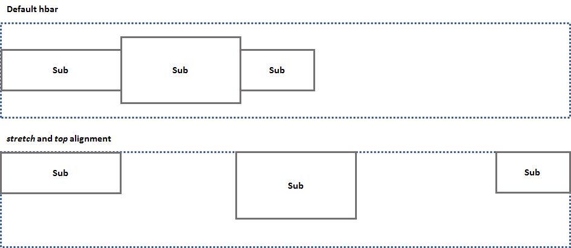

# ptcs-hbar


## This component is now deprecated. Use CSS `flexbox` directly instead.

The &lt;ptcs-hbar> web component is now deprecated and will be removed in a future update. Use CSS `flexbox` directly instead.

### Flexbox References
- Specification: https://www.w3.org/TR/css-flexbox-1/
- A Complete Guide to Flexbox: https://css-tricks.com/snippets/css/a-guide-to-flexbox/


## Visual



## Overview

The &lt;ptcs-hbar> web component aligns objects inside a horizontal bar. By default, objects within the bar are horizontally aligned to the left side and vertically aligned in the center. This component is a simplified interface for the CSS flex-box module.

## Usage Examples

### Basic Usage

```html
    <ptcs-hbar>
      
      <span>John Doe</span>
    </ptcs-hbar>
```

Result:


### Stretch horizontally

    <ptcs-hbar stretch>
      ...
    </ptcs-hbar>

### Align to the end

    <ptcs-hbar end>
      ...
    </ptcs-hbar>

### Stretch horizontally and align to the bottom

    <ptcs-hbar stretch bottom>
      ...
    </ptcs-hbar>

## Component API

### Properties
| Property | Type | Description |
|----------|------|-------------|
| inline | Boolean | Makes the hbar control an inline area. The control is a block area by default. |
| center | Boolean | Aligns objects in the center on the horizontal axis  |
| end | Boolean | Aligns objects at the end of the horizontal axis |
| stretch | Boolean | Fills the bar horizontally, and if needed, adds space between the objects. |
| space-around | Boolean | The same as _stretch_ but space is added before the first sub object and after the last sub object. |
| top  | Boolean | Aligns objects to the top of the vertical axis |
| bottom | Boolean | Aligns objects to the bottom of the vertical axis |
| xstretch | Boolean | Stretches sub objects to the same height as the hbar |
| wrap  | Boolean | Wraps the sub objects if they are wider than the hbox |


### Events

No events


### Methods

No methods


## Theming

N/A

## RTL

Supported.

## ARIA

N/A

