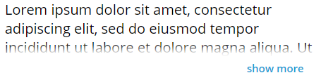

# ptcs-label

## Visual


A truncated single line label:


A truncated multiline label:



## Overview

ptcs-label displays static text. You can show text on a single line or across multiple lines. The dimensions of the control can be limited both horizontally and vertically.

When a single line label exceeds the specified width, an ellipsis is shown to indicate that the text is truncated. When a multiple-line label exceeds the specified height, then the text is wrapped across a new line. When the text label exceeds the specified height, a "show more" button is displayed. Clicking the button reveals the full text. The button label changes to "show less" when the text is revealed. You can click show less to hide the revealed text.

## Usage Examples

### Basic Usage

```html
<ptcs-label label="Enter payment method"></ptcs-label>
```

### Single line with maximum width (overflow truncation with ellipsis)

```html
<ptcs-label max-width="120px" label="Enter payment method"></ptcs-label>
```

### Multiline

```html
<ptcs-label
  multi-line
  label="A long informative text of some kind"
></ptcs-label>
```

### Multiline with constrained dimensions (Show More / Show Less link appears on overflow)

```html
<ptcs-label
  multi-line
  max-width="120px"
  max-height="80px"
  label="A long informative text of some kind"
></ptcs-label>
```

### Multiline with constrained dimensions (ellipsis truncation on overflow)

```html
<ptcs-label
  multi-line
  max-width="120px"
  max-height="80px"
  label="A long informative text of some kind"
  disclosure-control="ellipsis"
></ptcs-label>
```

### Variant

```html
<ptcs-label variant="some-variant" label="The label text"></ptcs-label>
```

## Component API

### Properties

| Property            | Type    | Description                                                                                                                            | Default    | Triggers a changed event? |
| ------------------- | ------- | -------------------------------------------------------------------------------------------------------------------------------------- | --------   | ------------------------- |
| disabled            | Boolean | Set to True to disable the element                                                                                                     | false      | No                        |
| disclosureControl   | String  | Values `show-more` or `ellipsis` for multiline overflow options                                                                        |            | No                        |
| horizontalAlignment | String  | Sets the horizontal alignment. You can set it to left, right, or center                                                                | left       | No                        |
| label               | String  | The text to display                                                                                                                    | " "        | No                        |
| maxHeight           | String  | The maximum height of the label. Requires multiLine mode. This property is only applied when the 'Height' CSS property is not defined. |            | No                        |
| maxWidth            | String  | The maximum width of the label. This property is only applied when the 'width' CSS property is not defined.                            |            | No                        |
| multiLine           | Boolean | Displays text across multiple lines                                                                                                    | false      | No                        |
| tabindex            | Number  | Tab order attribute, to allow element focus                                                                                            |            | No                        |
| tooltip             | String  | The tooltip that appears when hovering over the label                                                                                  | " "        | No                        |
| tooltipIcon         | String  | The icon for the tooltip                                                                                                               | " "        | No                        |
| variant             | String  | Variant of ptcs-label.                                                                                                                 | 'label'    | Yes                       |
| verticalAlignment   | String  | Sets the vertical alignment. You can specify the following values: flex-start, center, flex-end, stretch, and baseline                 |"flex-start"| No                        |
| showMoreLabel       | String  | The text for the show-button of "show more"                                                                                            |            | No                        |
| showLessLabel       | String  | The text for the show-button of "show less"                                                                                            |            | No                        |

### Events

No events.

### Methods

The component has Boolean function `isTruncated()` which returns `true` when the label text has been truncated because of size constraints, typically in combination with display options single line or `multiLine` set to `true` with `disclosureControl` set to `ellipsis`.

## Styling

### Parts

| Part        | Description                           |
| ----------- | ------------------------------------- |
| root        | The container for the label text      |
| label       | The label container                   |
| show-button | The 'show more' or 'show less' button |

### States

| Attribute | Description                            | Part  |
| --------- | -------------------------------------- | ----- |
| variant   | Specifies the label variant            | :host |
| disabled  | Specifies whether the list is disabled | :host |

### CSS Variables

| Custom property                | Description                                               | Default     |
| ------------------------------ | --------------------------------------------------------- | ----------- |
| --ptcs-label-show-button--more | The text for the show-button when part of label is hidden | "show more" |
| --ptcs-label-show-button--less | The text for the show-button when hidden text is revealed | "show less" |
