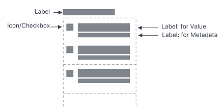

# ptc-list

## Visual

## Overview

A ptcs-list displays a list. Each list item can have a main "value label" and an optional "meta label" that is displayed below the value. The list supports both single and multiple selection mode. You can filter the list items.

## Usage Examples

### Basic Usage

~~~html
<ptcs-list items="[[items]]"></ptcs-list>
~~~

### Multi selection list

~~~html
<ptcs-list select-mode="multiple" items="[[items]]"></ptcs-list>
~~~

### List using a filter

~~~html
<ptcs-list filter items="[[items]]"></ptcs-list>
~~~

## Component API

### Properties
| Property                | Type     | Description                                                                                                                 | Default              |
|------------------------ | -------- | --------------------------------------------------------------------------------------------------------------------------- | -------------------- |
| alignment               | String   | Controls the alignment of items within the list. You can set it to 'right', 'left', or 'center'.                            | "left"               |
| allowNoItemSelection    | Boolean  | Disables or enables the clear selection button for single items                                                             |                      |
| autoSelectFirstRow      | Boolean  | Automatic select first item when items list is changed (true). No pre-defined selection otherwise                           |                      |
| clearSelectionLabel     | String   | The text to show in the item used to clear selection in single selection mode (when `allowNoItemSelection` is true)         |                      |
| disabled                | Boolean  | Disables the list                                                                                                           |                      |
| filter                  | Boolean  | Displays a text-field box that filters the list                                                                             | false                |
| hintText                | String   | The text for the "clear selection" label in single selection mode                                                           | "Filter"             |
| itemMeta                | Object   | Determines the item type. You can set it to text, link, image, and checkbox.                                                |                      |
| items                   | Array    | A JavaScript array that contains the list data                                                                              | [ ]                  |
| label                   | String   | An optional label that appears above the list                                                                               | " "                  |
| labelAlignment          | String   | Controls the alignment of items within the list. You can set it to 'right', 'left', or 'center'.                            | "left"               |
| labelType               | String   | A variant to use for the list label. You can set it to 'label', 'header', 'sub-header', and 'body'.                         | "label"              |
| selectAllLabel          | String   | The text to display for the item used to select all items in the list. The item is displayed at the top of the list when no items are selected in multiple selection mode.                                                                                                                                                              |"Select All"          |
| clearSelectedItemsLabel | String   | The text to display for the item used to clear all selections in the list. The item is displayed at the top of the list when one or more items are selected in multiple selection mode.                                                                                                                                                    |"Clear Selected Items"|
| metaSelector            | Any  | The same as _selector_ but selects the meta string instead. If _metaSelector_ has false data, the meta string is not displayed. | null                 |
| multiLine               | Boolean  | Determines whether list items can be displayed across multiple lines.                                                       | false                |
| multiSelect             | Boolean  | Enables multiple item selection                                                                                             |                      |
| rowHeight               | String   | Sets the row height                                                                                                         | '34'                 |
| selected                | Number   | If selectMode = "single" then _selected_ contains the selected item, if any.                                                | -1                   |
| selectedIndexes         | Array    | An array with the indexes of the selected items                                                                             | [ ]                  |
| selectedItems           | Array    | An array with the selected items                                                                                            |                      |
| selectedValue           | Object   | If selectMode = "single" then _selectedValue_ contains the selected item's value (according to _valueSelector_), if any.    |                      |
| selector                | Any      | Selects a string from each item in _items_ to be displayed as the list item label. If _unassigned_, items should be an array of strings. If a _string_ then items should be an array of objects, where the selector specifies the (string) property to display. If a _function_, then the function is called with each item and should return a string that represents the item.| null |
| treatValueAsString      | Boolean  | Deprecated. Returns _selectedValue_ as a _string_. Disabling the property returns the original object.                      |                      |
| returnOriginalValue     | Boolean  | Returns selectedValue in the original object format when set to true and as a string when set to false.                     | false                |
| valueSelector           | Any      | Selects a string from each item in _items_ to display as the list item value. If _unassigned_, uses _selector_ instead. If a _string_ then items should be an array of objects, where selector specifies the (string) property to display. If a _function_, then the function is called with each item and should return a string that represents the item. | null        |
| ownerTooltip            | String   | A tooltip from a list _owner_ (a component that uses `ptcs-list`, e.g. `ptcs-dropdown`) to be shown as part of list item truncation overflow tooltip |       |
| ownerTooltipIcon        | String   | Icon for the owner tooltip                                                                                                  |                      |
| extraValidation         | Function | Custom validation function to _complement_ the component's client-side validation logic. This is invoked with the list component itself as parameter, so that it can use any ptcs-list property for custom validation. Can return `true` (= valid), `false` (= invalid), or `undefined` (ignore validation)                                     |                      |
| externalValidity        | String   | List validity as determined externally (server-side). Value: `undefined`, "unvalidated", "invalid", or "valid"              |                      |
| hideValidationCriteria  | Boolean  | Don't show a hint message about the required selection in unvalidated state?                                                |                      |
| hideValidationError     | Boolean  | Don't show a failure message when the validation failed?                                                                    |                      |
| hideValidationSuccess   | Boolean  | Don't show a success message when the validation is successful?                                                             |                      |
| required                | Boolean  | Validation criterion: Require an item in the list to be selected.                                                           |                      |
| requiredMessage         | String   | The message to display when a list item is not selected.                                                                    |"A selection is required"|
| validationCriteria      | String   | A secondary message that displays more information about the validation failure/criteria message.                           |                      |
| validationCriteriaIcon  | String   | An icon to display within the criteria status message (unvalidated).                                                        | "cds:icon_info"      |
| validationErrorIcon     | String   | An icon to display within the status message when the validation fails (invalid).                                           | "cds:icon_error"     |
| validationMessage       | String   | The validation (title) message to display when the validation is in `invalid` or `unvalidated` states.                      |                      |
| validationSuccessDetails| String   | A secondary message that displays more information about the validation success message.                                    |                      |
| validationSuccessIcon   | String   | An icon to display within the status message when the validation succeeds (valid).                                          | "cds:icon_success"   |
| validationSuccessMessage| String   | The message (title) to display when the validation is successful.                                                           | "Success"            |
| validity                | String   | List validity status. Value: `undefined`, `unvalidated`, `invalid`, or `valid`                                              |                      |

### Events

| Name          | Data                       | Description                                              |
| ------------- | -------------------------- | -------------------------------------------------------- |
| DoubleClicked | { index of clicked item }  | Triggered whenever double-click event occurs on any item |

### Methods

No methods

## Styling

### Parts

| Part           | Description                                                                                                     |
| -------------- | --------------------------------------------------------------------------------------------------------------- |
| root           | The container for list                                                                                          |
| label          | An optional list label above the list                                                                           |
| list-container | The list body container (everything but the label)                                                              |
| filter         | The filter text-field                                                                                           |
| filter-field   | The filter text-field                                                                                           |
| multi-select   | the container for the link control that allows the whole list to be selected or unselected in multi-select mode |
| link           | The select or un-select all link                                                                                |
| list-item      | A list item in the list                                                                                         |
| item-checkbox  | The checkbox in multiple selection mode                                                                         |
| item-value     | The value label in the list item                                                                                |
| item-meta      | The meta label in the list item                                                                                 |
