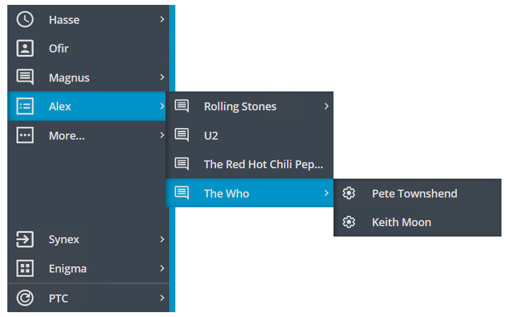

# ptcs-menubar

## Visual

## Overview

A `ptcs-menubar` presents the user with a vertical list of menu items. Each menu item might have optional subitems, which might _also_ have submenus, and so on. There is no physical limit to the nesting depth.

The subitems can be displayed in two different ways, either in _flyout_ or in _nested accordion_ mode.

In _nested_ mode, all items are displayed within the menu area itself. Items with subitems can be clicked to reveal the items below within the boundaries of the menu.

In _flyout_ mode, subitems are displayed in a popup window when the parent item is clicked.

The `ptcs-menubar` takes an array of objects. Fixed field names are used to extract the values from each object in the array:

* `label` is used for the title of the menu item
* `icon` for the item icon (if any)
* `disabled` is a boolean flag, specifying if the item should be grayed out and non-interactive. Default is false.
* `tooltip` / `tooltipIcon` specifies the tooltip / tooltip icon to display for the menu item (if any)
* `content` is an array, defining any (optional) subitems.

The Menu bar has four distinct areas:

* The _Header_ area, containing the reveal icon (that toggles the compact mode)
* The _Primary_ area
* The _Secondary_ area
* A _Footer_ area for branding information (e.g. a Company logo)

The _Primary_ area is displayed at the **top** of the Menu bar whereas the _Secondary_ and the _Footer_ areas are displayed at the **bottom** of the Menu bar. The Footer area is optional and may be hidden.

In _nested_ mode, the _Secondary_ area is not available. Any data passed to it will be appended to the data in the Primary area.

The `ptcs-menubar` can be displayed in **Compact mode**, showing the items on the primary level with just an icon, without the text. This is activated by clicking of the reveal icon in the header.

The `ptcs-menubar` has three internal helper objects:

* `ptcs-menu-flyout`, which handles the data in the Primary and Secondary areas if the Menu bar type is _flyout_.
* `ptcs-menu-item` represents an item in either the flyout menu or in a popup menu (with an (optional) icon, a title, and an optional submenu)
* `ptcs-menu-submenu` is a popup menu, displayed when selecting a menu item, containing the menu items of the submenu

These should not be exposed or used separately, but their parts are available for styling.

In the _nested accordion_ case, the data in the Primary and Secondary areas are handled by a `ptcs-accordion` object.

## Usage Examples

### Basic Usage

~~~html
<ptcs-menubar items="[[itemsTop]]"
           items2="[[itemsBottom]]"></ptcs-menubar>
~~~

## Component API

### Properties

| Property                 | Type     | Description                                                                                               | Default  | Triggers a changed event? |
|------------------------- | -------- | --------------------------------------------------------------------------------------------------------- | -------- | ------------------------- |
| menuType                 | String   | Defines the _type_ of the Menu bar, how subitems are displayed. Should be either `'flyout'` or `'nested'`.| "flyout" |                           |
| items                    | Array    | Array of objects to display in the _Primary_ area                                                         | [ ]      |                           |
| items2                   | Array    | Array of objects to display in the _Secondary_ area                                                       | [ ]      |                           |
| matchSelectorF           | Function | Function that determines if a given menu item matches a `selectedKey` string. This allows the user to match any property in the item, not just e.g. the title| | |
| selectedKey              | String   | When used to set the selection from the "outside", this is the 'key' to select (it is interpreted by the user-supplied `matchSelectorF` function)| | |
| maxMenuItems             | Number   | Defines the maximum number of visible primary items. If there are more items added to this area, they will be "collapsed" as a submenu under a "virtual" _More items..._ entry. This is only supported in _flyout_ mode. | | |
| maxSubmenuItems          | Number   | Defines the maximum number of items in a popup menu. If there are more items in the popup, they will be "collapsed" as a submenu under a "virtual" _More items..._ entry |||
| moreItemsLabel           | String   | The string to use for the text of the virtual "More..." entry                                             |"More..." |                           |
| moreItemsIcon            | String   | The icon to use for the virtual _More items..._ entry                                                     |"cds:icon_more_horizontal"|           |
| brandingItem             | String   | The data to use for the branding/footer section. Uses the same format as the "main" data, there should be a property called `label` for the text, `icon` for the (optional) icon and additional `logo` that overrides both `label` and `icon` on expanded mode. Any other data can also be added, this items is returned to the callback when the user clicks the footer.| null ||
| hideBrandingArea         | Boolean  | Hides the footer/branding area                                                                            |          |                           |
| allowMissingIcons        | Boolean  | Deprecated. Should any missing icons be replaced by a 'default' icon?                                     |          |                           |
| fillMissingIcons         | Boolean  | Displays a filler icons next to items with a missing icon                                                 |          |                           |
| stayOpenAfterSelection   | Boolean  | In 'nested' mode, should the Menu bar "collapse" or remain open after a selection has been made?          | false    |                           |
| alwaysOpen               | Boolean  | Should the Menu bar always be open, and the reveal button in the header thus be hidden?                   | false    |                           |
| preventResize            | Boolean  | Should the resize handle be visible or not?                                                               | false    |                           |
| displayIconsInUpperRegion| Boolean  | Should the icons in the upper (Primary) region be visible?                                                | false    |                           |
| displayIconsInLowerRegion| Boolean  | Should the icons in the lower (Secondary) region be visible?                                              | false    |                           |
| compactMode              | Boolean  | Deprecated. Should the main Menu bar be displayed in Compact mode (showing just the icons)?               |          |                           |
| disableCompactMode       | Boolean  | Disables compact mode                                                                                     | false    |                           |
| maxWidth                 | Number   | Minimum width of accordion. Directly mapped to CSS max-width.                                             |          |                           |
| minWidth                 | Number   | Minimum width of accordion. Directly mapped to CSS min-width.                                             |          |                           |
| menuMaxWidth             | String   | Max width of the popup menus                                                                              |          |                           |
| menuMinWidth             | String   | Min width of the popup menus                                                                              |          |                           |
| disabled                 | Boolean  | Should the Menu bar be disabled?                                                                          | false    |                           |
| iconWidth                | String   | Sets a fixed width for the icon (both iconWidth and iconHeight should be set, otherwise the icon default size is set) || No |
| iconHeight               | String   | Sets a fixed height for the icon (both iconWidth and iconHeight should be set, otherwise the icon default size is set)|| No |

### Parts Structure

The Menu bar has the following parts:

| Part          | Description                                                                                                    |
| ------------- | -------------------------------------------------------------------------------------------------------------- |
| root          | Root element of the Menu bar (including items and expand/handle parts)                                         |
| main-area     | Contains the header, the items-area, and the footer                                                            |
| header        | Contains the reveal button that toggles the compactMode                                                        |
| header-icon   | The reveal `ptcs-icon`                                                                                         |
| items-area    | The _core_ of the Menu bar where the items are displayed, either in _flyout_ or _nested_ mode                  |
| footer        | Containing the branding information                                                                            |
| branding-item | A `ptcs-menu-item` used to display the footer data                                                             |
| flyout        | In _flyout_ mode, this contains the `ptcs-menu-flyout` object that holds the Primary and Secondary areas       |
| accordion     | In _nested_ mode, Contains a `ptcs-accordion` object that displays the items                                   |
| expand        | The "line" to the right of the items                                                                           |
| handle        | The clickable handle displayed in the middle of the expand area to allow resizing by dragging                  |
| handle-icon   | The `ptcs-icon` of the handle                                                                                  |
| popup         | Each `ptcs-menu-submenu` that displays the items of a submenu has this part name                               |

Note that the popup elements are not added as children of the `ptcs-menubar` element in the DOM tree but rather appended to the document element itself.

The _flyout_ menu has the following parts:

| Part           | Description                                                 |
| -------------- | ----------------------------------------------------------- |
| navigator-items| Root element of the items, both primary and profile         |
| primary-items  | The Primary items displayed at the top of the Menu bar      |
| profile-items  | The Secondary items displayed at the bottom of the Menu bar |
| menu-item      | Each menu item (regardless of its area) has this part name  |

For the _nested_ menu type, see the `ptcs-accordion` documentation for details.

The menu item has the following parts:

| Part         | Description                                                                                |
| ------------ | ------------------------------------------------------------------------------------------ |
| icon         | A `ptcs-icon` displaying the item icon (if any)                                            |
| label        | A `ptcs-label` displaying the menu item text                                               |
| submenu-icon | A `ptcs-icon` displayed to the right of the label to indicate that an item has a _submenu_ |

The popup menu has the following parts:

| Part      | Description                         |
| --------- | ----------------------------------- |
| root      | Root element of the popup menu      |
| menu-item | Each menu item has this part name   |

### Events

| Name     | Data                   | Description                                                                             |
| -------- | ---------------------- | --------------------------------------------------------------------------------------- |
| `action` | `ev.detail = { item }` | Generated when the user clicks on a "leaf" in the menu tree (an item without a submenu) |

### Methods

`ptcs-menubar` has no methods.

### State attributes

| Attribute  |Description                                                                                                                                                                                | Part    |
| ---------  | ----------------------------------------------------------------------------------------------------------------------------------------------------------------------------------------- | -----   |
| disabled   | Is the Menu bar disabled?                                                                                                                                                                 | :host   |
| selected   | Is a menu item currently selected (does it have an open popup menu)                                                                                                                       |menu-item|
| overflow   | Set if the popup menu (or one of its parents) is not displayed in the "default" location (aligned with the right edge of the "parent" menu item) due to size constraints, this allows different styling in these cases    |popup|
| header     | Set on the menu item in the header section                                                                                                                                                |menu-item|
| branding   | Set on menu items in the branding section (normally just one)                                                                                                                             |menu-item|
| no-content | Set on items that don't have any content/submenu, this allows for styling these items differently                                                                                         |menu-item|
| all-siblings-childless| Set on menu items within a popup menu where none of the items in the menu has any content/submenu                                                                              |menu-item|
