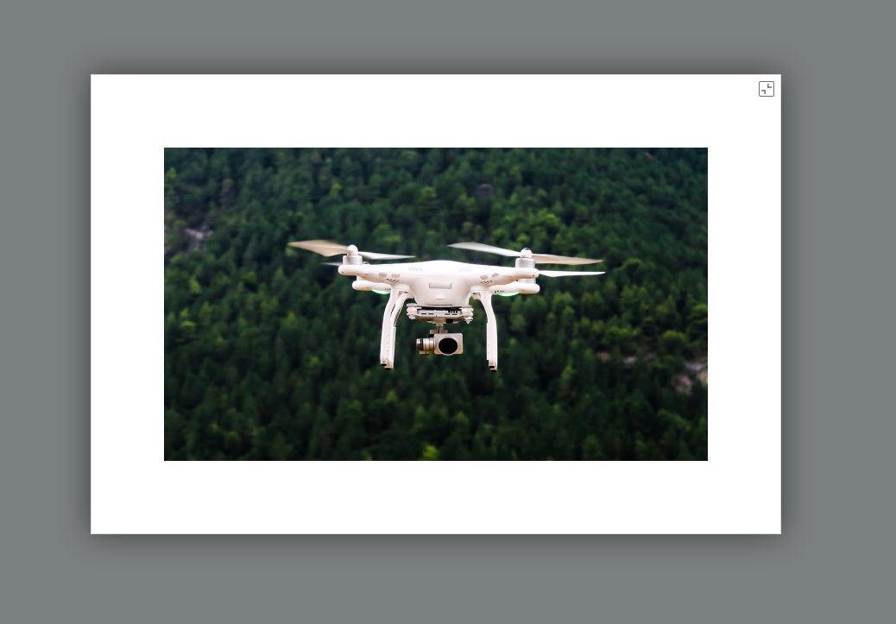

# ptcs-modal-image-popup

## Visual

## Overview

The ptcs-modal-image-popup shows an image thumbnail and a button. Clicking on the button shows the image in a modal pop-up against a semi-opaque backdrop.

## Usage Examples

### Basic Usage

    <ptcs-modal-image-popup src="./some-image.png"></ptcs-modal-image-popup>

    <ptcs-modal-image-popup src="./some-image.png" disabled></ptcs-modal-image-popup>

Attribute `disabled` prevents the pop-up behavior.

## Component API

### Properties
| Property | Type | Description | Triggers a changed event |
|----------|------|-------------|--------------------------|
|src| String | The image to display | No |
|backdropColor| String | The modal dialog backdrop overlay color (default: #232b2d) | No |
|backdropOpacity| String | The modal dialog backdrop opacity, a value between 0 and 1.0 (default: 0.6) | No |
|disabled|Boolean| Is the image pop-up disabled?| No |
|altText|String| Alternative text replacement for the image (shown when image doesn't load) | No |
|height|Number|Fixed height constraint| No |
|width|Number|Fixed width constraint| No |
|maxHeight|Number|Maximum height constraint| No |
|maxWidth|Number|Maximum width constraint| No |
|noDisclosureButton|Boolean|Toggle to show or hide the disclosure button; this property also governs whether or not to signal an overflow condition| No |

### Events

| Name | Description |
|------|-------------|
|popup-close-action| Triggered when clicking on close button of the pop-up |
|image-overflow| Boolean `ev.detail.overflow` is true when the image intrinsic size is larger than the displayed thumbnail and `noDisclosureButton` is false |

### Methods

The component has methods `open` and `close` but they are called automatically from the respective buttons, so do not need to be invoked directly.

| Signature | Description |
|-----------|-------------|
| open() | Opens the modal pop-up dialog. Called when you click on the button in the thumbnail version. |
| close() | Closes the modal pop-up dialog. Called when the close button is clicked. |

## Styling

### Parts

| Part | Description |
|------|-------------|
| popup-root | Container for the modal pop-up |
| live-art-area-image-thumbnail  Container for the thumbnail |
| image | The thumbnail image |

### State attributes

No public state attributes.
