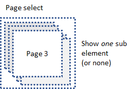

# ptcs-page-select

## Visual

## Overview

&lt;ptcs-page-select&gt; displays one or none of its child elements. The component works well with a &lt;ptcs-tabs&gt; component, where the tab control selects a page and the page selector displays the selected page.

The &lt;ptcs-page-select&gt; can support animations. When the component wants to show or hide an sub-element, it first checks if the element has a property named _opened_. If so it assigns _opened_ to _true_ (show) or _false_ (hide). The element (component) can watch this propery and animate any changes to it. If no such property exists &lt;ptcs-page-select&gt; sets the CSS _display_ property to "none" to hide to page.

## Usage Examples

### Basic Usage

~~~html
<ptcs-page-select selected="0">
  
Page One

  
Page Two

  
Page Three

</ptcs-page-select>
~~~

Show _Page One_ initially. Another element can be made visible by reassigning the _selected_ property or by using the corresponding methods of the component.

### Select Page via Attribute

~~~html
<ptcs-page-select attr-for-selected="page" selected="page2" fallback-selection="fallback">
  
Invalid page value

  
Page One

  
Page Two

  
Page Three

</ptcs-page-select>
~~~

Show _Page Two_ initially. If the _selected_ property is assigned a value that doesn't have a corresponding page, the _Invalid page value_ element displayed.

## Component API

### Properties
| Property | Type | Description |
|----------|------|-------------|
|selected| Number or String |The sub-element that should be visible.|
|attrForSelected| String | If null then _selected_ is interpreted as a zero-based index. Otherwise attrForSelected specifies an attribute name: the first sub-element that has the same value on the attribute as _selected_ is visible. |
|fallbackSelection|String| Specifies the sub-element that should be visible in case no element matches _selected_. This property is only used when _attrForSelected_ is non-null.|

### Events

| Name | Data | Description |
|------|------|-------------|
| selected-changed | { selected } | When the selected value changes |

### Methods

| Signature | Description |
|-----------|-------------|
|indexOf(el)|Returns the index of the page that contains el|
| select(value) | Set the selected propery. _value_ is either a string or a number.|

## Styling

&lt;ptcs-page-select&gt; is a pure layout component. It does not have any parts nor any CSS variable styling.

## RTL

N/A (?)

## ARIA

To be decided
