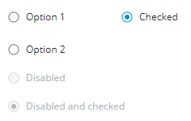

# ptcs-radio

## Visual

A radio button consists of a button and a text label.

You can assign a maximum width to the radio button label to display it across multiple lines.

## Overview

A radio button can be in an _on_ or an _off_ state. When the radio button is checked, it is set to _on_. Multiple radio buttons can belong to the same group. Only one button in the group can be in an _on_ state.

A radio button can be in a selected  and/or a disabled state. A disabled button does not respond to UI events.

A radio button has a **radiogroup** association to support the group notion. When checked (selected), the radio button remains in that _on_ state until another radio button in the same radiogroup is checked. The radio button cannot be deselected like toggle buttons.

## Usage Examples

### Basic Usage

    <ptcs-radio radiogroup="groupname" label="This is the label string"></ptcs-radio>

### Start in on state (checked)

    <ptcs-radio radiogroup="mammal" label="Dog" checked></ptcs-radio>

NOTE: By default, the first radio button of a radiogroup is checked. In the web component, this happens in the demo HTML, and for ptcs-radio that have an empty radiogroup. In the wrapped Radio Button of Composer, this functionality is triggered when the radiogroup is changed. In Mashup Builder, when you initially drag the Radio Button widget, none of them are checked. The first occurrence of a new and non-empty radiogroup *definition* checks the button.

### A group of radio buttons

    <ptcs-radio radiogroup="animal" label="Cat"></ptcs-radio>
    <ptcs-radio radiogroup="animal" label="Dog"></ptcs-radio>
    <ptcs-radio radiogroup="animal" label="Parrot"></ptcs-radio>

Radio buttons within the same radiogroup are mutually exclusive. Only one of the buttons in same radiogroup can be in the _on_ state.

### A radio button with maximum width label

        <ptcs-radio radiogroup="reptile" label="Anaconda. A very long label might be displayed as multiline, and does not get truncated or an ellipsis" label-max-width="150px">

 By default, the radio button label is a single line. You can wrap the label text across multiple lines by specifying a maximum width for the label or its inherited width.

## Component API

### Properties
| Property                | Type     | Description                                                      | Default           | Triggers a changed event?   |
| ----------------------- | -------- | ---------------------------------------------------------------- | ----------------- | --------------------------- |
| checked                 | Boolean  | The current state (on: checked === true, off: checked === false) | false             | No                          |
| disabled                | Boolean  | Disables the component. Users cannot interact with the element.  | false             | No                          |
| label                   | String   | The string for the radio button label                            | "Radio Button"    | No                          |
| labelMaxWidth           | String   | The maximum width (a CSS length) of the radio button label       | ""                | No                          |
| preventAutoSelect       | Boolean  | The radio button normally auto-selects itself when connected to the DOM if no other radio button is selected in the current `radiogroup`. Property `preventAutoSelect` disables this behavior. || No |
| radiogroup              | String   |To support mutually exclusive radio buttons in same radiogroup    | ""                | No                          |
| tooltip                 | String   | The tooltip that appears when hovering over the radio button     | ""                | No                          |
| tooltipIcon             | String   | The icon for the tooltip                                         | ""                | No                          |
| extraValidation         | Function | Custom validation function to _complement_ the component's client-side validation logic. This is invoked with the radio button component itself as parameter, so that it can use any radio button property for custom validation. Can return `true` (= valid), `false` (= invalid), or `undefined` (ignore validation) || No |
| externalValidity        | String   | Radio button validity as determined externally (server-side). Value: `undefined`, "unvalidated", "invalid", or "valid" | No  |
| hideValidationCriteria  | Boolean  | Don't show validation criteria in unvalidated state?             |                   | No                          |
| hideValidationError     | Boolean  | Don't show validation error state?                               |                   | No                          |
| hideValidationSuccess   | Boolean  | Don't show validation success state?                             |                   | No                          |
| required                | Boolean  | Validation criterion: Must the radio button be checked?          | false             | No                          |
| validationCriteria      | String   | The validation details message                                   |                   | No                          |
| validationCriteriaIcon  | String   | Icon for criteria state (unvalidated).                           | "cds:icon_info:"  | No                          |
| validationErrorIcon     | String   | Icon for error state (invalid).                                  | "cds:icon_error"  | No                          |
| validationMessage       | String   | The validation (title) message                                   |                   | No                          |
| validationSuccessDetails| String   | The validation success details message                           |                   | No                          |
| validationSuccessIcon   | String   | Icon for success state (valid).                                  | "cds:icon_success"| No                          |
| validationSuccessMessage| String   | The validation success (title) message.                          | "Success"         | No                          |

### Parts Structure

The radio button exposes following parts from its shadow tree for styling purposes.

| Part Name       | Description                                                                      |
| --------------- | -------------------------------------------------------------------------------- |
| root            | The radio button parent element                                                  |
| circle          | The radio button                                                                 |
| exterior-ring   | The exterior ring of the radio button                                            |
| interior-button | The interior part of the radio button, that is filled when the button is checked |
| label           | The radio button label                                                           |

### Events

| Name            | Data       | Description                                          |
| --------------- | ---------- | ---------------------------------------------------- |
| checked-changed | {checked}  | Generated when the state of the radio button changes |

### Methods

No methods

### State attributes
| Attribute  | Description                                    | Part         |
| ---------- | ---------------------------------------------- | ------------ |
| checked    | The current state                              | :host, root  |
| disabled   | Indicates whether the radio button is disabled | :host, root  |
| label      | The displayed label                            | :host, label |
| radiogroup | The associated radio group                     | :host        |