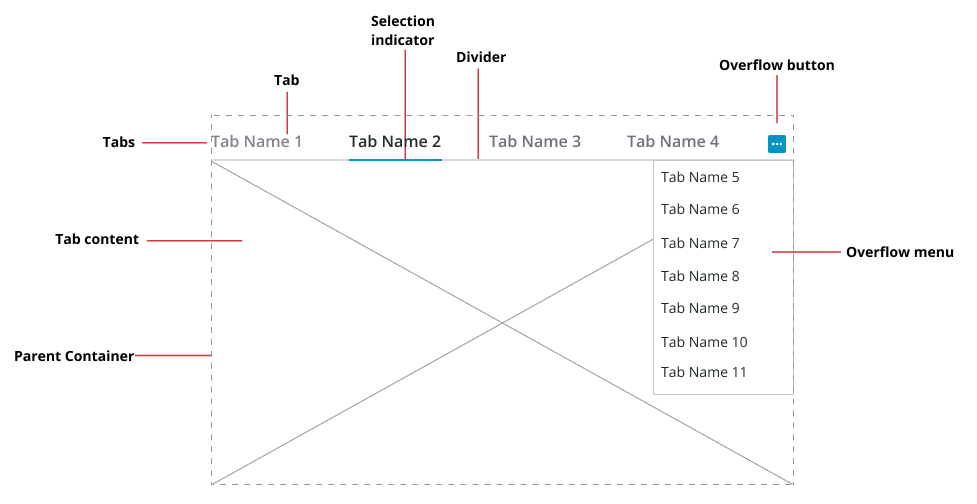

# ptcs-tab-set

## Visual

## Overview

The &lt;ptcs-tab-set&gt; is a layout component that contains a set of tabs. Each tab can display a different set of items. Only one tab can be selected at a time. The selected tab is indicated with a selection bar that is typically a line under the tab. The tab name width will auto-size to accommodate the name length, but can optionally be assigned a maximum width; a tab name that exceeds the maximum width is truncated with horizontal ellipsis suffix to indicate the overflow.

The layout mode is _horizontal_, where the tabs are laid out along a line. On overflow a dropdown menu button appears, for tabs that are not being shown. 

The component builds on `vaadin-tabs` so inherits a vertical layout option, but this is not a supported layout.

## Usage Examples

### Basic Usage

~~~javascript
function func()
  {
    const bind = document.getElementById('tabSet');

    bind.tabs = [
      { name: "Tab One Title"},
      { name: "Another Tab"}
    ];
  }
~~~

~~~html
<ptcs-tab-set selected="0" id="tabSet" items="{{tabs}}">

something in the first tab

</ptcs-tab-set>
~~~
Creates a two-column tab set with a div element that is shown when the first tab is selected.

### Vertical layout

~~~html
<ptcs-tab-set selected="0" orientation="vertical" id="tabSet" items="{{tabs}}">
</ptcs-tab-set>
Creates a two-column vertical tab set with a div element that is shown when the first tab is selected, without overflow or
~~~

NOTE:
* The PTC Design System does not provide support for vertical tabs. The orientation is only an attribute and not a property.
* Each DOM inside the tab set becomes the pages body of its index corresponding column.

## Component API

### Properties
| Property           | Type    | Description                                                                                             | Default |Triggers a changed event?|
| ------------------ | ------- | ------------------------------------------------------------------------------------------------------- | ------- | ----------------------- |
| defaultTabNumber   | Number  | The one-based index number of the selected tab when the tab set is loaded.                              | 1       | Yes                     |
| disabled           | Boolean | Disables the tabs.                                                                                      | false   | No                      |
| items              | Array   | The array that holds the tab data. It includes four properties: name, value (String), visible, and disabled |     | No                      |
| selected           | Number  | The zero-based index of the selected tab                                                                | 0       | Yes                     |
| selectedTabName    | String  | The name of the selected tab                                                                            |         | Yes                     |
| selectedTabValue   | String  | The value of the selected tab                                                                           |         | Yes                     |
| tabHeight          | Number  | The height of page that the tab is showing, unless the page is stretched by flex CSS.                   |         | No                      |
| tabNameMaxWidth    | Number  | The maximum width for the tab name (by default no limit)                                                |         | No                      |

### Methods
No methods.

## Styling

### The Parts of a Component

| Part       | Description                                                             |
| ---------- | ----------------------------------------------------------------------- |
| tabs-header| The tabs container. This does not include the page on the selected tab. |
| divider    | A divider between the tabs and the page display                         |
| pages      | The page that shows when you select a tab                               |

### State attributes

| Attribute | Description                              | Part                      |
| --------- | ---------------------------------------- | ------------------------- |
| disabled  | Is tab set disabled?                     | :host, tabs-header, pages |
| selected  | The zero-based index of the selected tab | :host                     |
| tabHeight | The height of page the tab is showing    | :host                     |

