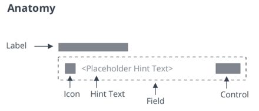

# ptcs-textfield

## Visual

## Overview

&lt;ptcs-textfield&gt; is an input box that can be customized to fit your application.

## Usage Examples

### Basic Usage

~~~html
<ptcs-textfield label="First name" hint-text="Enter first name"></ptcs-textfield>
~~~

Shows an input box with a label and a hint text.

### With validation

~~~html
<ptcs-textfield label="Length in centimeter" mask="numeric" >
</ptcs-textfield>
~~~

Shows an input box that allows only a specific pattern.

### With a search icon

~~~html
<ptcs-textfield icon label="Search Bar" hint="Search">
</ptcs-textfield>
~~~

## Component API

### Properties
| Property                | Type     | Description                                                                                      | Default |  Triggers a changed event? |
| ----------------------- | -------- | -------------------------------------------------------------------------------------------------| ------- | -------------------------- |
| counter                 | Boolean  | Adds a characters counter at the end of the field                                                |         | No                         |
| disabled                | Boolean  | Disables the component                                                                           | false   | No                         |
| hasText                 | Boolean  | A read-only property that indicates whether the text has a non-empty value.                      |         | No                         |
| hintText                | String   | The hint text to show for an empty text field                                                    | ""      | No                         |
| icon                    | String   | Specifies the icon with an icon set                                                              | ""      | No                         |
| iconSet                 | String   | A URL to an SVG icon set from which to select an icon (identified via `icon`)                    |         | No                         |
| label                   | String   | The label that is shown for the text field                                                       | ""      | No                         |
| labelAlignment          | String   | Aligns the label to the right, left, or center.                                                  | "left"  | No                         |
| mask                    | String   | Specifies the mask of the following format: a-alpha, 9-numeric, *-alphanumeric                   | ""      | No                         |
| maxNumberOfCharacters   | Number   | Allows only specified amount of characters.                                                      | 1000000 | No                         |
| password                | Boolean  | If true, characters are masked                                                                   | false   | No                         |
| readOnly                | Boolean  | This attribute indicates that the user cannot modify the value of the control                    | false   | No |
| showClearText           | Boolean  | Deprecated. Adds a clear-text button at the end of the field                                     |         | No                         |
| hideClearText           | Boolean  | Hides the clear-text button at the end of the field                                              | false   | No                         |
| text                    | String   | The initial value of the control. Supports two-way data binding                                  | ""      | Yes                        |
| textAlignment           | String   | Sets the text alignment to left or right.                                                        | "left"  | No                         |
| tooltip                 | String   | The tooltip that appears when hovering over the text field, or when it has keyboard focus        | ""      | No                         |
| tooltipIcon             | String   | The icon for the tooltip                                                                         | ""      | No                         |
| iconWidth               | String   | Sets a fixed width for the icon (both iconWidth and iconHeight should be set, otherwise the icon default size is set)  || No            |
| iconHeight              | String   | Sets a fixed height for the icon (both iconWidth and iconHeight should be set, otherwise the icon default size is set) || No            |
| validity                | String   | Returns the value of validation: "undefined", "unverified", "invalid" or "valid"                 |         | No                         |
| extraValidation         | Function | Custom client validation function. This is invoked with the text component itself as parameter, so that it can use any ptcs-textfield property for custom validation. Can return `true` (= valid), `false` (= invalid), or `undefined` (ignore validation) || No |
| externalValidity        | String   | Controls the state of the validation. You can set this property to unvalidated, valid, or invalid.|        | No                         |
| hideValidationCriteria  | Boolean  | Don't show validation criteria in unvalidated state?                                             |         | No                         |
| hideValidationError     | Boolean  | Don't show validation error state?                                                               |         | No                         |
| hideValidationSuccess   | Boolean  | Don't show validation success state?                                                             |         | No                         |
| required                | Boolean  | Validation criterion: Need to enter text                                                         |         | No                         |
| requiredMessage         | String   | The message that is displayed when no text is entered.                                           |"A value is required" | No            |
| minLength               | Number   | Validation criterion: minimum text length                                                        |         | No                         |
| minLengthFailureMessage | String   | The message to display when the value is invalid because of min length                           |         | No                         |
| maxLength               | Number   | Validation criterion: maximum text length                                                        |         | No                         |
| maxLengthFailureMessage | String   | The message to display when the current value exceeds the maximum character length.              |         | No                         |
| validationCriteria      | String   | The validation details message                                                                   |         | No                         |
| validationCriteriaIcon  | String   | Icon for criteria state (unvalidated).                                                           |"cds:icon_info"| No                   |
| validationErrorIcon     | String   | Icon for error state (invalid).                                                                  |"cds:icon_error"| No                  |
| validationMessage       | String   | The validation (title) message                                                                   |         | No                         |
| validationSuccessDetails| String   | The validation success details message                                                           |         | No                         |
| validationSuccessIcon   | String   | Icon for success state (valid).                                                                  |"cds:icon_success" | No               |
| validationSuccessMessage| String   | The validation success (title) message.                                                          |"Success"| No                         |

### Events
| Name         | Data     | Description                     |
| ------------ | -------- | ------------------------------- |
| text-changed | { text } | Triggered when the text changes |

### Methods

| Name        | Description                                                                                                |
| ----------- | ---------------------------------------------------------------------------------------------------------- |
| isTruncated | Boolean function which returns true when the textfield text has been truncated because of size constraints | 

## Styling

### Parts

| Part         | Description                                                                         |
| ------------ | ----------------------------------------------------------------------------------- |
| root         | The text field parent element                                                       |
| label        | The label element                                                                   |
| text-box     | The element that wraps icon, hint-text, mask, text-value, clear-button, and counter |
| icon         | The icon element inside the text-box element                                        |
| mask         | The mask element inside the text-box element (underline placeholder)                |
| hint-text    | The hint text value inside the text-box element                                     |
| text-value   | The text value element inside the text-box element                                  |
| clear-button | The clear button inside the text-box element                                        |
| counter      | The characters counter element inside the text-box element                          |

### State attributes
| Attribute             | Description                                                  | Part              |
| --------------------- |------------------------------------------------------------- | ----------------- |
| counter               | Set to a text field with a characters counter                | :host             |
| disabled              | Set to a disabled text field                                 | :host, text-value |
| hintText              | Set hint-text value to be presented on text-box              | :host, hint-text  |
| icon                  | Set a text field with an icon                                | :host, text-box   |
| label                 | Set label value                                              | :host, label      |
| labelAlignment        | Set text alignment in label part                             | :host, label      |
| mask                  | Set a text field with a specified  mask                      | :host, text-value |
| maxNumberOfCharacters | Set maximum number of characters to be entered in text-value | :host, text-value |
| password              | Set to a password mode field                                 |:host, text-value  |
| readOnly              |  Set to a read-only and non-editable text area               | :host, text-value |
| showClearText         |Set to a text field with a clear button                       |:host, clear-button|
| textAlignment         | Set text alignment of text-value input                       | :host, text-value |
| pattern               | String | Validation criterion: Regular expression. Field is valid only if the text matches this pattern rule |
