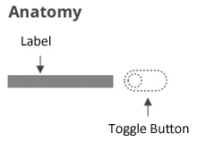

# ptcs-toggle-button

## Visual

## Overview

A toggle-button can be in an _on_ or _off_ state. When the toggle-button is engaged, it toggles a state.
The toggle-button uses the ptcs-behavior-binary/ptcs-behavior-binary.html behavior.

## Usage Examples

### Basic Usage

    <ptcs-toggle-button variable="{{show}}" label="Show"></ptcs-toggle-button>

Assigns the variable _show_ to _true_ when the toggle-button state is _on_, and to _false_ when it is _off_.

### Start in on state (checked)

    <ptcs-toggle-button variable="{{show}}" label="Show" checked></ptcs-toggle-button>

### Explicit variable values

    <ptcs-toggle-button variable="{{tool}}" label="Use tool" value-on="knife" value-off="fork"></ptcs-toggle-button>

Assigns the variable _tool_ to "knife" whenever the toggle-button is _on_ and "fork" otherwise.

## Component API

### Properties
| Property      | Type    | Description                                                                                     | Default | Triggers a changed event |
| ------------- | ------- | ----------------------------------------------------------------------------------------------- | ------- | ------------------------ |
| disabled      | Boolean | Disables the toggle-button                                                                      | false   | No                       |
| label         | String  | The displayed label                                                                             | ""      | No                       |
| labelalign    | String  | Determines the position of the label relative to the toggle-button: `left` or `right`           | "left"  | No                       |
| labelMaxWidth | String  | The maximum width of the label                                                                  |         | No                       |
| state         | Boolean | The current state. The state is _on_ when set to true and _off_ when set to false.              |         | No                       |
| tooltip       | String  | The tooltip that appears when hovering over the checkbox                                        | ""      | No                       |
| tooltipIcon   | String  | The icon for the tooltip                                                                        | ""      | No                       |
| valueOff      | _any_   | The value that the toggle-button assigns to `variable` when the toggle-button is turned _off_.  | false   | No                       |
| valueOn       | _any_   | The value that the toggle-button assigns to `variable` when the toggle-button is turned _on_.   | _true_  | No                       |
| variable      | _any_   | The variable that the toggle-button monitors and assigns                                        |         | No                       |

### Methods

No methods

## Styling

### The Parts of a Component

| Part      | Description                                         |
| --------- | --------------------------------------------------- |
| label     | The container that contains the label               |
| rectangle | The rectangle element containing the movable switch |
| oval      | The movable on/off switch of the toggle-button      |

### State attributes

| Attribute  | Description                                                                              | Part         |
| ---------- | ---------------------------------------------------------------------------------------- | ------------ |
| checked    | Current state (on: checked = true, off: checked = false)                                 | :host        |
| disabled   | Is the checkbox disabled?                                                                | :host        |
| label      | The displayed label                                                                      | :host, label |
| labelalign | The alignment of the button label. You can set it to left or right. The default is left. | :host        |
