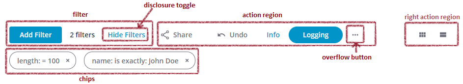

# ptcs-toolbar

## Visual

## Overview

A ptcs-toolbar consists of four regions:

- A _filter region_ that can contain a ptcs-chip-data-filter or a simple ptcs-textfield filter
- A _chips_ region, that contains any visible chips of the ptcs-chip-data-filter
- An _action region_ that contains user actions
- A _rightAction region_ that contains user actions

An _action_ can be either of:

- A ptcs-button
- A ptcs-link
- A ptcs-toggle-button
- A ptcs-dropdown

## Usage Example

~~~js
<ptcs-toolbar actions="[[actions]]"></ptcs-toolbar>
~~~

## Component API

### Properties

| Property            | Type    | Description                                                                                | Default              | Triggers a changed event |
| ------------------- | ------- | ------------------------------------------------------------------------------------------ | -------------------- | ------------------------ |
| disabled            | Boolean | Disables the toolbar                                                                       | false |  No |
| filterData          | Object  | The data for the filter options in the ptcs-chips-data-filter                              |                      | No |
| hideFilter          | Boolean | Hides the filter region                                                                    |                      | No |
| simpleFilter        | Boolean | Use simple filter instead of chips filter                                                  |                      | No |
| simpleFilterPos     | String  | The position of the simple filter. You can place the filter in the `'left'`, `'right'` , or `'center'` regions.|  | No |
| simpleFilterAlign   | String  | The alignment of the simple filter when placed in the center region. You can align the filter to the `'left'`, `'right'`, or `'center'`.|| No |
| simpleFilterWidth   | Number  | Sets a specific width in pixels for the simple filter box, although its actual width may be limited by CSS `min-width` on part `simple-filter`|| No |
| simpleFilterMinWidth| Number  | _Read-only_ property returning the simple filter's min-width, if any                       |                      | No |
| separator           | Boolean | Toggle to display vertical separator between the chip data filter and actions              |                      | No |
| actions             | Action[]| Actions for the action region. See below                                                   |                      | No |
| rightActions        | Action[]| Actions for the right region. See below.                                                   |                      | No |
| query               | Object  | Generated filter query from the ptcs-chips-data-filter                                     |                      | Yes |
| chipsOnTop          | Boolean | Show filter chips on top of the toolbar?                                                   |                      | No |
| additionalLabel     | String  | Specifies an additional label that occurs before the toolbar left actions                  |                      | No |
| rightOverflowLabel  | String  | Specifies a label for the collapsed right area button                                      |                      | No |
| filterLabel         | String  | Label displayed above the simple filter                                                    |                      | No |
| filterIcon          | String  | Specifies the icon in the simple filter.                                                   | "cds:icon_filter"    | No |
| filterTooltip       | String  | Tooltip for the simple filter                                                              |                      | No |
| filterHintText      | String  | Placeholder text for the simple filter                                                     | "Filter"             | No |
| filterString        | String  | The text that has been entered in the simple filter text                                   |                      | Yes |
| chipsDisclosure     | String  | Specifies how to handle the "Show Filters" / "Hide Filters" toggle in the ptcs-chips-data-filter: `'link'` - use a ptcs-link, `'icon'` - use a ptcs-icon, `'none'` - hide the disclosure toggle and always show the active filters / chips. | "link" | No |
| categoryLabel       | String  | The text that is displayed above the drop-down list for the filter categories in the chip filter|                 | No |
| conditionLabel      | String  | The text that is displayed above the drop-down list for the filter condition in the chip filter |                 | No |
| valueLabel          | String  | The text that is displayed above the box which contains the value for the condition in the chip filter|           | No |
| rangeStartValueLabel| String  | The text displayed above the first input box when filtering a range of values in the chip filter |                | No |
| rangeEndValueLabel  | String  | The text displayed above the second input box when filtering a range of values in the chip filter|                | No |
| unitsLabel          | String  | The text displayed above the drop-down list that is used to set the units when filtering by location or date in the chip filter|| No |
| latitudeLabel       | String  | The text displayed above the input box for latitude when filtering by location in the chip filter |               | No |
| longitudeLabel      | String  | The text displayed above the input box for longitude when filtering by location in the chip filter|               | No |

### Action data

Action data specifies the actions that should be added to the `action` and `rightAction` regions.

An Action object has the following fields:

| Name     | Type    | Description                                                                                                |
| -------- | ------- | ---------------------------------------------------------------------------------------------------------- |
| type     | String  | `'button'` , `'link'` , `'toggle'` , `'dropdown'`                                                          |
| id       | any     | Any identifier for the action. The id is only used for dynamically updating action properties, such as visibility, disabled mode, and current value. |
| label    | String  | The action label                                                                                           |
| alt      | String  | The alternative text of the action. Currently used as the action tooltip.                                  |
| altIcon  | String  | The alternative icon of the action. Currently used as the action tooltip-icon. See `ptcs-icon` for details.|
| disabled | Boolean | Is the action disabled?                                                                                    |
| hidden   | Boolean | Is the action hidden?                                                                                      |
| width    | String or Number| Width of the action control                                                                        |
| maxWidth | String or Number| Max width of the action control                                                                    |
| opt      | Object  | Specific options for the action type. See below.                                                           |

 

### `action.opt` options for `'button'`

| Name    | Type   | Description                                                                                | Default                 |
| ------- | ------ | -------------------------------------------------------------------------------------------|------------------------ |
| variant | String | The button variant (`'primary'`, `'secondary'`, `'tertiary'`, `'danger'`, `'transparent'`).| `'transparent'`         |
| icon    | String | The button icon. See `ptcs-icon` for details.                                              |                         |
| iconSet | String | The button icon. See `ptcs-icon` for details.                                              |                         |

 

### `action.opt` options for `'link'`

| Name    | Type   | Description                                    | Default             |
| ------- | ------ | -----------------------------------------------| ------------------- |
| href    | String | URL.                                           |                     |
| target  | String | The link target (`'new'`, `'same'`, `'popup'`).| `'new'`.            |
| variant | String | The link variant (`'primary'`, `'secondary'`). | `'primary'`.        |

 

### `action.opt` options for `'toggle'`

| Name       | Type                        | Description                        | Default            |
| ---------- | --------------------------- | ---------------------------------- | ------------------ |
| value      | Boolean                     | The initial toggle state           |                    |
| hideIcon   | Boolean                     | Hide/Show toggle icon              |                    |
| labelalign | String (`'left'`, `'right'`)| Label alignment.                   | `'left'`           |

 

### `action.opt` options for `'dropdown'`

| Name   | Type  | Description                |
| ------ | ----- | -------------------------- |
| value  | any   | The initial dropdown value |
| values | Array | Array of available values. Each array item has the mandatory field `value` that specifies the corresponding value and the optional field `label` that specifies the displayed label in the dropdown. If `label` is unspecified, it defaults to `value`. Additional optional field: `state` (`'hidden'`, `'disabled'`)|

 

### Methods

| Signature                 | Description                                                                                      |
| ------------------------- | ------------------------------------------------------------------------------------------------ |
| setDisabled(id, disabled) | Assigns the disabled mode for the action with id `id`                                            |
| setHidden(id, hidden)     | Assigns the visibility for the action with id `id`                                               |
| setValue(id, value)       | Assigns the value for  the action with id `id`. Only `toggle` and `dropdown` actions have values |

 

### Events

| Name          | Data                          | Description                                                                                                      |
| ------------- | ----------------------------- | ---------------------------------------------------------------------------------------------------------------- |
| activated     | ev.detail = { action, value } | Event for when the user clicks on a `button` or `link`. `action` is the _Action data_ that created the component.|
| value-changed | ev.detail = { action, value } | Event for when the value of a `toggle` or `dropdown` changes. `action` is the _Action data_ that created the component. `value` is the new value.|

 

## Styling

### The Parts of a Component

| Part          | Description       |
| ------------- | ----------------- |
| data-filter   | The data filter   |
| simple-filter | The simple filter |
| tools         | The toolbar       |

TODO: the action and rightAction regions are sub-parts of the ptcs-toolbar-tools component. These parts need to be imported before they can be styled via ptcs-toolbar.

 

### State attributes

| Attribute | Description              | Part  |
| --------- | ------------------------ | ----- |
| disabled  | Is the toolbar disabled? | :host |
