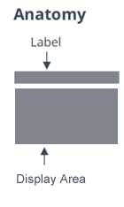

# ptcs-value-display

## Visual



The value display consists of an optional *label* (referred to as the KEY in the key / label data pair of the *property display* component)
and a display area in which to display a formatted *value*.


## Overview

The value display web component displays the data formats text, password, checkbox, image, link and html _natively_, either using other PTCS web components (ptcs-label, ptcs-textfield, ptcs-checkbox, ptcs-image (indirectly via ptcs-modal-image-popup), ptcs-link&mdash;respectively), or as plain HTML.

The native `type` values are

* `text`
* `image`
* `html`
* `link`
* `password`
* `checkbox`


## Usage Examples

### Text Value

```
<ptcs-value-display label = "A Famous Quote"
                    data  = "Veni, vidi, vici"></ptcs-value-display>

```
See the demo page for many additional examples with bound type.

## Component API

The value display grows to accommodate its content. You can constrain the value
display area using maximum width / height or by setting a fixed size.

### Properties

| Property           | Type   | Description                                                                    | Default     |
| ------------------ | ------ | ------------------------------------------------------------------------------ | ----------- |
| backdropColor      | String | The modal backdrop color                                                       |             |
| backdropOpacity    | Number | The modal backdrop opacity, a value betwenn 0-1.0                              |             |
| data               | Object | The data to display                                                            |             |
| defaultText        | String | Fallback textual contents to show when there is no data to display             |             |
| disabled           | Boolean| Is the value display disabled?                                                 | false       |
| height             | Number | Fixed height in pixels for the value display                                   |             |
| horizontalAlignment| String | Horizontal alignment within the display area: `left`, `center`, `right`        | "left"      |
| verticalAlignment  | String | Vertical alignment within the display area: `flex-start`, `center`, `flex-end` | "flex-start"|
| itemMeta           | Object | The type of the data to display. If you are running inside of MashupBuilder application you must use `{baseType: 'NUMBER'}` instead: This will apply default MashupBuilder formatter rules. `baseType` can be any type supported by MashupBuilder. Using it will override selector attribute described above. You should use only one of `type` or `baseType`|`{type: 'text')`|
| label              | String | The (key) label of the data value                                              | ""          |
| labelAlignment     | String | Horizontal alignment of the key label: `left`, `center`, `right`               | "left"      |  
| maxHeight          | Number | Maximum height in pixels for the value display                                 |             |
| maxWidth           | Number | Maximum width in pixels for the value display                                  |             |
| modalHeight        | Number | Height of the _general_ modal pop-up (not image)                               | 380         |
| modalWidth         | Number | Width of the _general_ modal pop-up (not image)                                | 600         |
| selector           | Any    | Selector for the value holder. If `null` the value is `data`; if the selector is of type `string` it identifies the name of the property in `data` that holds the value; otherwise it is interpreted as a function name to apply on `data`| null |
| textWrap           | Boolean| Allow text content to wrap in the value?                                       | false       |
| tooltip            | String | Tooltip text for the value display. In addition to any tooltip text on the web component itself, the tooltip will be populated from truncation overflow (when the value is truncated with ellipsis on account of size constraints)|""|
| tooltipIcon        | String | Icon for the tooltip text                                                      | ""          |
| twNumberFormatToken| String | Format numbers according to TWX localization token. Ex.: <ptcs-value-display ... tw-number-format-token='numberFormat_Custom'/>||
| overflowOption     | String | Controls display of overflow using disclosure button (default), 'Show More' textual link, or horizontal ellipsis with content truncation. Corresponding values are `disclosure`, `showmore`, and `ellipsis` (respectively) | "disclosure" |
| valueDisplayType   | String | One of the pre-defined label types (header, sub-header, label, or body)        |             |
| width              | Number | Fixed width in pixels for the value display                                    |             |

The value display uses `ptcs-value-container` to render the value. This has following properties (propagated from its parent `ptcs-value-display`):

| Property        | Type    | Description                                                                      | Default  |
| --------------- | ------- | -------------------------------------------------------------------------------- | -------- |
| alignment       | String  | Horizontal alignment of the value: `left`, `center`, `right`                     | "left"   |
| backdropColor   | String  | The modal backdrop color. This is for the image pop-up.                          | "#232b2d"|
| backdropOpacity | Number  | The modal backdrop opacity, a value between 0-1.0.  This is for the image pop-up.| 0.6      |
| disabled        | Boolean | Is the value display disabled?                                                   |          |
| height          | Number  | Fixed height in pixels. This constraint is used to scale the image thumbnail.    |          |
| itemMeta        | Object  | Defines container type (text, checkbox, password, image, link, html, function). Should be one of two kinds: `{type: 'text')` or : `{baseType='NUMBER'}`. When `baseType` is used, the type is calculated automatically. `baseType` will work properly only when used in the MashupBuilder application. It accepts any baseType defined in the MashupBuilder ||
| label           | String  | The key label for the value                                                      |          |
| labelHeight     | Number  | The height of the label above the value container; this is used to adjust the maximum available height accordingly | 0 |
| textWrap        | Boolean | Allow text content to wrap in the value?                                         |          |
| width           | Number  | Fixed width in pixels, This constraint is used to scale the image thumbnail.     |          |
| maxWidth        | Number  | Maximum width in pixels. This constraint is used to scale the image thumbnail and applied on the key label as well.| |


### Events

| Name             | Description                                         |
| ---------------- | --------------------------------------------------- |
|popup-close-action| Triggered when clicking on close button of a pop-up |

### Methods

_No methods_


## Styling

### Parts

The ptcs-value-display has following parts:

| Part                       | Description                                                                      |
| -------------------------- | -------------------------------------------------------------------------------- |
| root                       | The container for the value display                                              |
| value-display-area         | The container for the are where the value is displayed                           |
| overflow-control           | A container to monitor overflow of the value                                     |
| value-display-label        | The label above the value                                                        |
| disclosure-button-overlay  | This is used to cover the bottommost part of the display area on content overflow|
| disclosure-button-container| The 34px x 34px hit area that contains the disclosure button                     |
| disclosure-button          | The disclosure button to reveal the contents in a pop-up                         |
| show-button                | The `Show more` button, an alternative to the disclosure button                  |
| text-link                  | The container for the textual link (Show More / Show Less)                       |
| value-container            | The ptcs-value-container for the displayed value                                 |

Part `popup-container` is a child of `<body>`, shown when the disclosure button is clicked. It contains `ptcs-value-display-popup` that shows the key label and value as modal
popup, without its inline size constraints.

| Part                        | Description                                                                   |
| --------------------------- | ----------------------------------------------------------------------------- |
| value-display-popup         | The container for the value display in the pop-up, used for centering purposes|
| live-contents-area-popup    | The container for the close button section (part `popup-close-button-container`), the key label in the pop-up (part `value-display-label-popup`, and the `ptcs-value-container` (part `value-container-popup`)|
| popup-close-button-container| The 34px x 34px hit area that contains the close button                       |
| popup-close-button          | The button to close the pop-up                                                |
| value-display-label-popup   | The key label in the pop-up modal dialog                                      |
| value-container-popup       | The `ptcs-value-container` in the modal pop-up                                |


The `ptcs-value-container` used in the value display has following parts:

| Part                 | Description                        |
| -------------------- | ---------------------------------- |
| item-value           | The displayed value content holder |
| item-value-container | The container for `part=item-value`|

#### Custom Styling

The `Show More` disclosure link has the PTCS Base Theme primary background color set in the theme. If you were to use this component programmatically inside of your own component with another background color than the PTCS Base Theme, say `yellow`, you could override the background color of the "Show More" link (associated to `part=show-button`) in a couple of ways:

1. By injecting a `ptcs-style-unit` into the DOM:

```xml
   <ptcs-style-unit wc="PTCS-VALUE-DISPLAY">
     :host(:not([_show-all])) [part~=show-button] {
     background-color: yellow;
     box-shadow: yellow 0px -8px 16px;
     }
   </ptcs-style-unit>
```
where the `:host()` predicate ensures to only apply the styling in the collapsed state when "Show More" is showing.


2. Alternatively, you could use the [CSS Shadow Parts Draft Specification](https://drafts.csswg.org/css-shadow-parts/) (<https://drafts.csswg.org/css-shadow-parts/>) syntax:

```css
    ptcs-value-display::part(show-button) {
    background-color: yellow;
    box-shadow: yellow 0px -8px 16px;
    }
```

This latter option only works well in browsers that have Shadow DOM support such as Chrome or Mozilla FireFox.


### State attributes
| Attribute | Description                                       | Part  |
| --------- | ------------------------------------------------- | ----- |
| text-wrap | Set when the value area contents should line wrap | :host |


