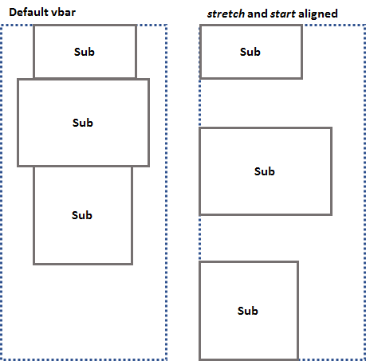

# ptcs-vbar


## This component is now deprecated. Use CSS `flexbox` directly instead.

The &lt;ptcs-vbar> web component is now deprecated and will be removed in a future update. Use CSS `flexbox` directly instead.

### Flexbox References
- Specification: https://www.w3.org/TR/css-flexbox-1/
- A Complete Guide to Flexbox: https://css-tricks.com/snippets/css/a-guide-to-flexbox/


## Visual



## Overview

The &lt;ptcs-vbar> aligns objects inside a vertical bar. By default, objects are aligned to the top on the vertical axis, and in the center on the horizontal axis.

This component is a simplified interface of the CSS flex-box module.


## Usage Examples

### Basic Usage

```html
    <ptcs-vbar>
      
      <span>John Doe</span>
    </ptcs-vbar>
```

Result:


### Stretch vertically

    <ptcs-vbar stretch>
      ...
    </ptcs-vbar>

### Align at the bottom

    <ptcs-hbar bottom>
      ...
    </ptcs-hbar>

### Stretch vertically and align horizontally to the start side

    <ptcs-vbar stretch start>
      ...
    </ptcs-vbar>

## Component API

### Properties
| Property | Type | Description |
|----------|------|-------------|
| inline | Boolean | Is the vbar control an inline area? (default is block)|
| center | Boolean | Aligns objects vertically in the center |
| bottom | Boolean | Aligns objects vertically at the bottom |
| stretch | Boolean | Fills the bar vertically, and if needed, adds space between the objects |
| space-around | Boolean | The same as _stretch_, but adds space before the first sub object and after the last sub object|
| start  | Boolean | Aligns objects horizontally to the start side |
| end | Boolean | Aligns objects horizontally to the end side |
| xstretch | Boolean | Stretches the objects to the same width as the hbar |
| wrap  | Boolean | Wraps the sub objects if they are higher than the vbox |


### Events

No events

### Methods

No methods


## Theming

N/A

## RTL

Supported

## ARIA

N/A

